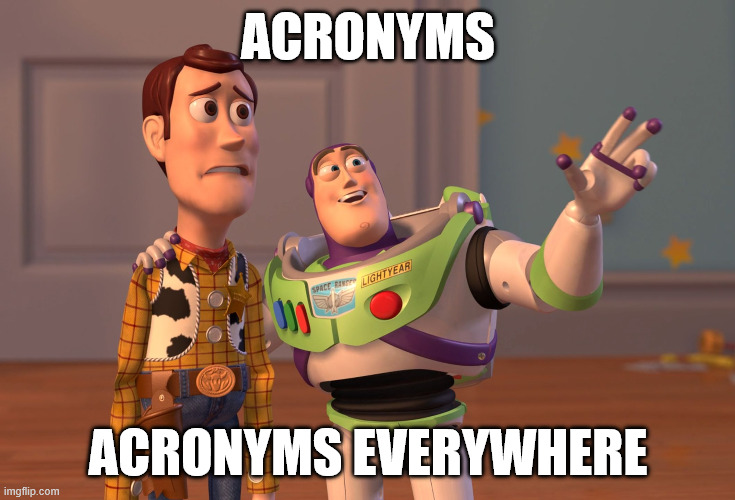

# Introduction to DB / RDBMS

> [!CAUTION]
> This is only a brief listing of some cornerpoints of the course material, and **cannot** be considered as a full-fledged learning material in itself.
> This only serves as a short recap of the most important concepts. 
> Reading the book and additional resources is still necessary. 

## Motivation for DB

### What do we want/need?

Store (a lot of) data (in a structured way).

### Why?

To get asnwers to questions and/or keep state of things.
 - What are the latest news?
 - How many people and who liked my last insta post?
 - Which supermarket is still open nearby? 
 - etc.

### What do we do with that data?

**C** reate it

**R** ead it

**U** pdate it

**D** elete it

## With what tool? 

### General wisdom

> Use the right tool for the job.

Each scenario / requiremenet / use-case is different, chose the tool for storing the data based on your needs, not what *the best*, *the state-of-the-art* tool is.

> If your only tool is a hammer, every problem looks like a nail.

RDBMS is not the only solution. 
It is a **very** important tool to know, but not suited for everything.
If it *feels* inadequate, look for a more fitting tool, in most of the cases there is something.
Be open to learn, extend your knowledge, avoid becoming a one-trick pony. 

> Don't bring a knife to a gun fight

Excel. is. NOT. a. database!

> Don't use a sledgehammer to crack a nut.

The tool for your beer tasting diary does not need a distributed Oracle Cloud Autonomous Database with in-memory processing, multi-region replication, and Kubernetes orchestration.

> If it ain't broke, don't fix it.

If your backend runs fine on a good old local MySQL DB, there's no need to ditch it for a trendy BaaS.

### Rule of thumbs

**Small amount of data, mostly hierarchical and changing structure, single user** 
→  A JSON file should do the trick.

**If it grows a lot, but the structure remains changing**  → Good time to move to a Document based NoSQL solution. (MongoDB, Couchbase, etc.)

**You don't want to manage it yourself, looking for a cloud solution** 
→ Something like Firebase is easy to set up, and can carry you a long way.

**If the structure solidifies and in a relational** → Probably a good time to learn about RDBMS. Logical to move for safety and speed, especially if data keeps growing.

**Small amount of mostly tabular data, with unfrequent changes or deletions, single user with manual editing needs**
→ A spreadsheet application will suffice.

**Same, but programmable access is needed** 
→ You can probably still get away with a spredsheet and a dataframe library like pandas.

**Data keeps growing, just a few sheets, just additions, mostly analytical functions, pivot tables**
→ OLAP is the way.

**Or instead: more and more sheets, interconnected by lot of `XLOOKUPS`, `INDEX`, etc. and/or need for multiple users**
→ This suggests OLTP direction with RDBMS.

#### RDBMS rule of thumbs

**Small/Medium size, single user, manual edits, reports** 
→ MS Acces / Libreoffice Base is a reasonable choice.

**Still a single user and small/medium size, but need for programmable access**
→ sqlite is most probably enough for these needs. (VERY prominent for embedded / mobile apps.)

**Larger size and/or need for multiple users possibly over the internet**
→ Open source proper DBMS, like MySQL, PosgreSQL is a good choice.

**Parallelization and performance become crucial due to growing size, query frequency**
→ State-of-the-art proprietary RDBMS, like Oracle, MS SQL is necessary.

**If it is not legally necessary for data to be on-premise, and infrastructure management is better outsourced**
→ Cloud native managed RDBMS (AWS RDS, Azure SQL).

**Same but simpler cases**
→ Supabase will probably ease your workflow (similar to Firebase in the NoSQL realm).

#### Still more

Confused already? We still haven't touched on:
 - Time-series data → InfluxDB, TimescaleDB
 - Special type of data (e.g. geodata) → PostGIS, GeoJSON
 - Graph-like relationships → Neo4j
 - Streaming platforms → Apache Kafka, Pulsar
 - ...

> [!IMPORTANT]  
> You **DON'T** need to learn all these at once. You’ll likely never use more than half — but you don’t know which half.
> The key takeaway: there are tools for many needs. When the need arises, be curious.

## Relational DB basics

TODO: conceptual/logical/physical design
TODO: table/relation, attribute/column, row/record, scheme/metadata, key, composite key, primary key, foreign key

## Database (Query) language

TODO: need for formal way of asking questions and an algorithmic way of answering them
TODO: SQL, DDL, DML, DQL, DCL, DTL

## Recapception (recap of the recap)

Test yourself by explaining the meaning of these acronyms: 
 - TLA
 - DB
 - DBMS
 - RDBMS
 - CRUD
 - BaaS
 - JSON
 - OLAP
 - SQL
 - DDL
 - DML
 - DTL
 - DCL
 - DQL
 - PK

