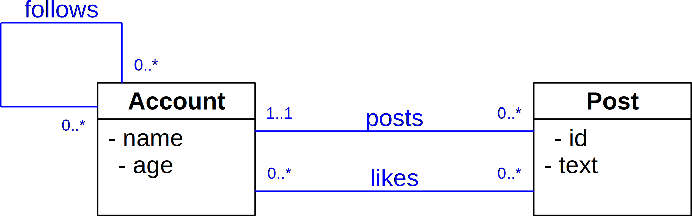

# Description

On Twitter there are accounts that have a unique name and an age.
An account may post tweets, which have a text that is limited to 128 characters.
Accounts may follow other accounts, and accounts may like any tweets.

# ER-diagram (UML style)



# SQL

```sql
CREATE TABLE Account (
    name VARCHAR(128) PRIMARY KEY,
    age INT 
);
CREATE TABLE Post (
    id SERIAL PRIMARY KEY,
    text VARCHAR(128),
    tweeter VARCHAR(128) REFERENCES Account(name) NOT NULL
);
CREATE TABLE Like (
    id SERIAL PRIMARY KEY,
    liker_account VARCHAR(128) REFERENCES Account(name) NOT NULL,
    liked_post INT REFERENCES Post(id) NOT NULL,
    UNIQUE(liker, liked)
);
CREATE TABLE Follow (
    id SERIAL PRIMARY KEY,
    follower VARCHAR(128) REFERENCES Account(name) NOT NULL,
    followed VARCHAR(128) REFERENCES Account(name) NOT NULL,
    UNIQUE(follower, followed)
);
```
