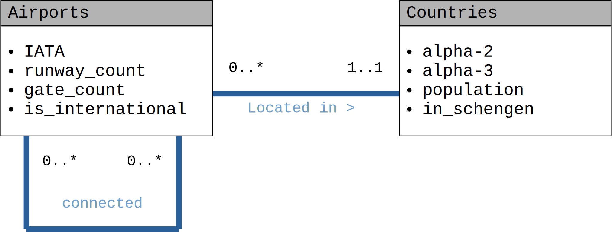

# Test

## Description

Draw the ER diagram for the following use case and write the SQL statements to create the corresponding schema.

> There are many airports around the world and each has its 3-letter identifier. For example VIE for Vienna - Schwechat International Airport. About each airport we know the number of both runways and gates, moreover whether it is international or not. Each airport is located in a country, that has a unique 2 digit (e.g., AT) and 3 digit (AUT) code. We also want to store the population of each country, and whether they are in Schengen or not. Finally, we would like to store, which airports are connected by at least one carrier.

`NOT NULL` and `ON DELETE` statements can be omitted.

## Solution

**One** good solution, there are more.

### ERD



### SQL DDL

```sql
CREATE TABLE Airports (
    iata VARCHAR(3) PRIMARY KEY,
    runway_count INT,
    gate_count INT,
    is_international BOOLEAN,
    country VARCHAR(3) REFERENCES Countries(alpha3)
);

CREATE TABLE Countries (
    alpha2 VARCHAR(2) UNIQUE,
    alpha3 VARCHAR(3) PRIMARY KEY,
    population INT,
    in_schengen BOOLEAN
);

CREATE TABLE Connections (
    iata1 VARCHAR(3) REFERENCES Airports(iata),
    iata2 VARCHAR(3) REFERENCES Airports(iata),
    PRIMARY KEY(iata1,iata2)
);
```