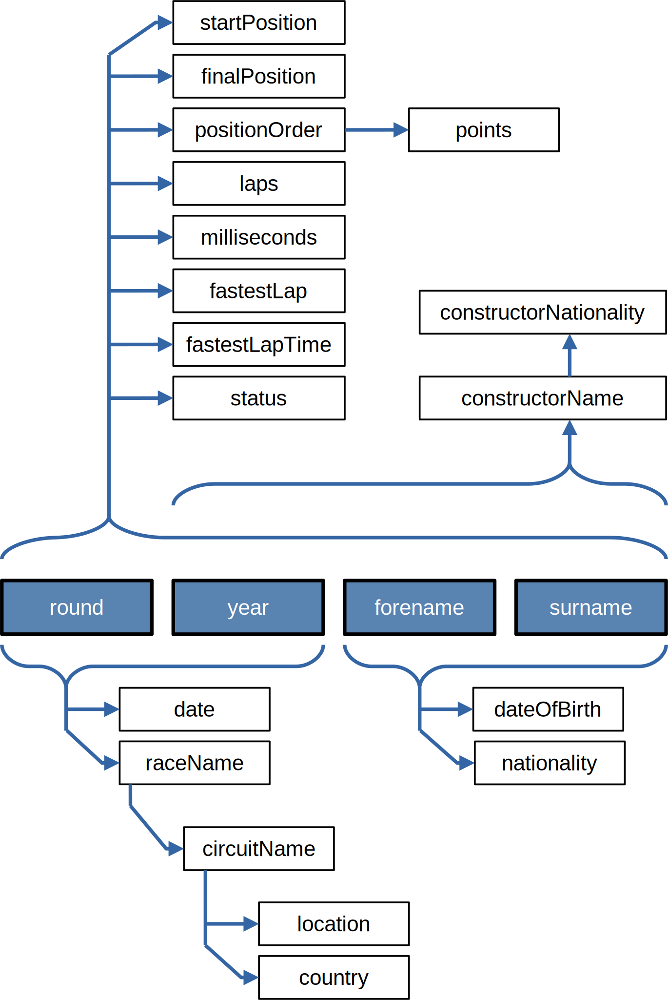
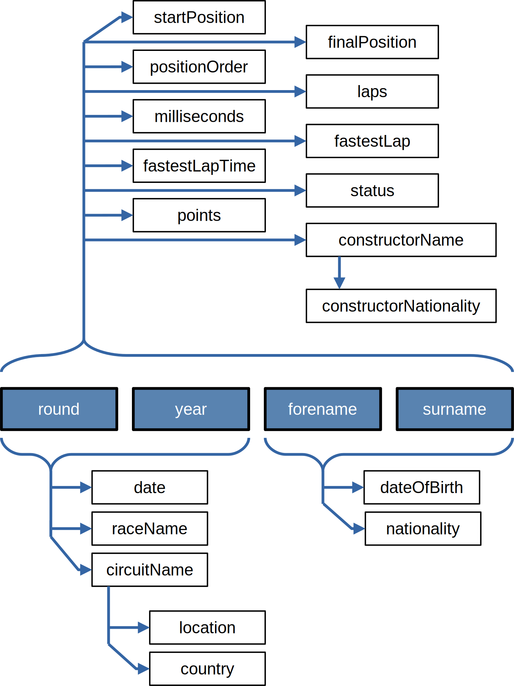
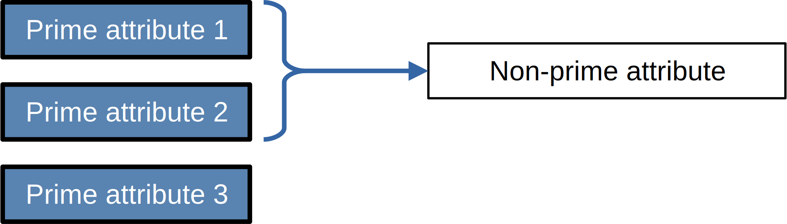
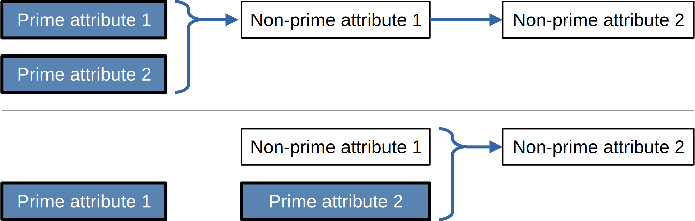

# Normalizing the data

We will learn normalization concepts and some DML commands on an example given in [this database](./results_1980.db).
The database contains a single table `results` that contains Formula 1 results since 1980, and was prepared based on [this dataset](https://www.kaggle.com/datasets/rohanrao/formula-1-world-championship-1950-2020?select=results.csv).

## "Network of implications"

The primary key is a composit key made up by `year`, `round`, `forename`, `surname`.
By definition, all of the attributes are *implied* by these 4 attributes, meaning that if we know the value for the 4 key attributes, the corresponding row (if exists) can uniquely be found based on them, and thus the value for all other attributes can be *derived* from that. 

However, by intuition, other *dependencies* are also present between these attributes, partially illustrated in the following figure:



`startPosition`, `finalPosition`, `positionOrder`, `laps`, `milliseconds`, `fastestLap`, `fastestLapTime`, and `status` seem to be really **dependent on all 4 of the prime attributes**. 
Other attributes, however, may only depend just on a subset of them, or even other non-prime attributes:
 - If we know the final position, the amount of points given should be known. Maybe it changes over the years, but probably not between rounds, and definitely should not depend on the driver.
 - Presumably, a driver competes with the same car for the whole season.
 - The year and the round should determine the name of the race, the latter also implying the circuits name, which implies city (location) and country.
 - Finally, the date of birth and the nationality of a driver does not depend on the race.

## Checking dependencies

> [!IMPORTANT]
> It is a **design decision** whether a dependency is there or not.
> When it is uncertain, one **must** talk with the domain experts to clarify it. 
> Extrapolating based on the existing data can lead to incorrect assumptions.
> The more data we have, less likely it is to happen, but still...

So, what we do here is not the *proper way*, but 
 - we don't have the domain experts and
 - it is a good exercise to practice the queries learned last time

There is no query that can ensure that an implication is there, as the query cannot know about future entries.
However, we can test, whether the data we have at the moment supports that assumption or not. 
The negative (i.e. the imlication is not there) can be proven even by a single counterexample.

So, how to check if we have a counterexample or not for an implication/dependency? 
For example, whether: 
```
(forename,surname) -> dateOfBirth
```
We can do this simple query:

```sql
SELECT forename, surname, COUNT(DISTINCT dateOfBirth) AS differentDOB FROM results GROUP BY forename, surname ORDER BY differentDOB DESC LIMIT 1;
```

The result:
| forename | surname | differentDOB |
| --- | --- | --- |
| Adrian | Sutil | 1 |

The query could be simplified however to filtering the aggregated results insted of ordering them and having the limits. 
Filtering after aggregation (group by) is done with `HAVING` insted of `WHERE`:

```sql
SELECT forename, surname, COUNT(DISTINCT dateOfBirth) AS differentDOB FROM results GROUP BY forename, surname HAVING differentDOB > 1;
```

or even:

```sql
SELECT forename, surname FROM results GROUP BY forename, surname HAVING  COUNT(DISTINCT dateOfBirth) > 1;
```

Both queries return 0 rows, meaning that there are no counterexamples to the assumed implication.
The same query can be run for `nationality` which will have the same result.

To check if the `date` and `raceName` is based on `year` and `round` we could do the same, or do it in a single step:

```sql
SELECT round, year FROM results GROUP BY round, year 
HAVING COUNT(DISTINCT date) > 1 OR COUNT(DISTINCT raceName) > 1;
```

Again, 0 results, the implications seem to hold.

```sql
SELECT raceName FROM results GROUP BY raceName 
HAVING COUNT(DISTINCT circuitName) > 1;
```

We have quite a few results:
| raceName |
| --- | 
| Australian Grand Prix |
| Belgian Grand Prix |
| Brazilian Grand Prix |
| British Grand Prix |
| European Grand Prix |
| French Grand Prix |
| German Grand Prix |
| Italian Grand Prix |
| Japanese Grand Prix |
| Portuguese Grand Prix |
| Spanish Grand Prix |
| United States Grand Prix |

Let's see what are these:

```sql
SELECT DISTINCT raceName, circuitName  FROM results ORDER BY raceName;
```

If we want to filter to only those races where multiple circuits appear, we need a nested query:

```sql
SELECT DISTINCT raceName, circuitName
FROM results
WHERE raceName IN (
  SELECT raceName FROM results GROUP BY raceName
  HAVING COUNT(DISTINCT circuitName) > 1
)
ORDER BY raceName;
```

So it seems that some countries had their Grand Prix at different circuits over the years.
That seems logical in hindsight, so probably it is the other way around,  `circuitName` implies `raceName`, let's check it:

```sql
SELECT circuitName FROM results GROUP BY circuitName 
HAVING COUNT(DISTINCT raceName) > 1;
```

Also no... we get a few results:

| circuitName |
| --- | 
| Autodromo Enzo e Dino Ferrari |
| Autódromo Hermanos Rodríguez |
| Autódromo José Carlos Pace |
| Bahrain International Circuit |
| Baku City Circuit |
| Brands Hatch |
| Circuito de Jerez |
| Dijon-Prenois |
| Nürburgring |
| Red Bull Ring |
| Silverstone Circuit |

How is that possible?

```sql
SELECT DISTINCT circuitName, raceName
FROM results
WHERE circuitName IN (
  SELECT circuitName FROM results GROUP BY circuitName
  HAVING COUNT(DISTINCT raceName) > 1
)
ORDER BY circuitName;
```

So it seems, that Baku City Circuit - for example - was European Grand Prix at some point and Azerbaujan Grand Prix at another year. Oh well... 

But... the racename and the year probably implies the circuitname:

```sql
SELECT raceName, year FROM results GROUP BY raceName, year 
HAVING COUNT(DISTINCT circuitName) > 1;
```

No rows, nice. 
But maybe it is true for the other way around too...


```sql
SELECT circuitName, year FROM results GROUP BY circuitName, year 
HAVING COUNT(DISTINCT raceName) > 1;
```

Nope... 

| circuitName | year |
| --- | --- |
| Bahrain International Circuit | 2020 |
| Red Bull Ring | 2020 |
| Red Bull Ring | 2021 |
| Silverstone Circuit | 2020 |

Here we see that `(year,round)` and `(year,raceName)` also imlies `circuitName`. 
But `(year,round)` also implies `raceName`.
This is an interesting situation that we will discuss later.

I leave the rest for you as an exercise, but...
 - `points` does not depend on either the `positionOrder` or `finalPosition` even if combined with `year`.
 - The name of the constructor implies its nationality.
 - But some drivers changed constructors during the year.

> [!NOTE]
> Proper database terminology calls thes implications/dependencies **functional dependency**, and the set of attributes that imply another is called the *determinant*.
> If all of the determinant attributes do actually play a role in implying the target attribute, i.e., no real subset of the determinant can by itself determine the target attribute, then the dependency is called **full functional dependency**. 

So, the end of our investigation is this:



## Preamble to normalization, intuition

As in many fields of IT, redundancy is the root of (if not all but a lot of) evil.
Just as in coding, it can be more costly and result in inconsistent data/behavior. 
A good rule of thumb is that if you feel there is redundancy in your database, you are probably not in 3rd Normal Form. 

What do we mean by redundancy? The above implications. For example, `year=1986` and `round=1` implies `raceName=Brazilian Grand Prix`, or `circuitName='Hungaroring'` implies `country='Hungary'`.
And the latter is expressed 911 times in the `results` table.

Bringing such unnormalized data to normal form means (partially) that we get rid of these redundancies, and express exactly at one place that Hockenheimring is in Germany.  

There are plenty of Normal forms, most not very creatively named:
 - 1NF - 1st normal form
 - 2NF - 2nd normal form
 - 3NF - 3rd normal form
 - BCNF - Boycce-Codd normal form
 - 4NF - 4th normal form
 - 5NF - 5th normal form

There are also some others (EKNF, 6NF, etc.), but we will only talk about 1NF, 2NF, and 3NF. 
These three pose ever extending rules on our schema, so if something is in 3NF, it is definitely in 2NF, and if our table violates 1NF, then it is not in 2NF either.

## 1NF - 1st Normal Form

If your data is already in a DB, you are (probably) already in 1NF. 
If your data is in Excel, and have merged cells (vertically), you are not in 1NF. 
You need to split them to get to 1NF. 
Same if you have cells that contain tables themselves. 

## 2NF - 2nd Normal form

Unfortunately this will get a bit trickier than 1NF. 
By definition all non-prime attributes depend on the primary key.
2NF is violated if (table is not in 1NF or) there is a non-prime attribute that only depends on a real subset of the primary key in reality.
Naturally, if the PK is not composite, 2NF cannot be violated.

Visually: 



> [!NOTE]
> Basically 2NF = 1NF + all the non-primary attributes must be fully functionally dependent on the PK. 

> [!NOTE]
> This is actually not the definition, but how 2NF is often addressed in practice.
> The proper definition requires that full functional dependency not only on the PK, but other candidate keys as well. 


We have this situation in two occasions:
 - (`forename`, `surname`) -> `dateOfBirth`, `nationality`
 - (`round`, `surname`) -> `date`, `raceName`, `circuitName`, `location`, `country`

To solve this, we need to make new tables where these subsets are the PK and, and copy the data there, and remove the dependent attributes from this table.

So for the driver-related data:

```sql
CREATE TABLE drivers (
        forename TEXT,
        surname TEXT,
        dateOfBirth TEXT,
        nationality TEXT,
        PRIMARY KEY (forename, surname)
);
```

Then copy all the data from the `results` table with the `INSERT INTO` command, that use the result of a query to insert multiple rows:

```sql
INSERT INTO drivers (forename, surname, dateOfBirth, nationality)
SELECT DISTINCT forename, surname, dateOfBirth, nationality FROM results;
```

285 rows inserted, nice. 
Now, delete the unnecessary columns from the `results` table: 

```sql 
ALTER TABLE results DROP COLUMN dateOfBirth;
ALTER TABLE results DROP COLUMN nationality;
```

Then do the same with (`round`, `surname`) -> `date`, `raceName`, `circuitName`, `location`, `country`:


```sql
CREATE TABLE races (
        year INTEGER,
        round INTEGER,
        date TEXT,
        raceName TEXT,
        circuitName TEXT,
        location TEXT,
        country TEXT,
        PRIMARY KEY (year, round)
);

INSERT INTO races (year, round, date, raceName, circuitName, location, country)
SELECT DISTINCT year, round, date, raceName, circuitName, location, country FROM results;

ALTER TABLE results DROP COLUMN date;
ALTER TABLE results DROP COLUMN raceName;
ALTER TABLE results DROP COLUMN circuitName;
ALTER TABLE results DROP COLUMN location;
ALTER TABLE results DROP COLUMN country;
```

Now, we have our database in 2NF, and removing those redundancies also shows on the file sizes:

```
bash$ ls -lh results_1980*
3.5M results_1980.db
1.9M results_1980_2NF.db
```

> [!NOTE]
> You will not get this size in sqlite unless you run the `VACUUM;` command as well. 
> PostgreSQL has that too, other vendors have similar commands.

## 3NF - 3rd Normal form

3NF is violated if a non-prime attribute can be implied by anything else than the (full) primary key.

This can happen 3 different ways:
 - an attribute is implied by a proper subset of the PK
 - an attribute is implied by non-prime attribute(s)
 - an attribute can be implied by a mix of prime - nonprime attributes

The first case is the 2NF violation, the latter two visually:



> [!NOTE]
> Again, this is how 3NF is addressed in practice.
> The theoretical definition is more strict, again, considering other candidate keys as well. 


There are of course plenty of variety on how these can appear, but we have this in our tables:
 - in `results`: `constructorName` -> `constructorNationality`
 - in `races`: `circuitName` -> `location`, `country`
 - in `races`: (`year`,`raceName`) -> `circuitName`

To resolve these, we do the same as before: new tables with the dependent attributes and their keys:

```sql
CREATE TABLE constructors (
        name TEXT PRIMARY KEY,
        nationality TEXT
);

INSERT INTO constructors (name, nationality)
SELECT DISTINCT constructorName, constructorNationality FROM results;

ALTER TABLE results DROP COLUMN constructorNationality;
```

Note, that it would have been silly to use `constructorName` and `constructorNationality` within the table `constructors`, so we simplified it, and copied the data like that. 

Now, same can be done for the circuits:

```sql
CREATE TABLE circuits (
        name TEXT PRIMARY KEY,
        city TEXT,
        country TEXT
);

INSERT INTO circuits (name, city, country)
SELECT DISTINCT circuitName, location, country FROM races;

ALTER TABLE races DROP COLUMN location;
ALTER TABLE races DROP COLUMN country;
```

And finally, (`year`,`raceName`) -> `circuitName`:

```sql
CREATE TABLE race_circuits (
        year INT,
        race TEXT,
        circuit TEXT,
        PRIMARY KEY (year,race)
);

INSERT INTO race_circuits (year, race, circuit)
SELECT DISTINCT year, raceName, circuitName FROM races;

ALTER TABLE races DROP COLUMN circuitName;
```

All done, now, we are in 3NF (if no other implications are there).

```
bash$ ls -lh results_1980*
3.5M results_1980.db
1.9M results_1980_2NF.db
1.8M results_1980_3NF.db
```

The size didn't really reduce much, but the reduncies are gone, we can sleep better.

# Querying the new database

The new schema is much more logical, is something that we would have came up with, if we were to do the design from the ground up.
However, getting certain information is a bit more difficult now. 
As long as we only ask questions about one table, everything is fine, e.g., what circuits are there in Germany?

```sql
SELECT name FROM circuits WHERE country = 'Germany';
```

However, if we ask questions that *span across tables*, things become a bit more tricky.
How would you answer the question: how many times (and in which years) did Schumacher (the older) win the Italian Grand Prix?
In the original database, it would have been easy:

```sql
SELECT year FROM results WHERE surname = 'Schumacher' AND forename = 'Michael' AND raceName = 'Italian Grand Prix' AND positionOrder = 1;
```

Now, to anwer this information we need the `results` table as well as the `races` table.
So, we want the year fields of such rows from the `results` table, where the driver is Michael Schumacher and the year, round pair is such, that the corresponding row in the `races` table has Italian Grand Prix as a name. 

The way to do that is to **join** the two tables **on** the year, round pairs, and kind of *undo* the splitting that we did to get to 2NF:

```sql
SELECT * FROM results JOIN races ON results.year = races.year AND results.round = races.round;
```

Now jut look for what we want:

```sql
SELECT results.year
FROM results JOIN races
ON results.year = races.year AND results.round = races.round
WHERE surname = 'Schumacher' AND forename = 'Michael' AND raceName = 'Italian Grand Prix' AND positionOrder = 1
```

You can imagine the joining of tables as if new tables were temporarily created (but they are not in reality). 


Ok, let's do something more meaningful: I want a table that contains all the occasions, when a driver won in his own country.
This get's complicated quickly, as I need 4 tables: `drivers`, `results`, `races`, `races_circuits` and finally `circuits`, which means we need to do 4 joins:

```sql
SELECT drivers.forename, drivers.surname, results.year, circuits.country, races.raceName
FROM drivers 
JOIN results ON drivers.forename = results.forename AND drivers.surname = results.surname
JOIN races ON results.year = races.year AND results.round = races.round
JOIN race_circuits ON races.year = race_circuits.year AND races.raceName = race_circuits.race
JOIN circuits ON race_circuits.circuit = circuits.name
WHERE drivers.nationality = circuits.country AND results.positionOrder = 1
```

Beaaauuutiful. And we get 0 results, because, `'Germany'!='German'`.
We would need another table that list for each country, how the nationality is called....

We will... not do that, instead just check whether the first 3 characters are the same, and keep silent if anybody asks about this. 
Obviously, this is NOT a solution, there are plenty of issues, e.g., FRAnce - FREnch, AUStralia&AUStria, UK-BRItish. 
But, being correct here is not the main point, and it gives an excellent opportunity to show an example of an SQL function: `substr`:

```sql
SELECT drivers.forename, drivers.surname, results.year, circuits.country, races.raceName
FROM drivers 
JOIN results ON drivers.forename = results.forename AND drivers.surname = results.surname
JOIN races ON results.year = races.year AND results.round = races.round
JOIN race_circuits ON races.year = race_circuits.year AND races.raceName = race_circuits.race
JOIN circuits ON race_circuits.circuit = circuits.name
WHERE substr(drivers.nationality, 1, 3) = substr(circuits.country, 1, 3) AND results.positionOrder = 1
```

| forename | surname | year | country | raceName | 
| --- | --- | --- | --- | --- |
| Felipe   | Massa      | 2008 | Brazil |  Brazilian Grand Prix |
| Michael  | Schumacher | 2006 | Germany        | European Grand Prix |
| Fernando | Alonso     | 2006 | Spain  |   Spanish Grand Prix |
| Michael  | Schumacher | 2006 | Germany        | German Grand Prix |
| Felipe   | Massa      | 2006 | Brazil |  Brazilian Grand Prix |
| Michael  | Schumacher | 2004 | Germany        | European Grand Prix |
| Michael  | Schumacher | 2004 | Germany        | German Grand Prix |
| Ralf     | Schumacher | 2003 | Germany        | European Grand Prix |
| Michael  | Schumacher | 2002 | Germany        | German Grand Prix |
| Michael  | Schumacher | 2001 | Germany        | European Grand Prix |
| Ralf     | Schumacher | 2001 | Germany        | German Grand Prix |
| Michael  | Schumacher | 2000 | Germany        | European Grand Prix |
| Michael  | Schumacher | 1995 | Germany        | German Grand Prix |
| Michael  | Schumacher | 1995 | Germany        | European Grand Prix |
| Ayrton   | Senna      | 1993 | Brazil |  Brazilian Grand Prix |
| Gerhard  | Berger     | 1992 | Australia      |       Australian Grand Prix |
| Ayrton   | Senna      | 1991 | Brazil |  Brazilian Grand Prix |
| Riccardo | Patrese    | 1990 | Italy  |   San Marino Grand Prix |
| Gerhard  | Berger     | 1987 | Australia      |       Australian Grand Prix |
| Nelson   | Piquet     | 1986 | Brazil |  Brazilian Grand Prix |
| Elio     | de Angelis | 1985 | Italy  |   San Marino Grand Prix |
| Niki     | Lauda      | 1984 | Austria        | Austrian Grand Prix |
| Nelson   | Piquet     | 1983 | Brazil |  Brazilian Grand Prix |
| Fernando | Alonso     | 2012 | Spain  |   European Grand Prix |
| Fernando | Alonso     | 2013 | Spain  |   Spanish Grand Prix |
| Sebastian| Vettel     | 2013 | Germany        | German Grand Prix |
| Nico     | Rosberg    | 2014 | Germany        | German Grand Prix |
| Charles  | Leclerc    | 2024 | Monaco |  Monaco Grand Prix |

Nnnnice. I'm convinced that Gerhard Berger is an echt Aussy name, let's just continue. 
Also, note, that `substr` is not standard SQL. 

There is a tiny thing, that foreshadows some later topics: now we join these 5 tables, and then filter at the end. 
For the country-nationality check this cannot really be helped, as they are at the two ends of our 5 table long *join chain*. 
But the filtering for first position could be done right at the beginning, creating a much smaller *temporary table* with the joins:

```sql
SELECT drivers.forename, drivers.surname, results.year, circuits.country, races.raceName
FROM (
    SELECT forename, surname, year, round FROM results WHERE positionOrder = 1
) as results
JOIN drivers ON drivers.forename = results.forename AND drivers.surname = results.surname
JOIN races ON results.year = races.year AND results.round = races.round
JOIN race_circuits ON races.year = race_circuits.year AND races.raceName = race_circuits.race
JOIN circuits ON race_circuits.circuit = circuits.name
WHERE substr(drivers.nationality, 1, 3) = substr(circuits.country, 1, 3)
```

Both queries return the results within similar amount of time, so this didn't really help. 
The why will be discussed later.

But, this is a big and ugly query, we will never want to write this again, so if it will be used often, it is a good idea to save it as a view:

```sql
CREATE VIEW local_winners AS
SELECT drivers.forename, drivers.surname, results.year, circuits.country, races.raceName
FROM drivers 
JOIN results ON drivers.forename = results.forename AND drivers.surname = results.surname
JOIN races ON results.year = races.year AND results.round = races.round
JOIN race_circuits ON races.year = race_circuits.year AND races.raceName = race_circuits.race
JOIN circuits ON race_circuits.circuit = circuits.name
WHERE substr(drivers.nationality, 1, 3) = substr(circuits.country, 1, 3) AND results.positionOrder = 1
```

Which we can use to query:
```sql
SELECT country, count(*) AS cnt FROM local_winners GROUP BY country ORDER BY cnt DESC;
```

| country | cnt |
| --- | --- |
| Germany | 13 |
| Brazil | 6 |
| Spain | 3 |
| Italy | 2 |
| Australia | 2 |
| Monaco | 1 |
| Austria | 1 |


# Replacing composite keys

From the theoretical point of view, having composite PKs is completely fine, however, in practice, it is not always the best choice, especially with non-integer attributes.

Let's investigate this issue with the `drivers` table, where the `forename` and `surname` pair is the key. 
There are several issues with this:
 - People sometimes change their names for various reasons, which is fine. However, now we not only have to change the name in one table, but everywhere where there is a foreign key to the `drivers` table. 
 - Two text attributes feel pretty wasteful just to provide a link between tables. Storing the two names takes most probably way more space than - for example  - to store a single integer id.  Now multiply that lavishness by the number of races a driver took part in. 
 - In case of joins, one has to look up things based on the foreign key (usually). Intuitively it feels easier (faster) to find a row by a single number than a pair of strings.
 - It is just simpler to write `JOIN drivers ON races.driver_id = drivers.id` than `JOIN drivers ON drivers.forename = results.forename AND drivers.surname = results.surname`.

The last point is only developer comfort, which sounds lazy, but the simpler something is for us, the less likely it is that we make mistakes. 
The first is a real issue, and the last two only matters if performance is important. 

So, resolve this, and create a new drivers table that has an autoincrement integer id, and push all the data from the earlier table into it: 

```sql
ALTER TABLE drivers RENAME TO drivers_old; 

CREATE TABLE drivers (
        id INTEGER PRIMARY KEY AUTOINCREMENT, 
        forename TEXT,
        surname TEXT,
        dateOfBirth TEXT,
        nationality TEXT
);

INSERT INTO drivers (forename, surname, dateOfBirth, nationality)
SELECT forename, surname, dateOfBirth, nationality FROM drivers_old ORDER BY dateOfBirth ASC;

DROP TABLE drivers_old;
```

We could have let the name pair remain unique, but maybe, there will be another Damon Hill in F1 in the future, so let's leave this door open instead.

> [!NOTE]
> Sqlite created also silently a new table, `sqlite_sequence`, that only has two columns, `name` and `seq` and a single row with `drivers` and `285`.
> This is the result of using `AUTOINCREMENT` above, that not only ensures that an `id` is given automatically, but also that old and unused ids (that appear due to deletion) are not reused. 
> The values in the `sqlite_sequence` table keep track of the largest id given so far.

Now we should add a new column to the `results` table, `driver_id` that takes the value based on a lookup in this new `drivers` table: 

```sql
ALTER TABLE results ADD COLUMN driver_id INTEGER;

UPDATE results SET driver_id = (SELECT id FROM drivers WHERE results.forename = drivers.forename AND results.surname = drivers.surname);
```

Nicely done.
If there were multiple drivers with the same name, we would have got an error. 

Now, just delete the two superfluous columns now:

```sql
ALTER TABLE results DROP COLUMN forename;
ALTER TABLE results DROP COLUMN surname;
```

Aaaand we get an error, because this columns are part of the primary key. 
Unfortunately, sqlite does not support changing the PK simply.
So, we need to create a new one with the new PK (`year, round, driver_id`), and copy all the data. 
(Or just use a tool like [DB Browser for SQLite](https://sqlitebrowser.org/) that does that for us behind the scenes.)
Anyhow, I'll leave that as an exercise for you.

After vacuuming, the filesize change is actually significant:

```
bash$ ls -lh results_1980*
3.5M results_1980.db
1.9M results_1980_2NF.db
1.8M results_1980_3NF.db
1.4M results_1980_3NF_driver_id.db
```


# Exercise questions

 - What was the fastest lap ever made on each circuit by whom, when, and with which car?
 - TODO


# Remaining issues

## Foreign keys

Note that none of the tables are *actually connected* by specifying foreign keys and how they reference other tables.
This means, that, for example:
 - A completely made-up `driver_id` can also be inserted into the `results` table.
 - If a driver is deleted, the corresponding rows in `results` will have an invalid `driver_id`.

Whether the second is a real issue also depends on our application logic. If we don't want to delete data at all, there is not much reason to add `ON DELETE` clauses. 

The first is definitely not ideal.
As with changing the PK, SQLite does not allow to add FKs in one step, one has to do the same dance: recreate the table with a new schema, and copy the data from the old table.

> [!IMPORTANT]
> SQLite has another quirk... Unless the command `PRAGMA foreign_keys=ON;` is executed (per connection - we will talk about this later), it will still ignore FK contraints. 

## Enums

We still have tables, where 3NF is not violated, but still feel redundant in a way.
There are columns, where the same *few* different (textual) values are repeated over and over. 
They feel like *enum*s from programming languages:
 - `status` in results
 - `raceName` in races

```sql
SELECT COUNT(raceName) FROM races;              -- 797
SELECT COUNT(DISTINCT raceName) FROM races;     -- 50 
SELECT COUNT(status) FROM results;              -- 18832
SELECT COUNT(DISTINCT status) FROM results;     -- 115
```

From the numbers it seems, that a racename is used around 16 times in average, and a status name around 150 times. 
Similarly to the composite key issue, there is a potential to save space by moving these values to separate tables and just having an FK to them. 
Additional benefits, reasons to do so:
 - Maybe later we want to add other information to a status, like explanation, or additional info to a racename, etc. Then leaving them in their current tables would violate 3NF.
 - If we later want to change the name, we only have to do it at one place. 
 - If the same enum is used in multiple tables, it is a good idea to have a single source of truth.

So, get down to it:

```sql
CREATE TABLE statuses (
        id INTEGER PRIMARY KEY AUTOINCREMENT, 
        name TEXT
);

INSERT INTO statuses (name)
SELECT DISTINCT status FROM results;

ALTER TABLE results ADD COLUMN status_id INTEGER;

UPDATE results SET status_id = (SELECT id FROM statuses WHERE results.status = statuses.name);

ALTER TABLE results DROP COLUMN status;
```

and: 

```sql
CREATE TABLE race_names (
        id INTEGER PRIMARY KEY AUTOINCREMENT, 
        name TEXT
);

INSERT INTO race_names (name)
SELECT DISTINCT raceName from races;

ALTER TABLE races ADD COLUMN raceName_id INTEGER;

UPDATE races SET raceName_id = (SELECT id FROM race_names WHERE races.raceName = race_names.name);

ALTER TABLE races DROP COLUMN raceName;
```

Again, the size decreased by a bit: 

```
bash$ ls -lh results_1980*
3.5M results_1980.db
1.9M results_1980_2NF.db
1.8M results_1980_3NF.db
1.4M results_1980_3NF_driver_id.db
1.2M results_1980_3NF_driver_id_enums.db
```