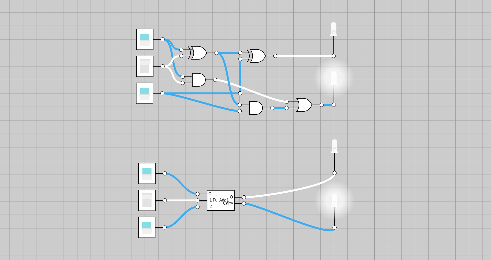
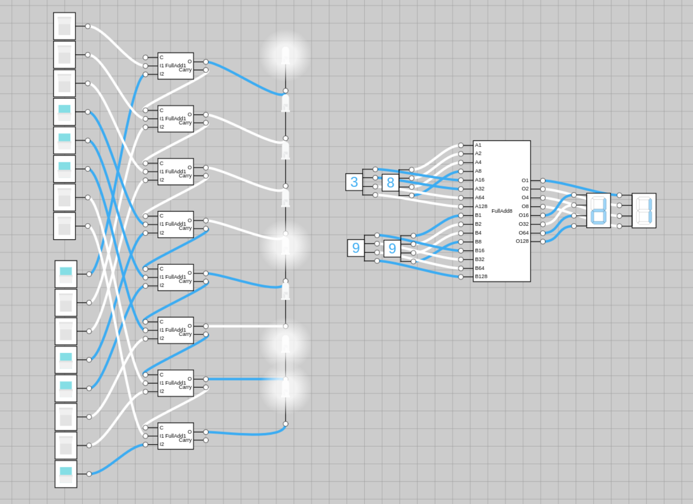
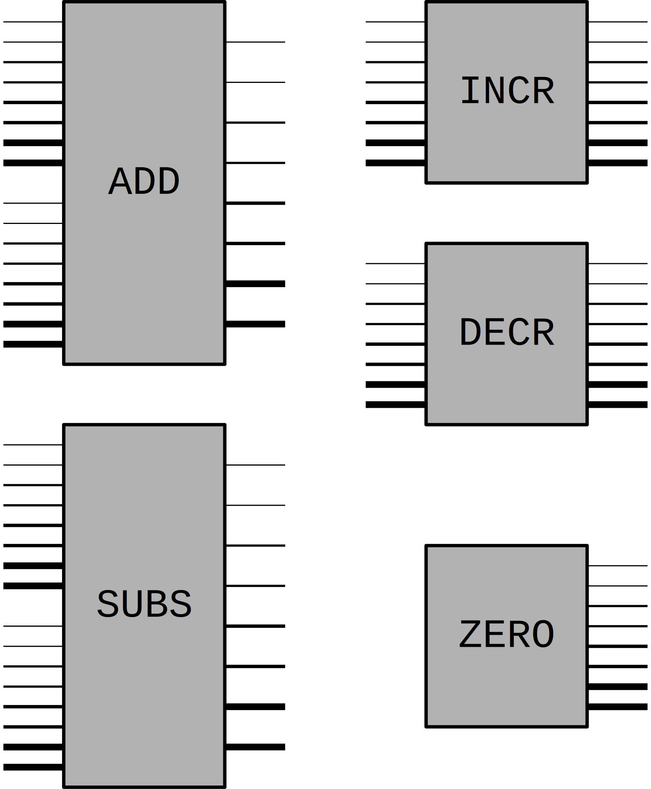
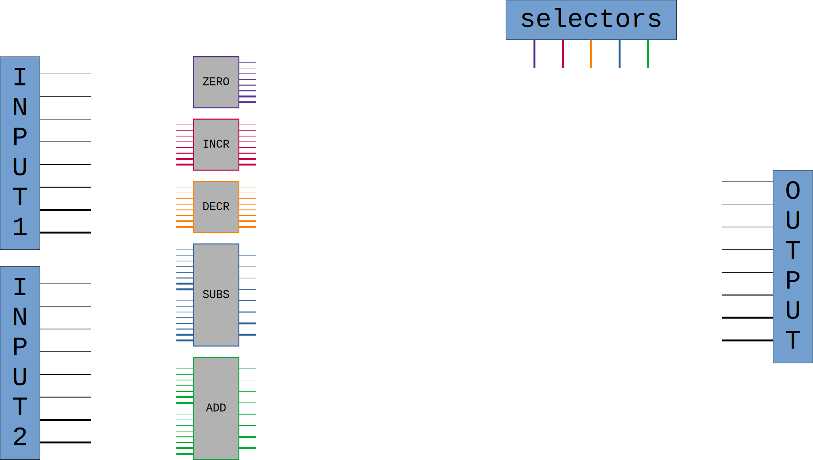
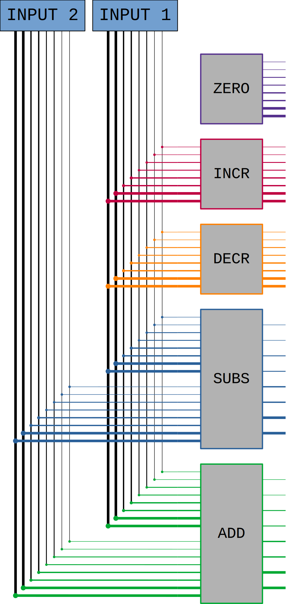
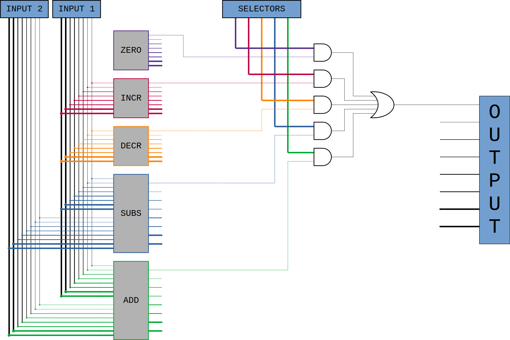
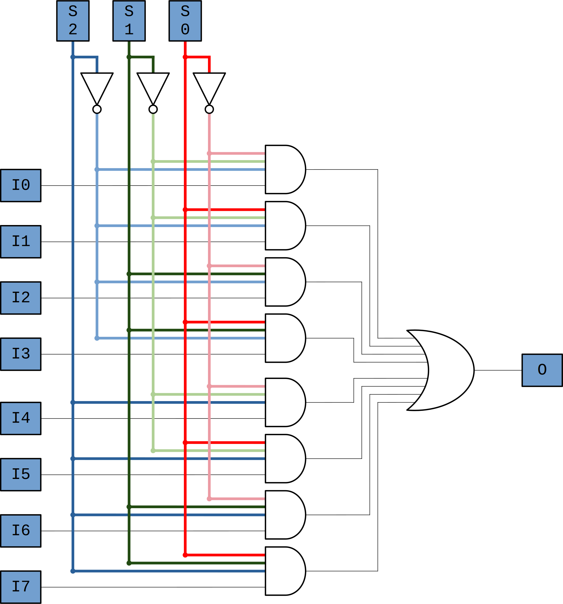
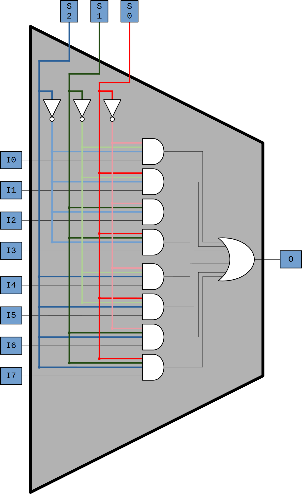
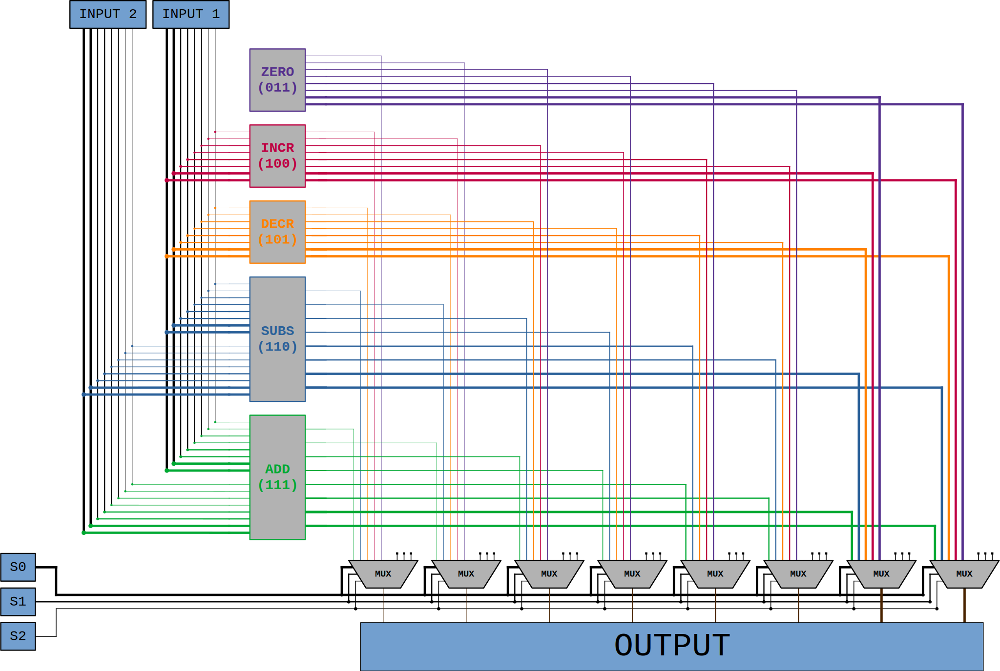
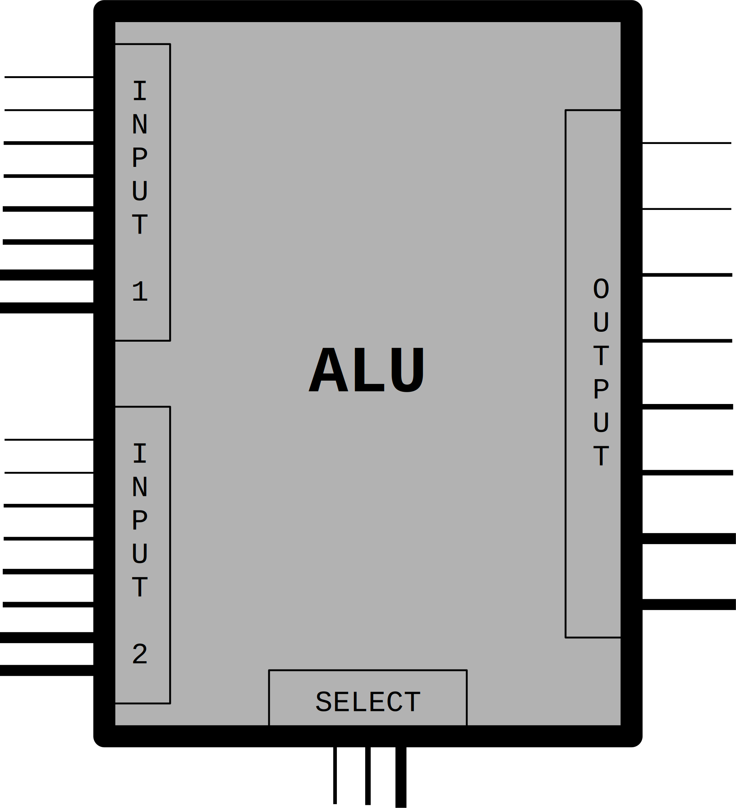

## Kollatz conjecture

1. Start with any (positive integer) number
2. If the number is odd: multiply by 3 and add 1
3. Else divide by 2
4. Repeat

Conjcecture: you always end up at 1.

### Simple C code:

> [!TIP]
> Try to write the code yourself


```C
#include <stdio.h>

int main() {
    unsigned int number;
    scanf("%u", &number);
    do {
        printf (" -> %u", number);
        if (number%2 == 1) {
            number *= 3;
            ++number;
        } else number /= 2;
    } while (number != 1);
    printf(" -> 1\n");
    return 1;
}
```

### Let's compile it
`gcc -Wall main.c`

Then we have the executable, `a.out` which looks like (`cat ./a.out`) this:
```
ELF>p@�6@8@@@�������   

                       �-�=�=X`�-�=�=�PPP ppp$$� � �   S�tdPPP P�td   ,,Q�tdR�td�-�=�=00GNU��GNU
                                                                                                z����A4�ܜ���Tг/lib64/ld-linux-x86-64.so.�e�mh '� .� "puts__libc_start_main__cxa_finalizeprintf__isoc99_scanflibc.so/u+UH�=�.H��t�P�  @�?�?�?�?�@@H�H��/H��t��H���5�/�%�/@�%�/h������%�/h������%�/h������%z/f�1�I��^H��H���PTE1�1�H�=��//�f.�@H�=�/H�z/H9�tH�/H��t   �����H�=Q/H�5J/H)�H��H��?H��H�H��tH��.H����fD�����=
             H�=�.�)����d�����.]������w���UH��H��H�E�H��H��H�Ǹ������E���H�H�Ǹ�����E�����t�U����ЉE��E����E��E���E��E���u�H�AH���[������H�H��%u -> %u -> 1(
                                                                                                                                                         ���tL����\���DE����zRx
                                                                                                                                                                              ���"zRx
                                                                                                                                                                                    $����@FJ
~                                                                                                                                                                                           �?␦;*3$"D���\�����A�C
GNUP=
��␦����o���
�
 �?Hp�  ������op���o���o^���o�=6FV @GCC: (Debian 14.2.0-19) 14.2.0��    �  ��� �3I␦(@U�=|P��=������� ����=� ��?�
                                                                                                                 Z @'8(@?�EX@e t @� �␦0@^p"�␦(@�Y���(@� �"
                                                                                                                                                          Scrt1.o__abi_tagcrtstuff.cderegister_tm_clones__do_global_dtors_auxcompleted.0__do_global_dtors_aux_fini_array_entryframe_dummy__frame_dummy_init_array_entrymain.c__FRAME_END___DYNAMIC__GNU_EH_FRAME_HDR_GLOBAL_OFFSET_TABLE___libc_start_main@GLIBC_2.34_ITM_deregisterTMCloneTableputs@GLIBC_2.2.5_edata_finiprintf@GLIBC_2.2.5__data_start__gmon_start____dso_handle_IO_stdin_used_end__bss_startmain__isoc99_scanf@GLIBC_2.7__TMC_END___ITM_registerTMCloneTable__cxa_finalize@GLIBC_2.2.5_init.symtab.strtab.shstrtab.note.gnu.property.note.gnu.build-id.interp.gnu.hash.dynsym.dynstr.gnu.version.gnu.version_r.rela.dyn.rela.plt.init.plt.got.text.fini.rodata.eh_frame_hdr.eh_frame.note.ABI-tag.init_array.fini_array.dynamic.got.plt.data.bss.comment[���c���o^^p���opp���Bpp��  @�ppl���    �  �  ,�@ @ �� �  ������=�-��?���?�@0
                                                                                                                           (@(0(0H0�    �3
```

A bit "nicer" with a hexdump (`hexdump -C ./a.out`):
```
00000000  7f 45 4c 46 02 01 01 00  00 00 00 00 00 00 00 00  |.ELF............|
00000010  03 00 3e 00 01 00 00 00  70 10 00 00 00 00 00 00  |..>.....p.......|
00000020  40 00 00 00 00 00 00 00  f8 36 00 00 00 00 00 00  |@........6......|
00000030  00 00 00 00 40 00 38 00  0e 00 40 00 1f 00 1e 00  |....@.8...@.....|
00000040  06 00 00 00 04 00 00 00  40 00 00 00 00 00 00 00  |........@.......|
00000050  40 00 00 00 00 00 00 00  40 00 00 00 00 00 00 00  |@.......@.......|
00000060  10 03 00 00 00 00 00 00  10 03 00 00 00 00 00 00  |................|
00000070  08 00 00 00 00 00 00 00  03 00 00 00 04 00 00 00  |................|
00000080  94 03 00 00 00 00 00 00  94 03 00 00 00 00 00 00  |................|
00000090  94 03 00 00 00 00 00 00  1c 00 00 00 00 00 00 00  |................|
000000a0  1c 00 00 00 00 00 00 00  01 00 00 00 00 00 00 00  |................|
000000b0  01 00 00 00 04 00 00 00  00 00 00 00 00 00 00 00  |................|
000000c0  00 00 00 00 00 00 00 00  00 00 00 00 00 00 00 00  |................|
000000d0  b8 06 00 00 00 00 00 00  b8 06 00 00 00 00 00 00  |................|
000000e0  00 10 00 00 00 00 00 00  01 00 00 00 05 00 00 00  |................|
000000f0  00 10 00 00 00 00 00 00  00 10 00 00 00 00 00 00  |................|
00000100  00 10 00 00 00 00 00 00  e5 01 00 00 00 00 00 00  |................|
00000110  e5 01 00 00 00 00 00 00  00 10 00 00 00 00 00 00  |................|
00000120  01 00 00 00 04 00 00 00  00 20 00 00 00 00 00 00  |......... ......|
00000130  00 20 00 00 00 00 00 00  00 20 00 00 00 00 00 00  |. ....... ......|
00000140  0c 01 00 00 00 00 00 00  0c 01 00 00 00 00 00 00  |................|
00000150  00 10 00 00 00 00 00 00  01 00 00 00 06 00 00 00  |................|
00000160  d0 2d 00 00 00 00 00 00  d0 3d 00 00 00 00 00 00  |.-.......=......|
00000170  d0 3d 00 00 00 00 00 00  58 02 00 00 00 00 00 00  |.=......X.......|
...
```
... and plenty more lines. 
The famous `1`s and `0`s that the computer understands.

### But how do we get here?

Now compile it like this: `gcc -Wall --save-temps main.c`, which will generate additional files:

[`a-main.i`](Kollatz/a-main.i) still looks like a C code, and it actually is. 
Our code starts at line 813, copied verbatim.
All the stuff before that is actually `stdio.h`, which contains a lot of declarations, e.g., `printf` is in line 478.

From this, the compiler builds an Abstract Syntax Tree (-> Algorithmen und Datenstrukturen @ Semester 2) based on the formal grammar of C (-> Theoretische Informatik @ Semester 4) and produces an assembler(-like) code in `a-main.s`: 

```assembly
    .file   "main.c"
    .text
    .section    .rodata
.LC0:
    .string "%u"
.LC1:
    .string " -> %u"
.LC2:
    .string " -> 1"
    .text
    .globl  main
    .type   main, @function
main:
.LFB0:
    .cfi_startproc
    pushq   %rbp
    .cfi_def_cfa_offset 16
    .cfi_offset 6, -16
    movq    %rsp, %rbp
    .cfi_def_cfa_register 6
    subq    $16, %rsp
    leaq    -4(%rbp), %rax
    movq    %rax, %rsi
    leaq    .LC0(%rip), %rax
    movq    %rax, %rdi
    movl    $0, %eax
    call    __isoc99_scanf@PLT
.L4:
    movl    -4(%rbp), %eax
    movl    %eax, %esi
    leaq    .LC1(%rip), %rax
    movq    %rax, %rdi
    movl    $0, %eax
    call    printf@PLT
    movl    -4(%rbp), %eax
    andl    $1, %eax
    testl   %eax, %eax
    je  .L2
    movl    -4(%rbp), %edx
    movl    %edx, %eax
    addl    %eax, %eax
    addl    %edx, %eax
    movl    %eax, -4(%rbp)
    movl    -4(%rbp), %eax
    addl    $1, %eax
    movl    %eax, -4(%rbp)
    jmp .L3
.L2:
    movl    -4(%rbp), %eax
    shrl    %eax
    movl    %eax, -4(%rbp)
.L3:
    movl    -4(%rbp), %eax
    cmpl    $1, %eax
    jne .L4
    leaq    .LC2(%rip), %rax
    movq    %rax, %rdi
    call    puts@PLT
    movl    $1, %eax
    leave
    .cfi_def_cfa 7, 8
    ret
    .cfi_endproc
.LFE0:
    .size   main, .-main
    .ident  "GCC: (Debian 14.2.0-19) 14.2.0"
    .section    .note.GNU-stack,"",@progbits
```
These are already simple, CPU level instructions for x86 architecture.
For example, these original lines:

```C
number *= 3;
++number;
```

Are here:

```assembly
    movl    -4(%rbp), %edx
    movl    %edx, %eax
    addl    %eax, %eax
    addl    %edx, %eax
    movl    %eax, -4(%rbp)
    movl    -4(%rbp), %eax
    addl    $1, %eax
    movl    %eax, -4(%rbp)
```

 - `movl source, destination` copies (32 bit) of data from `source` to `destination`.
 - `addl source, destination` adds the value of the`source` to the value of `destination` and stores it at the `destination`
 - `edx` and `eax` are 32 bit registers in the CPU. 
 - `rbp` is also a local register that typically stores the address of the stack, `-4(%rbp)` is just the address of `number` in the memory (RAM) in this case.
 - `$1` is just the literal value 1 (instead of memory address)

> [!TIP]
> Discuss, research what registers, and CPU caches are. 

> [!TIP]
> Execute these instructions yourself and think about if you could make it more efficient.


How about this?
```assembly
    movl    -4(%rbp), %edx
    movl    %edx, %eax
    addl    %eax, %eax
    addl    %edx, %eax
    addl    $1, %eax
    movl    %eax, -4(%rbp)
```
or even something like this:
```assembly
    movl    -4(%rbp), %eax
    imull   $3, %eax
    incl    %eax
    movl    %eax, -4(%rbp)
```

`incl` is just another CPU instruction increasing the value by 1, and `imull` is just multiplying. 

> [!Note]
> Try to research it, which one is faster, on which CPU (architecture)s they should work, CISC vs. RISC, etc.

Anyhow, we will stick with this middle ground:
```assembly
    movl    -4(%rbp), %edx
    movl    %edx, %eax
    addl    %eax, %eax
    addl    %edx, %eax
    incl    %eax
    movl    %eax, -4(%rbp)
```

So, how will get these to numbers? 
Well, each register has a 3-bit identifier, and each instruction has an opcode.
For example:

| register name | identifier in binary |
| --- | --- |
| eax | 000 |
| ecx | 001 |
| edx | 010 |
| ebx | 011 |
| ... | ... |

Instructions have their opcode as well, which is similar, but longer:

| instruction name | opcode in hex | binary opcode |
| --- | --- | --- |
| `movl`  | `0x89` | `10001001` |
| `addl`  | `0x01` | `00000001` |
| `incl`  | `0xFF /0` | `11111111` |
| `imull` | `0x0F` | `00001111` |

> [!Important]
> Life is not that easy unfortunately, [real construction of commands](https://www-user.tu-chemnitz.de/~heha/hs/chm/x86.chm/x86.htm) is way more complex, take everything here just as a "showcase" not exact specification.


So we just need to put all these next to each other, for example, the `addl %edx, %eax` line:

| assembly code | binary |
| --- | --- | 
| `addl` | `00000001` |
| register-to-register ModR/M code | `11` |
| `%edx` | `010` |
| `%edx` | `000` |

The endresult is `00000001 110100000` or `0xc0`.

# Design our own CPU

Let us try to design our very own simple CPU/Machine. 
We want compilers to be able to export such assembly codes, that can be run on our hardware.

But let us simplify our lives a bit (a lot actually):
 - 4 registers. Let them be called `dartagnan`, `athos`, `portos`, `aramis`. We will use `dar`, `ath`, `por` and `ara` for short and they will be identified by `00`, `01`, `10` and `11`, respectively. 
 - Each register is just 1 byte, and the only type we consider is `uint8_t`, i.e., 8-bit unsigned integer, i.e., `unsigned char`. 
 - We won't address more than 32 bytes of RAM (i.e., 5 bit addresses).
 - We will have only the instructions below (for now) with 3 bit opcodes:
  
| Instruction name & operands | What does it do? | Binary opcode |
| --- | --- | --- | 
| `load ADDR` | loads the `ADDR`th byte from the RAM to `dar` | `000` |
| `save ADDR` | saves `dar` to the `ADDR`th byte of RAM | `001` |
| `move reg1 reg2` | overwrites `reg2` with the value of `reg1` | `010` |
| `zero reg` | sets the value `0` in `reg` | `011` |
| `incr reg` | increases the value in register `reg` by 1 | `100` |
| `decr reg` | decreases the value in register `reg` by 1 | `101` |
| `subs reg1 reg2` | decreses the value of `reg2` by the value of `reg1` | `110` |
| `add reg1 reg2` | increases the value of `reg2` by the value of `reg1` | `111` |


Having these, all instructions fit into 1 byte, for example:

| Example instruction | Binary instruction | Segments of binary | Explanation |
| --- | --- | --- | --- |
| `load 31` | `000011111` | `000 011111` | `000` (`load`) + `011111` (31 in binary) |
| `move dar ath` | `01000010` | `010 00 01 0` | `010` (`move`) + `00` (`dartagnan`) + `01` (`athos`) + `0` (just filling) |
| `decr por` | `10110000` | `101 10 000` | `101` (`decr`) + `10` (`porthos`) + `000` (fill) |

> [!Warning]
> Try to figure out an important limitation of this system (besides the obvious ones).

While this seems, really basic, surprisingly many things could be done with very "small scale" computers. 
The Apollo Guidance Computer used 16-bit words, 34 basic instructions and 2KB of RAM, and managed to do a pretty good job. 
Also, [everything is just a fancy Turing Machine anyways](https://en.wikipedia.org/wiki/Church%E2%80%93Turing_thesis).

> [!Tip]
> If we were to move to a "CISC" processor from this "RISC" one, and include a `mul` operation, which one would you ditch to still use only 3-bit opcodes?

So, the very important limitation of this instruction set is the absence of any conditional jumps, so we can only have sequences, no iterations or branching. (Technically... we could overwrite the code in the RAM, but let's not go there.)


## Let the realization begin - arithmetic instructions

The easiest thing to grasp is the arithmetic operations, `add`, `subs`, `incr`, `decr` and `zero`.

> [!TIP] 
> Build all these IC-s  on [this site](http://opencircuits.io)

Let's do `add` together. 
In elementary school, we have learned, how to do the addition of multiple digit numbers: start with the ones, add them together, write down the results, then, if there is a carry, add it to the tens, where the same thing is repeated.
We will do the same, but instead of digits, we have bits, as we work in binary. 
The one bit full adder does exactly what we did on paper in decimal as children: adds two bits and the carry together to determine the result and the carry.
This could simply be done with 2 XOR, 2 AND, and one OR gate.



Making a circuit out of this, we get an IC that has 3 inputs (`C`, `I1`, `I2`) and 2 outputs (`O` and `Carry`). 

> [!Note]
> This is similar to writing functions in a programming language. 
> From the caller point of view, only the inputs (input pins) and outputs (output) pins are interesting. How exactly the function body (logical gate network) looks like, doesn't matter.
> We wrote (built) it once, tested it, trust that it works, and now we can continue building (more-or-less) on a higher level of abstraction.

Using 8 of these, it is pretty simple to just make an 8 bit adder:


`subsr` is a similarly good excercise, the others are much simpler to implement.
Let us assume that we have done this, and now we have these IC-s ready:



To avoid much clutter, instead of writing labels on pins, thicker ones indicate the more signifiant bits for each input/output. 
Naturally, `incr` and `decr` have only one input, and `zero` does not actually need an input.

The key conclusion is that we can build ICs that perform the arithmetic operations that appear in the instructions set of our machine. 

## Ok, but which one to execute?

As of now, we have 5 arithmetic operations, and assuming we have the inputs and the outputs somewhere, we can connext them to any of these, and perform the corresponding operation. 
However, which operation to perform should be programmable, i.e., similar to the input pins for the numbers, the selection of the arithmetic operation / IC should be possible with several input pins.

For now, let us assume, that we have 5 input pins, each corresponding to one operation, and we know that always only one of them is true, and can be used for selection.

So, the setup is something like this:



For now, we used different colors for the different operations.

> [!TIP] 
> Try to figure out yourself, how to connect the pins so that selector pins *control* which operation is executed.

The idea is, that we let all of the ICs work *in parallel* and then select which output we want to use.
So first, connect all the inputs to all of the gates:



Now, let us only focus on the least significant bit. 
We want to *disregard* the value from the non-selected ICs, and keep the value for the selected one. 
This can simply be done by ANDing those outputs with the respective selector inputs. 
In this case, *disregarding* means, that the output of an unselected IC will be just 0. 
Now, if we OR these values together, we just get the output of the selected IC:



Now we just have to do this 8 times... 
Now, that would get ugly pretty fast, so we do two things first.
If we look at this set of gates:


This is basically a selector for 5 inputs with 5 control signals (as inputs).
We could make a circuit out of this, but before doing that, let us observe, that if we want to select from 5 inputs, 3 input signals are enough as 2^3 >= 5.
We don't need 5 separate signals, 3 is enough, as 3 bits can encode 5 different options, or even 8. 
Obviously, some gates will be needed to do that: 



This circuit has 11 inputs and 1 output. 
3 input pins are used to select from the other 8 inputs.
The colors here are assigned to the selector bits, darker hues for the `1` value, and lighter for the `0` value. 
The AND gates correspond to the `000`, `001`, ..., `111` inputs on the selector pins. (`S0` being the least significant bit.)

We use the magic of *boxing things together* just as we did with the `ADD`, `SUBS`, etc., circuits:



Now, we used a trapezoid instead of a rectangle, because this is a common circuit called a **multiplexer** of often just **MUX**, which is usually represented with such a shape.

Now we can go back and use a MUX for all of the output bits in our ALU. 



The lowest 3 inputs of each MUX is unused, as there is no arithmetic instruction assigned to `000`, `001` and `010`.

Remember that each gray shape here contains its own network, and using them as a building block, we again ended up with something more complex. 
Which we don't want to draw ever again, so... replace it with a gray box, and lets name it **ALU** (Arithmetic Logical Unit):



## But... which input to chose? 

=> Again, a MUX

## And where does the output go? 

=> Demux

## Now, let's do the registers

=> SR flip-flop, gates, transistors, and whatnot (https://www.build-electronic-circuits.com/d-latch/)
=> D flip-flop

https://www.build-electronic-circuits.com/how-transistors-work/

https://www.allaboutelectronics.org/cmos-logic-gates-explained/

https://www.wevolver.com/article/how-do-mosfets-work


