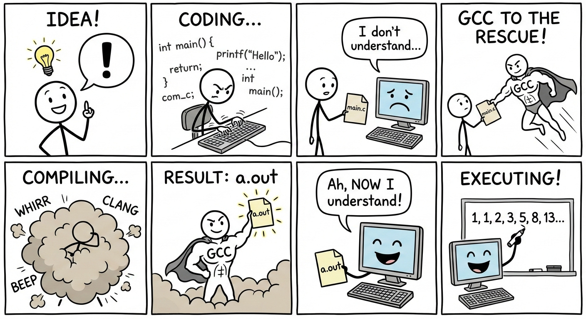
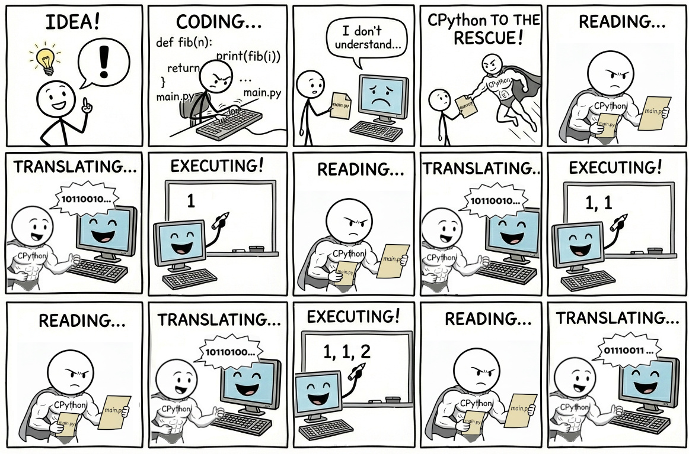

# Python Grundlagen

## Prolog 
(Nicht [dieser Prolog](https://de.wikipedia.org/wiki/Prolog_(Programmiersprache)))

### 💬 Was ist Python?

Eine andere Programmiersprache. 

### 💬 Warum lernen wir Python?

Weil C nicht sehr geeignet für objektorientierte Programmierung ist. 

### 💬 Was ist objektorientierte Programmierung?

Wir werden alle Klassen in diesem Semester brauchen, um diese Frage (teilweise) beantworten zu können. 
Aber kurzgesagt🐦: ein Stil, wie man den Code schreiben und strukturieren kann. 

### 💬 Und ist dieser Stil in C nicht möglich?

Es ist (z.B. [GTK](https://www.gtk.org/)), aber die Sprache unterstützt diesen Stil nicht (sehr).
Man kann mit einem Motorsäge Brot schneiden, aber... 

### 💬 Ist dieser Stil wichtig? 

Ja, der objektorientierte Stil ist sehr wichtig. 
Aber der richtige Begriff ist nicht *Stil*, sondern *Paradigma*. 
Wir werden von nun das verwenden, und die Abkürzung OO für Objektorientierte [Paradigma]. 

### 💬 Warum ist das objektorientierte Paradigma wichtig?

Dieses Paradigma ist (stand heute) dasjenige, das zuverlässig für große, komplexe Systeme verwendet werden kann. 

### 💬 Ich habe es gelesen, dass "OO is dead" und dass man heute das funktionale Paradigma lernen sollte.

Du wirst sehen, dass es in diesem Bereich viele heiße Debatten gibt, wie zum Beispiel OO gegen FP. 
Funktionale Programmierung und ihre Ideen sind heutzutage sehr populär und genutzt, aber fast alle großen Softwares sind tatsächlich in OO geschrieben. 

Allerdings sind Paradigmen nicht exklusiv.
Eine Programmiersprache kann sozusagen eine Multi-Paradigma-Sprache sein.

### 💬 So wie Python?

Genau, Python unterstützt objektorientierte, funktional und prozedural. 

### 💬 Prozedural?

Was du schon mit C gelernt hast. 

### 💬 Und sind diese drei alle Paradigmen, die es gibt? 

Nein, gibt es andere, z. B. [dieser Prolog](https://de.wikipedia.org/wiki/Prolog_(Programmiersprache)) unterstützt logische Programmierung. 

Aber das ist nicht wirklich wichtig für uns jetzt, was wichtiger ist:

## Python ist eine interpretierte Sprache

### 💬 Interpretierte Sprache?

Als wir in der Klasse "Grundlage der Informatik" [gelernt haben](../../Misc/2025_11_05_GDI_Flipflops_CPU/notes.md) gelernt haben, dass der Computer Machinencode benötigt, um ausgeführt werden zu können. 
Wir haben gesehen, wie ein C-code in Machinencode umgewandelt wird.
Dieser Prozess heißt Kompilierung, und das Program, das dies macht, nennt man Compiler.


(Kannst du den versteckten Witz finden?)

Was bei C passiert ist, dass der gesammte Code zuerst umgewandelt wird, und dann kann die Binärdatei selbst ausgeführt werden.
Bei interpretierten Sprachen ist der Process anders: ein anderes Programm, der sogenannte Interpreter, liest den (z.B. Python) Code Zeile für Zeile, und gibt dem Computer dieselben Anweisungen in Machinencode.



> [!NOTE]
> Eine Sprache selbst ist nicht wirklich kompiliert oder interpretiert. 
> Zum Beispiel, man könnte auch ein Programm schreiben, das C-Code interpretieren kann. 
> Aber diese Bezeichnungen werden oft verwendet, weil eine Sprache meistens nur auf eine Weise genutzt wird.

### 💬 Was ist CPython? Ist es C oder Python or beides?

CPython ist ein Programm, das Python-Code interpretieren kann.
Dieses Programm ist in C geschrieben und kann kompiliert werden, z.B. mit GCC.

> [!NOTE]
> Es ist ein interessantes Gedankenexperiment, darüber nachzudenken, wie GCC erstellt wurde. 

### 💬 Dieses Prozess scheint viel komplizierter zu sein, was ist der Vorteil?

Es gibt viele allgemeine Unterschiede zwischen kompilierten und interpretierten Sprachen.
In dieser Tabelle gibt es einige, die meistens zutreffen:

| | Kompilierte Sprachen | Interpretierte Sprachen |
| --- | --- | --- |
| Beispiele | C, C++, C#, Rust, Java, Go, ... | JS, Python, PHP, perl, ... |
| Schwierigkeit beim Lernen für Anfänger | 😫 schwieriger | 🙂 einfacher  | 
| Typsystem | 🔒 statisch | 🔓 dynamisch |
| Erkennung des syntaktischen Fehlers | sofort bei Kompilierung | später bei der Ausführung |
| Effizienz | 🐇 schneller | 🐢 langsamer |
| Interaktive Programmierung | ❌ Nein | ✅ Ja |  

### 💬 Ich habe viele Fragen... zuerst: Was ist interaktive programmierung?

Weil der Interpreter den Code Zeile für Zeile ausführt, kann der Programmierer den Code auch Zeile für Zeile and den Interpreter übergeben und die Ausgabe jederzeit ansehen. 
Es gibt also zwei verschiedene Wege, wie ein Interpreter benutzt werden kann: 

1. Den ganzen Code in einer Datei schreiben, und dann die Datei an den Interpreter übergeben, der ihn ausführt.
2. Den Interpreter starten und dann einen Dialog mit ihm führen.

Der erste Weg ist ähnlich wie die Arbeit mit C. 
Der zweite ist neu und wird oft als REPL abgekürzt. 

### 💬 REPL?

Steht für Read-Evaluate-Print-Loop. 
Jedes Mal, wenn der Programmierer eine Anweisung gibt, 
 - **R**ead: liest der Interpreter sie
 - **E**valuate: führt sie aus
 - **P**rint: schreibt dann die Ausgabe
 - **L**oop: und dieser Prozess ist wiederholt.

### 💬 Wie sieht das aus?

Öffne ein Terminal, gib `python3` (oder `python` für Windows) ein und drücke die Eingabetaste.
Du solltest etwas wie das hier sehen:

```
$ python3
Python 3.13.5 (main, Jun 25 2025, 18:55:22) [GCC 14.2.0] on linux
Type "help", "copyright", "credits" or "license" for more information.
>>> 
```
Der Interpreter läuft und `>>>` zeigt an, dass er eine Anweisung erwartet. 
Wir werden gleich lernen, welche Anweisungen Python akzeptieren kann, aber jetzt veruche, diese einzugeben:
 - `3+5`
 - `x = 10`
 - `x*5`
 - `int x = 3;`
 - `1+1`

Du solltest etwas wie das hier sehen:
```
$ python3
Python 3.13.5 (main, Jun 25 2025, 18:55:22) [GCC 14.2.0] on linux
Type "help", "copyright", "credits" or "license" for more information.
>>> 3+5
8
>>> x = 10
>>> x*5
50
>>> int x = 3;
  File "<python-input-3>", line 1
    int x;
        ^
SyntaxError: invalid syntax
>>> 1+1
2
>>>
```

Die vierte anweisung führt zu einem syntaktischen Fehler, weil `int x = 3;` C-Code und kein Python ist. 
Der Fehler wird erklärt, aber danach können wir mit einer anderen Anweisung fortfahren.

### 💬 Ist das so, wie wir Python benutzen werden?

Nein, meistens werden wir den ersten Weg benutzen. 

### 💬 Dann warum lernen wir über REPL?!

REPL ist sehr nützlich und praktisch, wenn du etwas schnell ausprobieren möchtest. 
Es ist nicht nötig, eine ganze Quelldatei zu erstellen - öffne einfach schnell ein Terminal, gib den Code in und sieh, ob es (wie beabsichtigt) funktioniert oder nicht.

> [!TIP]
> Es ist gut, während des PRogrammierens eine REPL immer geöffnet zu haben, damit sie immer griffbereit ist. 

> [!NOTE]
> Es gibt andere Situationen, in denen eine REPL sehr nützlich ist, und die von Dataanalysten verwendeten [Jupyter Notebooks](https://jupyter.org/) nutzen eine ähnliche Methodologie.

### 💬 Gut... Und warum ist Python langsamer als C, und was ist ein statisches/dynammisches Typsystem?

Beide Fragen können leichter beantwortet werden, wenn wir schon ein bisschen Python kennen, also:

## Python erste Schritte

Es wäre unorthodox, nicht mit "Hello World" zu beginnen:

<table><tr><th>C</th><th>Python</th></tr><tr><td>

```c
#include <stdio.h>

int main() {
    printf("Hello World!\n");
    return 0;
}
```

</td><td>

```python
print("Hello World!")
```

</td></tr></table>

Einige Notizen:

 - Keine Semikolon.
 - `print('Hello World!')` passt auch. In Python können sowohl `'` als auch `"` verwendet werden, um ein Stringliteral zu erstellen. Aber sei einfach konsequent. `"` und `'` willkürlich gemischt im selben Code zu verwenden, ist ein absolutes No-Go.

> [!Important] 
> `'a'` ist dasselbe wie `"a"`, also kein einzelnes Zeichen sondern ein String. Python hat keinen Zeichentyp nur Strings.

 - `print` in Python fügt automatisch einen Zeilenumbruch hinzu. Falls man das nicht möchte, sollte man `print("Hello World!", end="")` verwenden.
 - Keine `main`-Funktion erforderlich. Der Interpreter führt einfach die Anweisungen in der Quelldatei aus.

### 💬 Kann `print` auch eine Variable ausgeben?

Natürlich:

<table><tr><th>C</th><th>Python</th></tr><tr><td>

```c
#include <stdio.h>

int main() {
    int number = 3;
    printf("%d\n", number);
    return 0;
}
```

</td><td>

```python
number = 3
print(number)
```

</td></tr></table>

### 💬  `printf` konnte mehrere Variablen gemeinsam mit Formattierung ausgeben. Kann `print` in Python das auch?

Ja genau: 

<table><tr><th>C</th><th>Python</th></tr><tr><td>

```c
#include <stdio.h>

int main() {
    int num1 = 3;
    int num2 = 5;
    printf("%d plus %d ist %d.\n", num1, num2, num1 + num2);
    return 0;
}
```

</td><td>

```python
num1 = 3
num2 = 5

# Option 1
print("%d plus %d ist %d." % (num1, num2, num1 + num2))

# Option 2
print(f"{num1} plus {num2} ist {num1+num2}.")
```
</td></tr></table>

 - Option 2 ist viel einfacher als Option 1, daher werden wir immer sie verwenden. 
 - Option 1 wird nur erwähnt, weil es `printf` aus C sehr ähnlich ist. 
 - Option 2 heißt f-String. Beachte das `f` vor dem öffnenden `"`. Fehlt es, wäre die Ausgabe `{num1} plus {num2} ist {num1+num2}.` statt `3 plus 5 ist 8.`.

### 💬  Immer 3 und 5 zu addieren ist langweilig. Wie kann ich Werte vom Benutzer abfragen?

Ganz einfach:

<table><tr><th>C</th><th>Python</th></tr><tr><td>

```c
#include <stdio.h>

int main() {
    int num;
    printf("Bitte eine ganzen Zahl eingeben: ");
    scanf("%d", &num);
    printf("Deine Zahl: %d\n", num);
    return 0;
}
```

</td><td>

```python
num = input("Bitte eine ganzen Zahl eingeben: ")
print(f"Deine Zahl: {num}")
```
</td></tr></table>

> [!TIP]
> Versuche, selbst ein Addierer-Programm in Python zu schreiben.

Deine erste Lösung sieht vielleicht so aus:

```python
num1 = input("Bitte die ersete Zahl eingeben: ")
num2 = input("Bitte die zweite Zahl eingeben: ")
print(f"{num1} + {num2} = {num1+num2}")
```

Fast  korrekt, aber bei der Ausführung sieht etwas falsch aus:

```
$ python3 adder.py
Bitte die ersete Zahl eingeben: 3
Bitte die zweite Zahl eingeben: 5
3 + 5 = 35
$
```
Etwas ist verdächtig.

> [!TIP]
> Falls etwas fehlerhaft läuft, ist es immer eine gute Idee, mit mehreren Eingaben zu testen.
> So kann man einfacher herausfinden, was das Problem ist.

```
$ python3 adder.py
Bitte die ersete Zahl eingeben: 1
Bitte die zweite Zahl eingeben: 1
1 + 1=11
$ python3 adder.py
Bitte die ersete Zahl eingeben: 1
Bitte die zweite Zahl eingeben: -1
1 + -1 = 1-1
$ python3 adder.py
Bitte die ersete Zahl eingeben: 3.14
Bitte die zweite Zahl eingeben: 3.14
3.14 + 3.14 = 3.143.14
$ python3 adder.py
Bitte die ersete Zahl eingeben: eins
Bitte die zweite Zahl eingeben: zwei
eins + zwei = einszwei
$ python3 adder.py
Bitte die ersete Zahl eingeben: ab
Bitte die zweite Zahl eingeben: er
ab + er = aber
$ python3 adder.py
Bitte die ersete Zahl eingeben: 2*2
Bitte die zweite Zahl eingeben: drei
2*2 + drei = 2*2drei
$
```

Ich hoffe, dass du schon ungefähr weißt, was hier passiert. 
Um die Situation vollständig zu verstehen, sollten wir über den Elefant im Raum sprechen:

## Typen in Python


