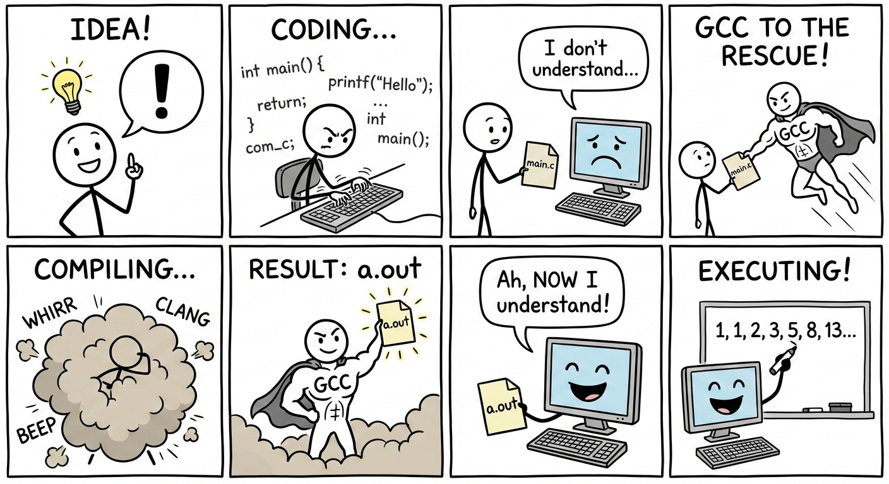
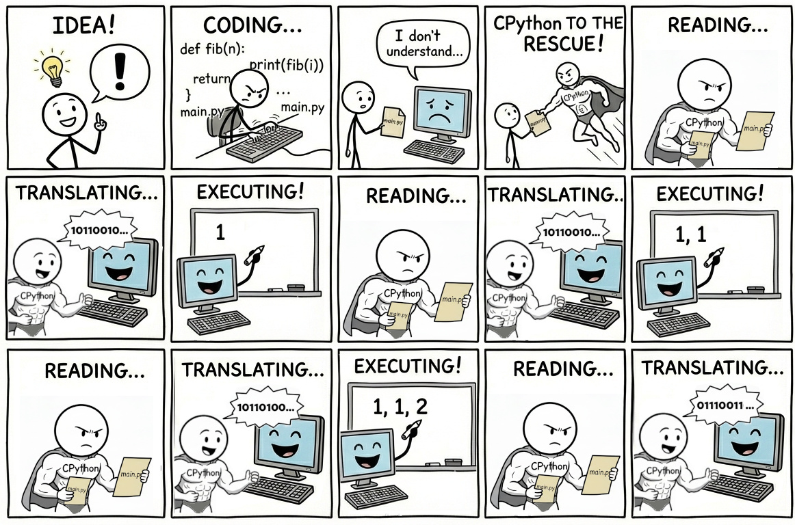

# Python Grundlagen

## Prolog 
(Nicht [dieser Prolog](https://de.wikipedia.org/wiki/Prolog_(Programmiersprache)))

### 💬 Was ist Python?

Eine andere Programmiersprache. 

### 💬 Warum lernen wir Python?

Weil C nicht sehr geeignet für objektorientierte Programmierung ist. 

### 💬 Was ist objektorientierte Programmierung?

Wir werden alle Klassen in diesem Semester brauchen, um diese Frage (teilweise) beantworten zu können. 
Aber kurzgesagt🐦: ein Stil, wie man den Code schreiben und strukturieren kann. 

### 💬 Und ist dieser Stil in C nicht möglich?

Es ist (z.B. [GTK](https://www.gtk.org/)), aber die Sprache unterstützt diesen Stil nicht (sehr).
Man kann mit einem Motorsäge Brot schneiden, aber... 

### 💬 Ist dieser Stil wichtig? 

Ja, der objektorientierte Stil ist sehr wichtig. 
Aber der richtige Begriff ist nicht *Stil*, sondern *Paradigma*. 
Wir werden von nun das verwenden, und die Abkürzung OO für Objektorientierte [Paradigma]. 

### 💬 Warum ist das objektorientierte Paradigma wichtig?

Dieses Paradigma ist (stand heute) dasjenige, das zuverlässig für große, komplexe Systeme verwendet werden kann. 

### 💬 Ich habe es gelesen, dass "OO is dead" und dass man heute das funktionale Paradigma lernen sollte.

Du wirst sehen, dass es in diesem Bereich viele heiße Debatten gibt, wie zum Beispiel OO gegen FP. 
Funktionale Programmierung und ihre Ideen sind heutzutage sehr populär und genutzt, aber fast alle großen Softwares sind tatsächlich in OO geschrieben. 

Allerdings sind Paradigmen nicht exklusiv.
Eine Programmiersprache kann sozusagen eine Multi-Paradigma-Sprache sein.

### 💬 So wie Python?

Genau, Python unterstützt objektorientierte, funktional und prozedural. 

### 💬 Prozedural?

Was du schon mit C gelernt hast. 

### 💬 Und sind diese drei alle Paradigmen, die es gibt? 

Nein, gibt es andere, z. B. [dieser Prolog](https://de.wikipedia.org/wiki/Prolog_(Programmiersprache)) unterstützt logische Programmierung. 

Aber das ist nicht wirklich wichtig für uns jetzt, was wichtiger ist:

## Python ist eine interpretierte Sprache

### 💬 Interpretierte Sprache?

Wie wir in der Klasse "Grundlage der Informatik" [gelernt haben](../../Misc/2025_11_05_GDI_Flipflops_CPU/notes.md), der Computer benötigt Machinencode, um ausgeführt werden zu können. 
Wir haben gesehen, wie ein C-code in Machinencode umgewandelt wird.
Dieser Prozess heißt Kompilierung, und das Program, das dies macht, nennt man Compiler.


(Kannst du den versteckten Witz finden?)

Was bei C passiert ist, dass der gesammte Code zuerst umgewandelt wird, und dann kann die Binärdatei selbst ausgeführt werden.
Bei interpretierten Sprachen ist der Process anders: ein anderes Programm, der sogenannte Interpreter, liest den (z.B. Python) Code Zeile für Zeile, und gibt dem Computer dieselben Anweisungen in Machinencode.



> [!NOTE]
> Eine Sprache selbst ist nicht wirklich kompiliert oder interpretiert. 
> Zum Beispiel, man könnte auch ein Programm schreiben, das C-Code interpretieren kann. 
> Aber diese Bezeichnungen werden oft verwendet, weil eine Sprache meistens nur auf eine Weise genutzt wird.

### 💬 Was ist CPython? Ist es C oder Python or beides?

CPython ist ein Programm, das Python-Code interpretieren kann.
Dieses Programm ist in C geschrieben und kann kompiliert werden, z.B. mit GCC.

> [!NOTE]
> Es ist ein interessantes Gedankenexperiment, darüber nachzudenken, wie GCC erstellt wurde. 

### 💬 Dieses Prozess scheint viel komplizierter zu sein, was ist der Vorteil?

Es gibt viele allgemeine Unterschiede zwischen kompilierten und interpretierten Sprachen.
In dieser Tabelle gibt es einige, die meistens zutreffen:

| | Kompilierte Sprachen | Interpretierte Sprachen |
| --- | --- | --- |
| Beispiele | C, C++, C#, Rust, Java, Go, ... | JS, Python, PHP, perl, ... |
| Schwierigkeit beim Lernen für Anfänger | 😫 schwieriger | 🙂 einfacher  | 
| Typsystem | 🔒 statisch | 🔓 dynamisch |
| Erkennung des syntaktischen Fehlers | sofort bei Kompilierung | später bei der Ausführung |
| Effizienz | 🐇 schneller | 🐢 langsamer |
| Interaktive Programmierung | ❌ Nein | ✅ Ja |  

### 💬 Ich habe viele Fragen... zuerst: Was ist interaktive programmierung?

Weil der Interpreter den Code Zeile für Zeile ausführt, kann der Programmierer den Code auch Zeile für Zeile and den Interpreter übergeben und die Ausgabe jederzeit ansehen. 
Es gibt also zwei verschiedene Wege, wie ein Interpreter benutzt werden kann: 

1. Den ganzen Code in einer Datei schreiben, und dann die Datei an den Interpreter übergeben, der ihn ausführt.
2. Den Interpreter starten und dann einen Dialog mit ihm führen.

Der erste Weg ist ähnlich wie die Arbeit mit C. 
Der zweite ist neu und wird oft als REPL abgekürzt. 

### 💬 REPL?

Steht für Read-Evaluate-Print-Loop. 
Jedes Mal, wenn der Programmierer eine Anweisung gibt, 
 - **R**ead: liest der Interpreter sie
 - **E**valuate: führt sie aus
 - **P**rint: schreibt dann die Ausgabe
 - **L**oop: und dieser Prozess ist wiederholt.

### 💬 Wie sieht das aus?

Öffne ein Terminal, gib `python3` (oder `python` für Windows) ein und drücke <kbd>Enter</kbd>.
Du solltest etwas wie das hier sehen:

```
$ python3
Python 3.13.5 (main, Jun 25 2025, 18:55:22) [GCC 14.2.0] on linux
Type "help", "copyright", "credits" or "license" for more information.
>>> 
```
Der Interpreter läuft und `>>>` zeigt an, dass er eine Anweisung erwartet. 
Wir werden gleich lernen, welche Anweisungen Python akzeptieren kann, aber jetzt veruche, diese einzugeben:
 - `3+5`
 - `x = 10`
 - `x*5`
 - `int x = 3;`
 - `1+1`

Du solltest etwas wie das hier sehen:
```
$ python3
Python 3.13.5 (main, Jun 25 2025, 18:55:22) [GCC 14.2.0] on linux
Type "help", "copyright", "credits" or "license" for more information.
>>> 3+5
8
>>> x = 10
>>> x*5
50
>>> int x = 3;
  File "<python-input-3>", line 1
    int x;
        ^
SyntaxError: invalid syntax
>>> 1+1
2
>>>
```

Die vierte Anweisung führt zu einem syntaktischen Fehler, weil `int x = 3;` C-Code und kein Python ist. 
Der Fehler wird erklärt, aber danach können wir mit einer anderen Anweisung fortfahren.

### 💬 Ist das so, wie wir Python benutzen werden?

Nein, meistens werden wir den ersten Weg benutzen. 

### 💬 Dann warum lernen wir über REPL?!

REPL ist sehr nützlich und praktisch, wenn du etwas schnell ausprobieren möchtest. 
Es ist nicht nötig, eine ganze Quelldatei zu erstellen - öffne einfach schnell ein Terminal, gib den Code in und sieh, ob es (wie beabsichtigt) funktioniert oder nicht.

> [!TIP]
> Es ist gut, während des Programmierens eine REPL immer geöffnet zu haben, damit sie immer griffbereit ist. 

> [!NOTE]
> Es gibt andere Situationen, in denen eine REPL sehr nützlich ist, und die von Dataanalysten verwendeten [Jupyter Notebooks](https://jupyter.org/) nutzen eine ähnliche Methodologie.

### 💬 Gut... Und warum ist Python langsamer als C, und was ist ein statisches/dynammisches Typsystem?

Beide Fragen können leichter beantwortet werden, wenn wir schon ein bisschen Python kennen, also:

## Python erste Schritte

Es wäre unorthodox, nicht mit "Hello World" zu beginnen:

<table><tr><th style="width: 50%;">C</th><th style="width: 50%;">Python</th></tr><tr><td style="vertical-align: top;">

```c
#include <stdio.h>

int main() {
    printf("Hello World!\n");
    return 0;
}
```

</td><td style="vertical-align: top;">

```python
print("Hello World!")
```

</td></tr></table>

Einige Notizen:

 - Keine Semikolon.
 - `print('Hello World!')` passt auch. In Python können sowohl `'` als auch `"` verwendet werden, um ein Stringliteral zu erstellen. Aber sei einfach konsequent. `"` und `'` willkürlich gemischt im selben Code zu verwenden, ist ein absolutes No-Go.

> [!Important] 
> `'a'` ist dasselbe wie `"a"`, also kein einzelnes Zeichen sondern ein String. Python hat keinen Zeichentyp nur Strings.

 - `print` in Python fügt automatisch einen Zeilenumbruch hinzu. Falls man das nicht möchte, sollte man `print("Hello World!", end="")` verwenden.
 - Keine `main`-Funktion erforderlich. Der Interpreter führt einfach die Anweisungen in der Quelldatei aus.

### 💬 Kann `print` auch eine Variable ausgeben?

Natürlich:

<table><tr><th style="width: 50%;">C</th><th style="width: 50%;">Python</th></tr><tr><td style="vertical-align: top;">

```c
#include <stdio.h>

int main() {
    int number = 3;
    printf("%d\n", number);
    return 0;
}
```

</td><td style="vertical-align: top;">

```python
number = 3
print(number)
```

</td></tr></table>

### 💬  `printf` konnte mehrere Variablen gemeinsam mit Formattierung ausgeben. Kann `print` in Python das auch?

Ja genau: 

<table><tr><th style="width: 50%;">C</th><th style="width: 50%;">Python</th></tr><tr><td style="vertical-align: top;">

```c
#include <stdio.h>

int main() {
    int num1 = 3;
    int num2 = 5;
    printf("%d plus %d ist %d.\n", num1, num2, num1 + num2);
    return 0;
}
```

</td><td style="vertical-align: top;">

```python
num1 = 3
num2 = 5

# Option 1
print("%d plus %d ist %d." % (num1, num2, num1 + num2))

# Option 2
print(f"{num1} plus {num2} ist {num1+num2}.")
```
</td></tr></table>

 - Option 2 ist viel einfacher als Option 1, daher werden wir immer sie verwenden. 
 - Option 1 wird nur erwähnt, weil es `printf` aus C sehr ähnlich ist. 
 - Option 2 heißt f-String. Beachte das `f` vor dem öffnenden `"`. Fehlt es, wäre die Ausgabe `{num1} plus {num2} ist {num1+num2}.` statt `3 plus 5 ist 8.`.

### 💬  Immer 3 und 5 zu addieren ist langweilig. Wie kann ich Werte vom Benutzer abfragen?

Ganz einfach:

<table><tr><th style="width: 50%;">C</th><th style="width: 50%;">Python</th></tr><tr><td style="vertical-align: top;">

```c
#include <stdio.h>

int main() {
    int num;
    printf("Bitte eine ganzen Zahl eingeben: ");
    scanf("%d", &num);
    printf("Deine Zahl: %d\n", num);
    return 0;
}
```

</td><td style="vertical-align: top;">

```python
num = input("Bitte eine ganzen Zahl eingeben: ")
print(f"Deine Zahl: {num}")
```
</td></tr></table>

> [!TIP]
> Versuche, selbst ein Addierer-Programm in Python zu schreiben.

Deine erste Lösung sieht vielleicht so aus:

```python
num1 = input("Bitte die ersete Zahl eingeben: ")
num2 = input("Bitte die zweite Zahl eingeben: ")
print(f"{num1} + {num2} = {num1+num2}")
```

Fast  korrekt, aber bei der Ausführung sieht etwas falsch aus:

```
$ python3 adder.py
Bitte die ersete Zahl eingeben: 3
Bitte die zweite Zahl eingeben: 5
3 + 5 = 35
$
```
Etwas ist verdächtig.

> [!TIP]
> Falls etwas fehlerhaft läuft, ist es immer eine gute Idee, mit mehreren Eingaben zu testen.
> So kann man einfacher herausfinden, was das Problem ist.

```
$ python3 adder.py
Bitte die ersete Zahl eingeben: 1
Bitte die zweite Zahl eingeben: 1
1 + 1=11
$ python3 adder.py
Bitte die ersete Zahl eingeben: 1
Bitte die zweite Zahl eingeben: -1
1 + -1 = 1-1
$ python3 adder.py
Bitte die ersete Zahl eingeben: 3.14
Bitte die zweite Zahl eingeben: 3.14
3.14 + 3.14 = 3.143.14
$ python3 adder.py
Bitte die ersete Zahl eingeben: eins
Bitte die zweite Zahl eingeben: zwei
eins + zwei = einszwei
$ python3 adder.py
Bitte die ersete Zahl eingeben: ab
Bitte die zweite Zahl eingeben: er
ab + er = aber
$ python3 adder.py
Bitte die ersete Zahl eingeben: 2*2
Bitte die zweite Zahl eingeben: drei
2*2 + drei = 2*2drei
$
```

Ich hoffe, dass du schon ungefähr weißt, was hier passiert. 
Um die Situation vollständig zu verstehen, sollten wir über den Elefant im Raum sprechen:

## Typen in Python

Wie C, Python hat einige grudnlegende Variabletypen:

| Typname | Beschreibung | Beispielwerte | 
| --- | --- | --- |
| `int` | Ganze Zahlen | `0`, `1`, `-3548`, `9_999_999_999_999`, `0b01110`, `0xBAB3` | 
| `float` | Fließkommazahlen |  `3.14`, `-4.2`, `.3`, `100.0`, `6.3E23`, `inf`, `nan` | 
| `str` | Zeichenketten | `"foo"`, `'bar'` | 
| `bool` | Logische Werte | `True`, `False` | 
| `complex` | Komplexe Zahlen | `4+5j`, `1.2-4.5j` | 
| `bytes` | Bytefolgen | `b"foobar"`, `b"\xcc\xa2"` |
| `NoneType` | *Nulltyp* | `None` | 

Es gibt noch andere, aber diese sind für uns im Moment genug.

### 💬  Meistens ist es ähnlich wie in C. `int` / `float` / `bool` scheinen dasselbe zu sein. Gibt es `long` / `short` / `unsigned int` / `double` usw.?

Nein, und z.B. `int` ist auch ein bißchen anders. 
In Python kann man beliebig große Zahlen speichern.
Es gibt andere Unterschiede, aber wir lassen das fürs spätere Lernen. 

### 💬  Abgesehen von diesen Unterschieden scheint es immer noch ziemlich ähnlich zu C zu sein...

Ja.... aber der Typ einer Variable ist dynamisch.

### 💬  Dynamisch?

Es bedeutet, daß der Typ bei jeder Zuweisung ge andert werden kann:

```python
>>> x = 3 
>>> type(x)
<class 'int'>
>>> x = 2.5
>>> type(x)
<class 'float'>
>>> x = "Now I'm a string"
>>> type(x)
<class 'str'>
>>> 
```

> [!Tip] 
> `type` ist eine Funktion, die den Typ der Variable (oder des Ausdrucks) zurückgibt.
> Das kann oft praktisch sein.

Da sich der Typ ändern kann, muss man den Typ (und die Variable) nicht zuerst wie in C deklarieren.

### 💬  Muss nicht oder kann nicht?

Mann kann den Typ annotieren:
```python
x : int = 3
```

Aber die Annotierung wird ähnlich wie Kommentare bei der Interpreter verworfen.
Eine Annotierung ändert den Ablauf des Codes überhaupt nicht:

```python
>>> pi : int = 3.14
>>> type(pi)
<class 'float'>
```

### 💬  Dann welchen Sinn hat eine Annotation überhaupt?

Man kann die Annotierung für statische Typprüfungen, zum Beispiel mit mypy, verwenden.
Wir werden später darüber lernen, aber eine gute Faustregel:

> [!Tip] 
> Verwende immer die Typ-Annotierungen für Funktionargumente und Rückgabewerte.

Nun lernen wir grundlegende Operationen auf diesen Basistypen.

## Grundlegende Operationen

### Operationen auf `int`

Addition, Subtraktion und Multiplikation funktionieren wie gewohnt:

```python
>>> 3 + 3
6
>>> 4 - 5
-1
>>> 6 * 7
42
```

Aber die Division (seit Python 3) ist ein bisschen anders:

```python
>>> 10 / 2
5.0
>>> 10 // 2
5
```

`/` ist eine echte Division, die ein float zurückgibt. Für Ganzzahldivision muss man `//` verwenden.

Es ist auch bequem, Potenzen (und damit Wurzeln) zu berechnen:

```python
>>> 2 ** 8
256
>>> 4 ** 0.5
2.0
```

Potenzen mit Brüchen geben immer einen `float` zurück. 
Wenn man das in Ganzzahlen umwandeln möchte, muss man die Funktion `int()` verwenden:

```python
>>> int(4 ** 0.5)
2
```

Das Gegenstück zu `//` ist der Modulo-Operator:

```python
>>> 42 // 5
8
>>> 42 % 5
2
```

Alle diese Operationen haben eine zugehörige Zuweisungsvariante, das heißt: Statt `variable = variable ⊙ nummer` kann man einfach `variable ⊙= nummer` für jede Operation schreiben:

```python
>>> x = 1
>>> x *= 2
>>> x
2
>>> x += 3
>>> x
5
>>> x //= 2
>>> x
2
>>> x %= 2
>>> x
0
```

> [!Important] 
> Es gibt kein `x++` oder `++x` in Python. 
> Man muss `x += 1` verwenden.
> Der Grund dafür wird besprochen, wenn wir lernen, wie Python Variablen im Speicher verwaltet.

Nicht zuletzt, die Vergleiche <, >, <=, >=, == und != sind ebenfalls verfügbar, und geben ein `bool` zurück.

### Operationen auf `float`

Die Operatoren `+`,`-`,`*`,`/`, und sogar `**` und `%` funktionieren genauso wie für Ganzzahlen.
Die Zuweisungvarianten und die Vergleiche sind ebenfalls verfügbar. 

> [!TIP]
> Das Paket [`math`](https://docs.python.org/3/library/math.html) stellt nützliche zusätzliche Funktionen und Konstanten für Gleitkommazahlen (und einige für Ganzzahlen auch) bereit.

### Operationen auf `str`

Vielleicht ist die wichtigste String‑Operation die Konkatenation:

```python
>>> "lorem"+"ipsum"
'loremipsum'
>>> "2" + "3"
'23'
```

Der Operator `*` kann verwendet werden, um Strings zu vervielfachen:

```python
>>> "=" * 10
'=========='
>>> 6 * " - "
' -  -  -  -  -  - '
>>> "na " * 7 + "Batman" + 3 * "!"
'na na na na na na na Batman!!!'
```

`[idx]` kann verwendet werden, um auf einzelne Zeichen zuzugreifen:

```python
>>> "Donaudampfschifffahrtsgesellschaftskapitän"[0]
'D'
>>> "Donaudampfschifffahrtsgesellschaftskapitän"[1]
'o'
>>> "Donaudampfschifffahrtsgesellschaftskapitän"[2]
'n'
>>> "Donaudampfschifffahrtsgesellschaftskapitän"[50]
Traceback (most recent call last):
  File "<python-input-29>", line 1, in <module>
    "Donaudampfschifffahrtsgesellschaftskapitän"[50]
    ~~~~~~~~~~~~~~~~~~~~~~~~~~~~~~~~~~~~~~~~~~~~^^^^
IndexError: string index out of range
```

Eine nützliche Eigenschaft dieses Operators ist, dass man auch negative Indizes verwenden kann:

```python
>>> "zurück"[-1]
'k'
>>> "zurück"[-2]
'c'
>>> "zurück"[-42]
Traceback (most recent call last):
  File "<python-input-32>", line 1, in <module>
    "zurück"[-42]
    ~~~~~~~~^^^^^
IndexError: string index out of range
```

Eckige Klammern sind mit String‑Slicing noch mächtiger:

```python
>>> "Zeichen ab dem fünften Index."[5:]
'en ab dem fünften Index.'
>>> "Die letzten fünf Zeichen."[-5:]
'chen.'
>>> "Die ersten fünf Zeichen."[:5]
'Die e'
>>> "Die Zeichen von Index 5 bis (exklusive) Index 30."[5:30]
'eichen von Index 5 bis (e'
>>> "Jedes zweite Zeichen."[::2]
'Jdszet ece.'
>>> "Denselben String rückwärts."[::-1]
'.sträwkcür gnirtS neblesneD'
>>> "Zuerst die Zeichen am Index 3, dann jeweils das Zeichen an den Indizes 3 + 4, 3 + 4 + 4, ..., bis der Index größer oder gleich 50 wird."[3:50:4]
'rdZhan d e  '
```

Vergleiche funktionieren mit `==`, und die anderen liefern eine lexikografische Ordnung:

```python
>>> "foo" == 'foo'
True
>>> "fünf" != "5"
True
>>> "Eins" < "Zwei"
True
>>> "Zwei" <= "Drei"
False
>>> "19999" < "2"
True
```

> [!CAUTION]
> Dies ist ein häufiges Fallstrick bei dynamisch typisierten, interpretierten Sprachen. 
> Der Code funktioniert zwar, aber die Typen sind nicht die angenommenen, und dadurch ändert sich die Logik stillschweigend.

Der letzte bei uns erwähnte Operator ist `in`:

```python
>>> "e" in "letzte"
True
>>> "E" in "letzte"
False
>>> "meow" in "Homeowner"
True
>>> "cat" not in "box"
True
```

`len` (kein Operator, eine Funktion) kann verwendet werden, um die Länge eines Strings zu erhalten:

```python
>>> len("Wie lang bin ich?")
17
>>> len("")
0
>>> len("+"*100)
100
```

Die Klasse [`str`](https://docs.python.org/3/library/string.html) hat noch sehr nützliche Methoden; wir werden diese später lernen.

### Operationen auf `bool`

In Python sind logische Operationen ausgeschrieben, anstatt Symbole wie `&&`, `||`, usw. zu verwenden:

```python
>>> not True
False
>>> not False
True
>>> True or False
True
>>> True and False
False
```

> [!Note]
> `~`, `&`, `|`, `^` (xor), sind bitweise Operatoren auf `int`, nicht logische Operatoren auf `bool`.
>  `<<`, `>>`, und alle die Zuweisungsvarienten sind ebenso verfügbar für `int`

### `None`

`None` ist ein specieller Wert.
Wir verwenden ihn meist für Funktionsrückgabewerte oder Standardargumentwerte. 
Wir werden später noch etwas mehr darüber entfahren, aber wichtig ist zu beachten, dass man die "`None`-heit" einer Variablen immer mit `x is None` statt `x == None` prüfen sollte. 
Und entsprechend `x is not None` statt `x != None`. 

### Prezedenz und implizite Konvertierungen

Python folgt einer logischen, gewohnten Operatorpräzedenz, aber...

> [!TIP]
> Verwende Klammern, wenn du unsicher bist, und/oder teste die Situation schnell im REPL. 

Implizite Typumwandlungen können die Ursache vieler Kopfschmerzen sein. 
Python ist in diesem Sinne ähnlich wie C (und [viel](https://youtu.be/et8xNAc2ic8?si=SxLkXrfTrSB9I0aS) [besser als JS](https://www.destroyallsoftware.com/talks/wat)), aber:

```python
>>> 1 + 2.0 
3.0
>>> True + 1
2
>>> True == 3
False
>>> False == 0
True
>>> 1 > False
True
>>> None != False
True
>>> None == True
False
```
## Steuerstrukturen

## Bedingungen

Einfache `if`-Anweisungen können ähnlich wie in C verwendet werden:

<table><tr><th style="width: 50%;">C</th><th style="width: 50%;">Python</th></tr><tr><td style="vertical-align: top;">

```c
if ( number < 0 ) {
    printf("Negative.\n");
} else if ( number > 0 ) {
    printf("Positive\n");
} else {
    printf("Zero.\n");
}
```

</td><td style="vertical-align: top;">

```python
if number < 0 :
    print("Negative.")
elif number > 0 :
    print("Positive\n")
else :
    print("Zero.")
```

</td></tr></table>

Blöcke werden nicht durch geschweifte Klammern begrenzt, sondern durch Einrückung.

> [!IMPORTANT]
> Einrückung in Python ist nicht nur eine stilistische Frage wie in C, sondern trägt semantische Bedeutung.

Es gibt auch einen ternären Operator, nur besser lesbar:

<table><tr><th style="width: 50%;">C</th><th style="width: 50%;">Python</th></tr><tr><td style="vertical-align: top;">

```c
printf(num % 2 == 0 ? "gerade" : "ungerade")
```

</td><td style="vertical-align: top;">

```python
print("gerade" if num % 2 == 0 else "ungerade")
```

</td></tr></table>

## Schleifen

Jetzt lernen wir nur über while‑Schleifen, die ähnlich wie in C funktionieren:

<table><tr><th style="width: 50%;">C</th><th style="width: 50%;">Python</th></tr><tr><td style="vertical-align: top;">

```c
while ( number > 0 ) {
    printf("%d", number % 2);
    number /= 2;
}
printf("\n");
```

</td><td style="vertical-align: top;">

```python
while number > 0 :
    print(number % 2, end="")
    number //= 2
print()
```

</td></tr></table>


Es gibt keine `do‑while`-Schleife in Python, aber `break` kann verwendet werden, um solches Verhalten zu erreichen:

<table><tr><th style="width: 50%;">C</th><th style="width: 50%;">Python</th></tr><tr><td style="vertical-align: top;">

```c
do {
    printf("Alter: ");
    scanf("%d", &age);
} while (age < 0);
```

</td><td style="vertical-align: top;">

```python
while True :
    age = int(input("Alter: "))
    if age >= 0: break
```

</td></tr></table>