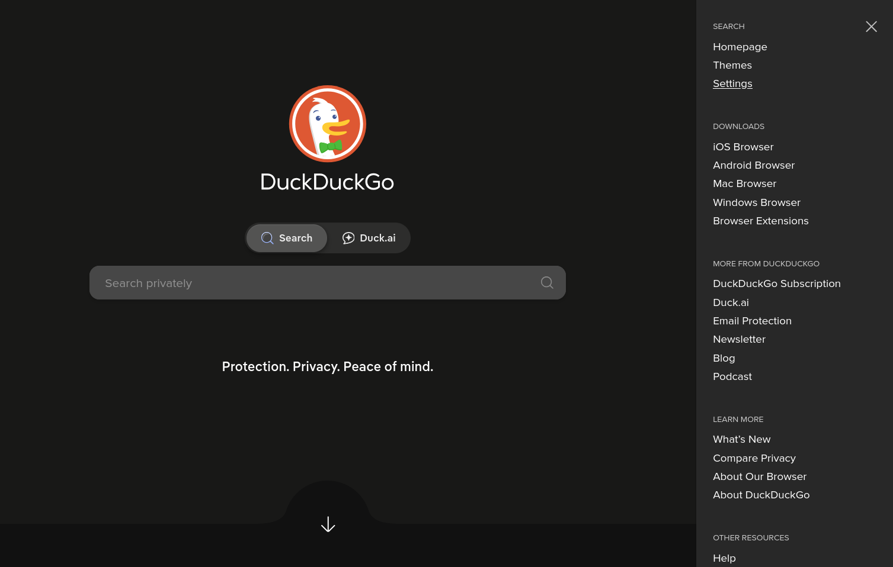
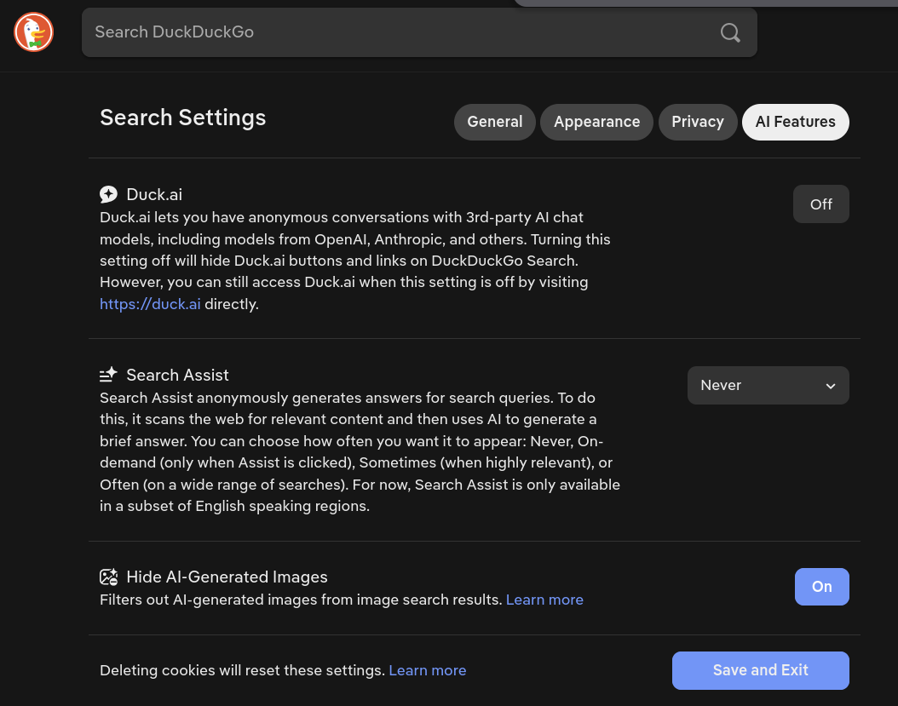
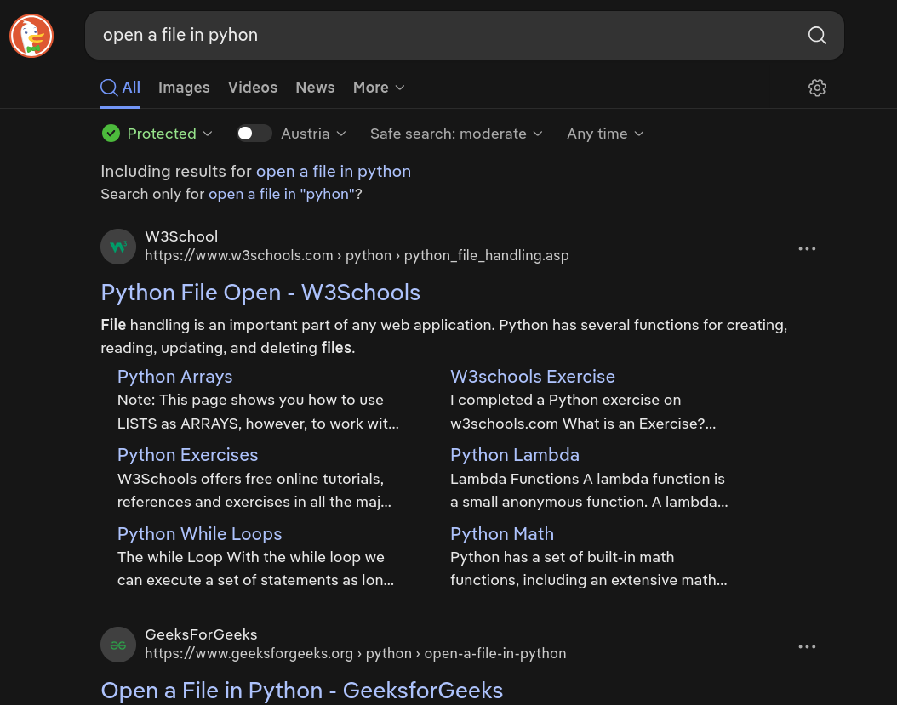
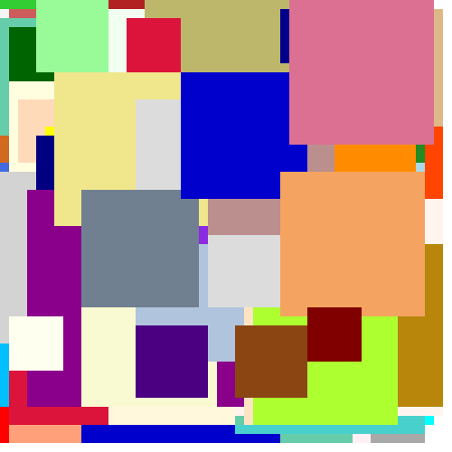
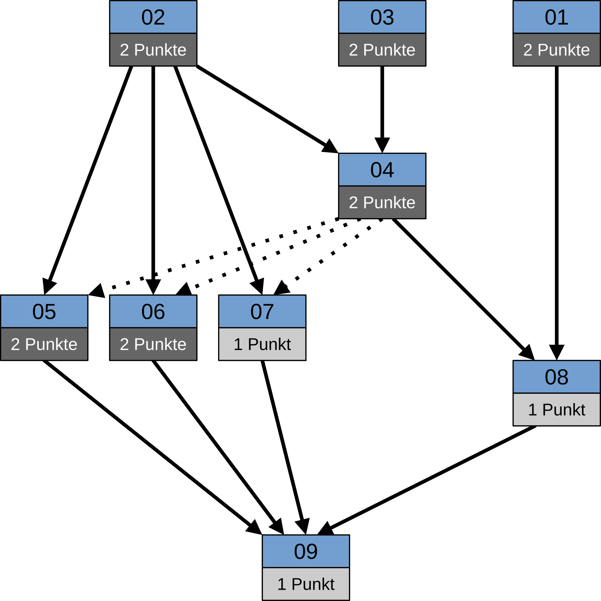
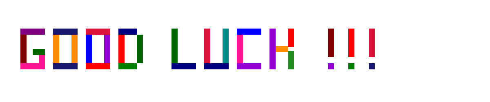

# Objectoriented Programming - Mechatronics - Programming test 1

> [!NOTE]
> Since this description contains tables and images, best to read it in "rendered mode".
> `ctrl`+`shift`+`v`
## General Rules

 - Time limit: 2.5 hours
 - Allowed resources:
   - any written/printed notes
   - [lecture notes](https://github.com/hegyhati/ClassRoomExamples/tree/master/FHWN/OO)
   - any python file of former exercises 
   - any static website, specially, e.g.:
     - [Official python documentation](https://docs.python.org/3/)
     - [W3Schools](https://www.w3schools.com/python/)
     - [GeeksForGeeks](https://www.geeksforgeeks.org/python/python-programming-language-tutorial/)
     - [RealPython](https://realpython.com/)
   - [PythonTutor](https://pythontutor.com/visualize.html#)
   - Only allowed search engine is [DuckDuckGo](https://duckduckgo.com/) see details below
   - Basically anything, **except another person or any form of AI**, i.e., no coding agent, copilot completion, chatgpt, etc.
   - If you still have question, ask any time during test.
 - Screens are recorded, violating previous rule results in immediate failure of the course.
 - Submission:
   - No zipping, upload all of the `.py` files that you worked on, and only those.
   - You may create additional `.py` files for testing, trying out things, but everything must be submitted in the originally given files
   - Earlier submission is allowed.
   - We may ask any time during the test to upload a snapshot the current state of files.
 - You may delete, comment out the unit tests given, write your own tests, we will only look at the required functions. 
 - The signatures of the required functions/methods can not be changed, and no side effects (`input` or `print`) in the submitted version.
 - Only have assumptions that are specifically stated. All other edge cases must be tackled. 

### Setting up DuckDuckGo

Go to [DuckDuckGo](https://duckduckgo.com/), click on the hamburger icon (`≡`): 

Here click on `Settings`, then select `AI Features`:

Here turn off `Duck.ai` and set `Search assist` to `never`.

After this, feel free to use DDG for searching:

## The task

### Final goal

The aim of this project is to create an application that can "compress" svg "art" inspired by [De Stijl](https://en.wikipedia.org/wiki/De_Stijl) by removing completely covered rectangles.

Under the [resources/compression/](resources/compression/) directory you can find two examples of randomly generated "art" figures in SVG. 

| File | [original.svg](resources/compression/example2/original.svg) | [filtered_by_individual_cover.svg](resources/compression/example2/filtered_by_individual_cover.svg) | [filtered_by_probabilistic_method.svg](resources/compression/example2/filtered_by_probabilistic_method.svg) | 
| --- | --- | --- | --- |
| Image |  |  |  | 
| Description | Original input file, that has a lot of squares that are not visible, because they are covered by other squares | Version where those squares are removed that are completely covered by another single square | Version where those squares are also removed that are covered by 2 or more other squares | 
| Square count | 1000 | 212 | 55 |
| File size (kB) | 65 | 15 | 4 | 

The three images look the same, but have very different sizes. How the compression works will be detailed in the [last step](09_compress_by_cover.py).

### Steps

As announced before, this project is built up by a series of small steps, that can be found in the `.py` files. 
You will never need more information for completing the task, then what is given in that file. (No need to understand the final steps to do the first steps).

There are dependencies among the steps:

Solid arrows mean necessary dependencies. Dotted arrows mean, that the tests in 05/06/07 are written so, that they expect the Rectangle class to have a color argument in the constructor, see details in those files.

