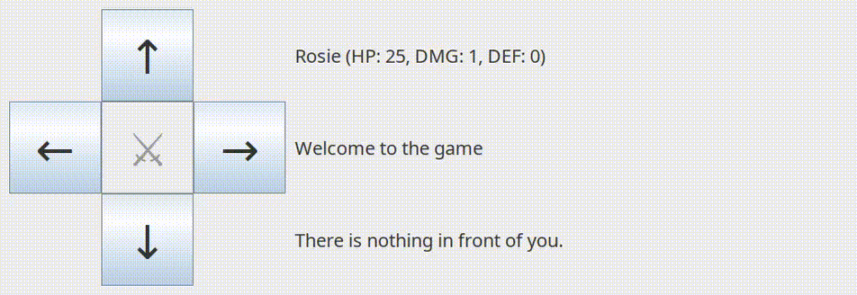

# Grafikus felület és további funkciók

## Primitív grafikus felület

### Technológia

Az előző fejezetben elkészült egy TUI (Text User Interface), de nyilvánvalóan sokkal kényelmesebb volna egy grafikus felületen (GUI - Graphical User Interface) játszani a játékunkkal.

Javahoz szerencsére több könyvtár is rendelkezésre áll, amivel hasonlókat meg tudunk valósítani.
A teljesség igénye nélkül néhány:
- [AWT](https://docs.oracle.com/javase/8/docs/api/java/awt/package-summary.html)
- [Swing](https://docs.oracle.com/javase/tutorial/uiswing/)
- [JavaFX](https://openjfx.io/)
- [SWT](https://www.eclipse.org/swt/)
- [JIDE](https://www.jidesoft.com/)
- [JGoodies](https://www.jgoodies.com/)

Ezek közül az AWT és a Swing van alapértelmezetten benne a JDK-ban, így most ezek közül választunk, mégpedig a "modernebb" Swing-et. 

> [!NOTE]
> A jegyzetnek nem célja komolyabb hangsúlyt fektetni a GUI programozás csínjára-bínjára, de itt röviden megjegyezzük, hogy a modern igényeknek valóban megfelelő UI elkészítéséhez javasoltabb mondjuk a JavaFX-et használni.

### Felületterv

Első körben nem álmodunk nagyot, lényegében azt szeretnénk replikálni, amit már a terminálban megcsináltunk, csak egy grafikus felületen, illetve a `N`, `E`, stb. begépelése helyett mondjuk gombnyomásra cserélni a mozgatások, támadások indítását.

Ilyenkor érdemes először felskiccelni magunknak, milyen felületet képzelünk el. 
Olyan egyszerű alkalmazásnál, mint a mienk, teljesen jól megfelel papír + ceruza, vagy egy Gimp, Libreoffice Draw.

> [!NOTE]
> Komolyabb, összetettebb felületekhez már sok mock-up, tervező alkalmazás áll rendelkezésre, teljesség igénye nélkül néhány:
- [Figma](https://www.figma.com/)
- [Adobe XD](https://www.adobe.com/products/xd.html)
- [Sketch](https://www.sketch.com/)
- [Balsamiq Mockups](https://balsamiq.com/)
- [Axure RP](https://www.axure.com/)
- [InVision](https://www.invisionapp.com/)
- [Marvel App](https://marvelapp.com/)

Egy nagyon egyszerű megvalósítása a korábbiaknak így nézhetne például ki:


Bal oldalt 5 gombbal lehet mozogni, támadni, jobb oldalt pedig 3 részen jelennek meg az üzenetek, valamint a hősünk és az előtte levő szörny adatai, ha van ilyen.

### Alap Swing váz elkészítése

Az objektumorientált paradigma térnyerésének az egyik katalizátora pont a GUI alkalmazások elterjedése volt. 
Ahogy korábban is említettük, nem minden problémához ez a fajta szemlélet a legkényelmesebb, célravezetőbb, de a grafikus felületek fejlesztése pont egy olyan terület, ahol jól bevállt módszer az objektum alapú modellezés.

A fenti tervben van egy ablak amin vannak gombok, cimkék. 
Az ablaknak ezek az építőelemek a részei, tud róluk, használja azokat. 
Ez tankönyvi példája a kompozíciónak, tehát Java nyelven valami ilyesmi módon foglmazhatnánk meg a dolgot:

```java

class RPG_Window {
    Button up;
    Button left;
    Button down;
    Button right;
    Button attack;
    Label heroInfo;
    Label message;
    Label monsterInfo;
    ...
}
```

A korábban említett GUI keretrendszerek részben abban nyújtanak segítséget, hogy ilyen komponenseket kínálnak, amiket csak felhasználni és testreszabni kell. 
Nem kell nekünk foglalkozni azzal, miként rajzoljunk egy téglalapot a kijelzőre, vegyük észre az egérkattintásokat, stb. 

A Swing megfelelői a fenti komponenseknek a [`JButton`](https://docs.oracle.com/javase/8/docs/api/javax/swing/JButton.html) és a [`JLabel`](https://docs.oracle.com/javase/8/docs/api/javax/swing/JLabel.html). Az ablak pedig egy [`JFrame`](https://docs.oracle.com/javase/8/docs/api/javax/swing/JFrame.html), aminek a mi ablakunk egy testreszabott, speciális változata, így például örököltethetünk is belőle.  
Azaz így néz ki a most már valid kódunk:

```java
import javax.swing.*;

class GUI extends JFrame {
    JButton up;
    JButton left;
    JButton down;
    JButton right;
    JButton attack;
    JLabel heroInfo;
    JLabel message;
    JLabel monsterInfo;
    ...
}
```

Az osztály konstruktorában hozhatjuk ténylegesen létre ezeket a komponenseket, állíthatjuk be a (kezdeti) szövegüket, méretüket, stb.
A Swing specifikus technikai részleteket jelen jegyzetben nem taglaljuk hosszasan, az olvasóra bízzuk a linkelt referenciák, mintakódok megtekintését.

Egy egyszerű kód:

```java
public class GUI extends JFrame {
    private JLabel messageLabel;
    private JLabel monsterLabel;
    private JLabel heroLabel;
    private JButton upButton;
    private JButton downButton;
    private JButton rightButton;
    private JButton leftButton;
    private JButton attackButton;

    private final GameLogic model;

    public GUI() {
        super("RPG GUI");  
        UIManager.put("Label.font", new java.awt.Font("SansSerif", java.awt.Font.PLAIN, 20));
        UIManager.put("Button.font", new java.awt.Font("SansSerif", java.awt.Font.PLAIN, 50));

        setLayout(null);

        heroLabel = new JLabel("Rosie (HP:25, DMG: 1, DEF: 0)");
        messageLabel =  new JLabel("Welcome to the game");
        monsterLabel = new JLabel("There is nothing in front of you.");

        heroLabel.setBounds(320, 20, 600, 80);
        messageLabel.setBounds(320, 120, 600, 80);
        monsterLabel.setBounds(320, 220, 600, 80);

        add(messageLabel);
        add(heroLabel);
        add(monsterLabel);

        upButton = new JButton("↑");
        downButton = new JButton("↓");
        rightButton = new JButton("→");
        leftButton = new JButton("←");
        attackButton = new JButton("⚔");

        upButton.setBounds(110,10,100,100);
        downButton.setBounds(110, 210, 100, 100);
        leftButton.setBounds(10, 110, 100, 100);
        rightButton.setBounds(210, 110, 100, 100);
        attackButton.setBounds(110, 110, 100, 100);

        add(upButton);
        add(downButton);
        add(leftButton);
        add(rightButton);   
        add(attackButton);

        setSize(930, 320);
        setResizable(false);

        setDefaultCloseOperation(JFrame.EXIT_ON_CLOSE);
    }
}
```

Néhány apró megjegyzés a kóddal kapcsolatban:
 - A `setLayout`, `setSize`, stb. metódusokat a `JFrame` osztálytól örökölte meg a mienk. 
 - Különbség van aközött, hogy az ablak osztályunk tartalmaz egy cimkét, és aközött, hogy az meg is jelenik rajta. Utóbbihoz az `add` metódust kell használni.
 - Layout menedzserek használata helyett most a `setBounds` függvényekkel pontosan megadtuk mindennek a helyét, méretét. Ez egy semennyire nem reszponzív felületet eredményez, de ez most nem is célunk.


Már csak példányosítani kell az új `GUI` osztályunkat. 
Ha ezt megtesszük, és futtatjuk a kódot, nem fogunk látni semmit. 
Ennek oka, hogy a `JFrame`-ek alapból nem láthatóak, nekünk kell azzá tennünk. 
Hogy hasonló maradjon a kódunk a korábbi TUI alkalmazáséhoz, ezt hasonlóan egy `run` metódusba tegyük bele:

```java
    public void run() {
        setVisible(true);
    }
```

Ezek után a `Main`-ben egy karakter módosításával már indítható is a GUI program:

```java
class Main {
    public static void main(String[] args) throws Exception{
        new GUI("maps/minimal.xml").run();
    }
}
```

Ha a fenti kódot lefordítjuk és futtatjuk, az alábbihoz hasonló ablakot kapunk:


### Játéklogika kezdeti bekötése, és frissítés

Az ablakunk egyelőre teljesen statikus tartalmat mutat, és semmi köze nincs a megírt játékhoz. 
A TUI-hoz hasonlóan a konstruktorban létre kell hozni egy `GameLogic` objektumot a konstruktorban:

```java
public class GUI extends JFrame {
    ...
    private final GameLogic model;

    public GUI(String mapFileName) throws Exception {
        super("RPG GUI");  
       
        ...
       
        model = new GameLogic(mapFileName);
    }
}
```
A konstruktor átláthatósága érdekében a ...-tal jelölt, grafikus komponenseket felépítő részeket érdemes egy külön metódusba, pl. `private void initialize_elements()` kiszervezni.

A következő feladat az lenne, hogy a cimkék tartalma ne beégetve legyen, hanem azt valóban a játéklogikától kérdezze le. 
Ezt nyilvánvalóan minden lépés után meg kell tennünk, így szintén kiszervezzük egy függvénybe:

```java
private void update(){
    Hero hero = this.model.getHero();
    Monster monster = this.model.getMonsterInFrontOfHero();

    this.heroLabel.setText(hero.toString());
    monsterLabel.setText( 
        monster != null
        ? "<html>There is a monster in front of you:<br>" + monster  + "</html>"
        : "There is nothing in front of you."
    );   
}
```

A konstruktor így módosul:

```java
    public GUI(String mapFileName) throws Exception {
        super("RPG GUI");  
        initialize_elements();  
        model = new GameLogic(mapFileName);
        update();
    }
```

Az `initialize_elements` függvényben pedig a cimkék létrehozásánál elég üres sztringeket megadni ideiglenesen: 

```java
private void initialize_elements() {
    ...

    heroLabel = new JLabel("");
    messageLabel =  new JLabel("Welcome to the game");
    monsterLabel = new JLabel("");

    ...
}
```

A kód fordítása és futtatása után pontosan ugyanazt a kimenetet látjuk, amit az előbb.

### Mozgás és támadás, lambdák

Végül, de nem utolsó sorban, a gombok működését kell megadni, hiszen jelenleg hiába kattintgatunk rájuk, nem történik semmi.
A felhasználói interakciókat Swing-ben listenerekkel lehet megoldani, ebből többféle is van, mi most a `JButton`-höz kiválóan használható [`ActionListener`](https://docs.oracle.com/javase/8/docs/api/java/awt/event/ActionListener.html)-t fogjuk használni.

Minden kattintáshoz készül egy metódus, amit az `initialize_elements`-ben hozzá is rendelünk a gombokhoz. 

A felfele mozgás releváns részei: 


```java
import java.awt.event.ActionEvent;

private void initialize_elements() {
    ...
    upButton.addActionListener(this::upButtonClicked);
}

private void upButtonClicked(ActionEvent e) {
    messageLabel.setText( 
        this.model.moveHero("N") 
        ? "You moved North." 
        : "You cannot move North."
    );
    update();
}
```

Az `upButtonClicked` kódja nagyban hasonlít a `UI` osztályban lévőhöz, csak `print` helyett a megfelelő cimkék szövege kerül lecserélésre.
Az inicializáló függvényben technikailag a gomboknak egy `JButton`-ben definiált metódusát hívjuk meg, amivel egy új `ActionListener`-t regisztrálunk a metódusra mutató `this::upButtonClicked` referencia alapján.

A másik három irány logikája gyakorlatilag azonos, a támadásé kicsit más. 
Ezen a példán ismerjünk meg most egy új nyelvi elemét a Javanak: a lambda függvényeket. 
A lambda függvények leegyszerűsítve név nélküli függvények, melyek működését csak egyszer, a felhasználási helyükön inline megadjuk. 
Az `ActionListener`-eket gyakran így definiáljuk, hiszen nincs szükség nevet adni, később nem valószínű, hogy máshonnét meghívnánk, stb.

A szintaktika a támadáson bemutatva:

```java
private void initialize_elements() {
    ...
    attackButton.addActionListener(e -> {
        this.model.attack();
        messageLabel.setText("You attacked the monster");
        update();
    });
}
```

> [!NOTE]
> A lambdák kiváló példák arra, hogy egy programozási nyelv, szoftverbázis általában nem feketén-fehéren egy paradigmát követ. A lambdák a funkcionális programozási nyelvekben jelentek meg, azonban mára a legtöbb mainstream programozási nyelv is bevette az eszköztárába, Java esetében a 8-as verzióval. 

Hogy mikor melyiket érdemes használni, arra általános szabályt nehéz lenne adni. 
Egyfajta ökölszabály lehet, hogy a lambdák irányába tereli a döntést, ha rövidül működés kódja.
Itt most kicsit hosszabbak a kódok, valamint az irányok működése elég hasonló, ezért érezhető, hogy ott jól jönne egy paraméterezhető, névvel ellátott metódus.

Így most ennél a vegyes megoldásnál maradunk:

```java
private void initialize_elements() {
    ...
    upButton.addActionListener(e -> moveButtonClicked(e, "north"));
    downButton.addActionListener(e -> moveButtonClicked(e, "south"));
    rightButton.addActionListener(e -> moveButtonClicked(e, "east"));
    leftButton.addActionListener(e -> moveButtonClicked(e, "west"));
    attackButton.addActionListener(this::attackButtonClicked);
    ...
}

private void moveButtonClicked(ActionEvent e, String direction) {
    messageLabel.setText( 
        this.model.moveHero(direction.substring(0,1))
        ? String.format("You moved %s.", direction)
        : String.format("You cannot move %s.", direction)
    );
    update();
}

private void attackButtonClicked(ActionEvent e) {
    this.model.attack();
    messageLabel.setText("You attacked the monster");
    update();
}
```

A két metódusunknál az `e` `ActionEvent`-re nincs szükség, de a támadásnál a `::` szintaktika miatt szükséges, hogy a metódus szignatúrája egy ilyen típusú argumentumot tartalmazzon. 
A mozgásnál használtunk lambdákat, így itt lespórolhattuk volna `e`-t, de konzisztencia, későbbi fejlesztés/szépítés miatt most otthagytuk. 

### Utolsó simítások, játék

A `JButton`-öknek van egy `setEnabled` függvénye, amivel beállítható, hogy lehessen-e kattintani rájuk. 
Az update függvényünket módosíthatjuk úgy, hogy egyrészt ne legyen kattintható a támadás, ha nincs előttünk szörny, másrészt ha vége a játéknak, akkor az összes gombot deaktiválja, és cserélje le az üzenetet:

```java
private void update() {
    Hero hero = this.model.getHero();
    Monster monster = this.model.getMonsterInFrontOfHero();

    this.heroLabel.setText(hero.toString());
    monsterLabel.setText( 
        monster != null 
        ? "<html>There is a monster in front of you:<br>" + monster  + "</html>"
        : "There is nothing in front of you."
    ); 

    attackButton.setEnabled( monster != null );

    if (model.isGameOver()) {
        upButton.setEnabled(false);
        downButton.setEnabled(false);
        leftButton.setEnabled(false);
        rightButton.setEnabled(false);        
        messageLabel.setText( 
            hero.isAlive() 
            ? "Congrats, " + hero.getOfficialName() + " cleansed the world  of monsters."
            : "The hero died, the monsters reign over the world."
        );
    }
}
```

A végleges kód [itt](src/0300_GUI/) elérhető, a játék egy minta futása a korábbi minimális pályán:


### Záró gondolatok az első grafikus felülethez

Mielőtt további funkciókkal fejlesztenénk a játékunkat, érdemes megállni egy pillanatra, és észrevenni, hogy a grafikus felület elkészítéséhez semmit nem kellett a korábbi, játéklogikát érintő kódokon módosítani.
A `GameLogic` objektumunk ugyanúgy teszi a dolgát, anélkül, hogy tudná, hogy a felhasználó egy szöveges vagy egy grafikus felülettel van összeköttetésben.

Azt is vegyük észre, hogyha a játéklogikában változik valami olyan dolog, ami az interakciókat nem érinti (például változik a szintlépés bónusz), akkor ahhoz a felületeken nem kell módosítani semmit. 

Vannak viszont még nem teljesen ideális "biztonsági réseink". 
Például, hogy a hőst és szörnyeket másolás nélkül szimplán visszaadjuk a felületnek, ami akár változtathatná is.

Felhasználói oldalról pedig azért nem a legkényelmesebb, hogy nem látunk magunk körül semmit a pályából, csak azt tudjuk, van-e előttünk valami. 
A hősünk dolgait is sokkal szebb volna vizuálisan megjeleníteni.

> [!TIP]
> Gondolkodj el rajta, melyiket hogyan oldanád meg, 1-2-t érdemes is gyakorlásként megcsinálni.


# Állapot, immutability, lények biztonságosabb átadása

# Állapot és mutability Javaban

Sokáig félretettünk egy fontos technikai részletét a Java nyelvnek: az objektumok módosíthatóságának a kérdését.
Eljött az idő, hogy a mélyére nézzünk a dolognak, és megértsük a különbséget egy objektum, a referenciája, módosítás és reassignment, valamint mutable és immutable típusok között.

Kísérleti lónak a model és a view közötti, hőst érintő információ átadást vesszük elő:

```java
public class GameLogic {
    Hero hero;
    ...
    public Hero getHero() { return this.hero; }
    ...
}

public class GUI extends JFrame {
    private void update() {
        Hero hero = this.model.getHero();
        ...
    }
}
```

Ahogy a korábbi fejezetben utaltunk rá, ez a fajta átadás okozhat gondokat a későbbiekben. 
De mi pontosan a baj? 
Az első és kisebbik probléma, hogy a modellnek most már nincs kontrollja afelett, mit láthat a hős adataiból a view, és mit nem. 
Jelen esetben nincs, amit el szeretnénk titkolni, de ha ugyanúgy megkapja a hőst a view mint a modell, akkor ugyanazokat is látja. 
(Legalábbis amíg egy csomagban vannak, erre még visszatérünk.)

A második, és súlyosabb probléma, hogy a hős objektum mutable, és ugyanazt a referenciát kapja a meg a view is, amit a modell használ. 

Az első fontos tisztázandó dolog az objektum állapota. 
Sokféle definíciót lehet adni, absztrakt megközelítésben azt szokás mondani, hogy azon információk összessége, melyek befolyásolják az egyes kérdésekre (függvényhívások) adott válaszokat (visszatérési értékek).
Kicsit "pragmatikusabb" megközelítésben a belső adattagok, attríbútumok értékeinek az összessége az objektum állapota (hiszen azoktól függ az egyes metódusok visszatérési értéke).

Például a `Hero` osztálynak a `health` adattagja az állapotának a része, hiszen a `getHealth()` vagy az `isAlive()` metódusok visszatérési értéke ettől függ. 
A `Hero` objektumoknak a program futása során változhat az életerő pontja, tehát változhat az objektum állapota.
Az ilyen, módosuló állapottal rendelkező objektumokat mutable-nek nevezzük.

Nem minden típus ilyen. Sokat használtuk már a `String` osztályt, és ha tüzetesen átnézzük az osztály [referenciáját](https://docs.oracle.com/javase/8/docs/api/java/lang/String.html) egyetlen metódust sem találunk, ami **módosítaná** az objektumot. 
Van több is, aminél első ránézésre így tűnhet, pl.: `toLowerCase()`, `trim()`, stb. 
Azonban a leírás elolvasása után egyértelművé válik, hogy ezek egyike sem módosítja magát az objektumot, hanem csinál egy újat, amiben minden betű kicsi, amin le vannak vágva a whitespace karakterek a szó elejéről és végéről, stb.
Ezt könnyen ellenőrizhetjük egy egyszerű kis programrészlettel:

```java
String name = "Joe";
name.toUpperCase();
System.out.println(name);
```

A kimenet Joe lesz és nem JOE.
Ha azt szeretnénk, hogy a `name` most már a nagybetűs értéket "tartalmazza", akkor ez a teendő:

```java
String name = "Joe";
name = name.toUpperCase();
System.out.println(name);
```

Itt a lényegi rész a `name =` mely egy reassignment, azaz új érték adása. 
Javaban azok a változóink, amik nem primitív típusúak, azok valójában referenciák objektumokra, nem "maguk az objektumok". 
Amikor átállítjuk a változót, referenciát egy új objektumra, a régi továbbra is ugyanúgy létezik a memóriában, és ha másik változó is ugyanarra mutat, akkor nem érzékel változást.
Ezért van különbség aközött, hogy módosítunk egy objektumon (mutáljuk), vagy a referenciát átállítjuk egy másik objektumra. 
Itt a `name` csak egy referencia, amit átállítunk arra az új objektumra, amelyiket a `toUpperCase()` metódus létrehoz. 

Az `String`-hez hasonló osztályokat, amiknél az objektumok állapota nem módosítható egyetlen metódussal sem, immutable-nek nevezzük.
Szintén immutable a `Position` record, sehol sem módosítottuk a `.col` vagy `.row` értékeket, a hős mozgatásánál is reassignment történt:

```java
class GameLogic{
    ...
    boolean moveHero(String direction) {
        Position newPosition;
        switch(direction) {
            case "n", "N" -> newPosition = new Position(this.heroPosition.row - 1, this.heroPosition.col);
            case "e", "E" -> newPosition = new Position(this.heroPosition.row, this.heroPosition.col + 1);
            case "w", "W" -> newPosition = new Position(this.heroPosition.row, this.heroPosition.col - 1);
            case "s", "S" -> newPosition = new Position(this.heroPosition.row + 1, this.heroPosition.col);
            default -> { return false; }
        }
        if (!this.accessible[newPosition.row][newPosition.col]) return false;
        this.heroPosition = newPosition;
        return true;
    }
    ...
}
```

E fölött az előző fejezetben átsiklottunk, de `Position` immutable volta különösen fontos volt akkor, amikor a `HashMap` kulcsként használtuk:

```java

class GameLogic {
    private record Position(int row, int col){} 
    private final HashMap<Position,Monster> monsters = new HashMap<>();
    ...
}
```

Bár technikailag megengedett, hogy egy  `HashMap` kulcsának típusa mutable típus legyen, ezt azonban mindenképpen kerülni kell, érdemes.
Ez igaz több másik tárolóra is.
A részletekre most nem térünk ki, de viszonylag jó ökölszabály, hogy ha a tároló nevében `Hash` vagy `Tree` szerepel, akkor ne használjunk (kulcsnak) mutable típusokat. 
Az okokról, a tárolók által használt adatszerkezetek működéséről egy adatstruktúrákkal foglalkozó kurzuson, könyvben, videóban érdemes elmélyülnie az érdeklődő olvasónak. 

> [!NOTE]
> Más nyelveken előfordulhat védelem az ellen, hogy módosítható kulcsokat használjunk, Python például nem enged listákat halmazokba tenni, vagy kulcsként használni. Rustban és Go-ban is adott ilyesfajta védelem, de például C++, C# esetében nem.


## Hős és szörnyek biztonságos átadása

Ezután a kis kitérő után térjünk vissza a modell `getHero()` függvényéhez:

```java
class GameLogic {
    Hero hero;

    public int getHero() { return this.hero; }
}
```

Itt egy mutable objektumra mutató referenciát adunk tovább a view-nak. 
Azaz a `GameLogic.hero` és a `GUI.update()` függvényben a `hero` két különböző referencia, mely ugyanarra az objektumra hivatkozik, mutat.
Ezek után semmi nem gátolja meg, hogy view oldalon valaki ilyet csináljon:

```java
    public void printState() {
        Hero hero = this.model.getHero();
        // sneaky cheat
        hero.healToFull();
        System.out.println(hero.getOfficialName());
        ...
    }
```

A gyógyítás ugyanazon az objektumon történik, amire a `GameLogic.hero` is mutat.
Tehát a view a modell tudta nélkül tetszőlegesen módosíthatja a hős objektum, és ezzel az egész játék állapotát. 
Jelenleg csak a felületet készítő fejlesztő jóindulatán / figyelmén múlik, hogy ilyen ne forduljon elő.
Ilyen szituációkban általában nem is a szándékos rosszalkodás megakadályozása a fő cél, hanem a véletlen hibákból fakadó hibák kivédése.

A probléma röviden: a UI-nak szüksége van a hősre, szörnyre, hogy a felhasználó számára meg tudja jeleníteni a szükséges információkat, de valahogy meg kellene oldani, hogy ne tudja módosítani azokat.

Vegyünk sorra néhány ötletet:

1. Nem az objektumot adjuk vissza, hanem csak pl a szöveges reprezentációját.
2. Készítünk egy másolatot az objektumról, és ezt a másolatot adjuk vissza.
3. "Csak olvasható" formában adjuk vissza az objektumot.

Röviden mérlegeljük ezeket.

> [!TIP]
> Érvelj az egyes megoldások mellett / ellen, illetve gondolkodj el, miként oldanád meg a harmadikat.

Az első opciót az előző fejezetben már lényegében tárgyaltuk, ez lenne most a legegyszerűbb, hiszen a `GameLogid.getHero()` függvény helyett lenne egy ilyen:

```java
class GameLogic {
    ...
    public String getHeroInfo() { return this.hero.toString(); }
}
```

A felületeken elég lenne ezt megkapni és kiiratni, vagy beállítani a cimke szövegének. 
Mi történne azonban, ha szebben szeretnénk megjeleníteni a hősünk adatait? 
Akkor a felület oldalán kellene kibányászni a szövegből, hogy melyik karakterek mit jelentenek.
Ez már eleve csúnya és számításpazarló megoldás volna, és továbbá nagyon törékeny is.
Ha kibővülne valamilyen információval a hős, akkor figyelni kellene erre a UI oldalon is.
Egy fokkal továbbfejlesztett gondolat, hogy strukturáltan adjuk át az adatokat, ne szerializálva egy szövegben. 
Lehetne akár egy tömb, amiben benne van minden adat.
De mennyivel jobb volna, ha még névvel is hivatkozhatnánk az egyes adattagokra. 
Pár fejezettel korábban erre vezettük be az osztályokat, objektumokat, és ezzel el is érkeztünk a második megoldáshoz, miszerint csináljunk egy másolatot az eredeti objektumunkról. 

Ezt könnyen megoldhatnánk például egy úgynevezett másolókonstruktorokkal:

```java

class Unit {
    ...

    public Unit(Unit other) {
        this.name = other.name;
        this.health = other.health;
        this.damage = other.damage;
        this.defense = other.defense;
    }
}

class Hero {
    ...
    public Hero(Hero other) {
        super(other);
        this.title = other.title;
        this.experience = other.experience;
        this.maxHealth = other.maxHealth;
    }
}

class Monster {
    ...
    public Monster(Monster other) {
        super(other);
        this.title = other.title;
    }
}
```

És akkor a `GameLogic` osztályban:

```java
class GameLogic {
    ...
    public Hero getHero() { return new Hero(this.hero); }
    public Monster getMonsterInFrontOfHero() {
        Monster monster = this.monsters.get(this.heroPosition);
        return monster == null; null ; new Monster(monster);
    }
}
```

Ezek után a játéklogika fejlesztője nyugodtan aludhat, hiszen akármennyire is fáradt a felületen dolgozó kollegája, nem tudja véletlen hibából fakadóan a játék tényleges állapotát befolyásolni, csak és kizárólag a `GameLogic` osztály publikusan engedélyezett függvényein keresztül kontrollált formában.
Ezáltal ha hibát vét a felület fejlesztője, akkor az lokalizáltan megmarad UI oldalon, így könnyebb megtalálni és kijavítani is.
Ha valahol véletlenül mutálódik a másolat a felületen, akkor igaz, hogy az igazi állapot nem változott meg, de amit a felhasználó lát, az igen.
Ezért ennél egy fokkal még jobb volna, ha a felület fejlesztőjének nem is lenne lehetősége mutálni az objektumot.

Egy másik hátránya ennek a megoldásnak, hogy létrehoz egy új objektumot, ezzel memóriát és CPU időt pazarolva. 
Amig csak 1-2 pici objektumon történik ilyen másolás, ez természetesen nem számottevő, de hamar performacia problémákat szülhet, ha nem figyelünk ezekre. 

Mindkét problémát megoldaná, ha a harmadik megoldás működne, azaz ugyanazt az objektumot adnánk vissza, csak nem módosítható módon.

> [!NOTE]
> Vannak nyelvek, amik erre a konkret problemara adnak explicit támogatást, például C++ esetében a `const` referenciák, pointerek. Javaban a `final` sajnos mutáció ellen "nem véd", így itt mindenképpen más megoldást kell találni.

Ha a másolás memória, CPU költsége nem lenne probléma, akkor csinálhatnánk egy `ReadOnlyHero` osztályt, ami kb így nézne ki:

```java

class ReadOnlyHero {
    public final name;
    public final health;
    ...
    public ReadOnlyHero (Hero hero) {
        this.name = hero.name;
        this.health = hero.health;
        ...
    }
}
```

Ezek után pedig ilyen másolatokat adna vissza a `GameLogic` és használna a `UI`/`GUI`. 
Az erőforráspazarlást nem oldottuk meg, bár ha csak 1-2 adatára van szükség a felületen, akkor lehetőség van csak azokat átmásolni, ami javítja a helyzetet.
Ennél nagyobb probléma, hogy ez a kód nem fordulna le, mivel `Hero`-nál az adattagok többsége privát, amit egy külső osztály nem érhet el.
Nincs arra mód, hogy csak ennek az egy másik osztálynak megengedjük, hogy láthassa a privát dolgainkat.
Vagy mindenki látja, vagy csak mi. 

> [!NOTE]
> Más nyelvek ismét adhatnak ilyen eszközöket a kezünkbe, például C++-ban a `friend` kulcsszó erre szolgál. 
> Javaban még egy szint, az alapértelmezett `package private` rendelkezésre áll, amire vissza is fogunk még térni, és szintén lehetne használni ennek a helyzetnek a megoldására.

Ezt az irányt tehát elengedve kanyarodjunk vissza, hogy az eredeti objektumot adjuk vissza, és akkor a performaciával sem lesz gond.
Mivel Java-ban valójában nem magukat az objektumokat adjuk vissza, hanem azokra mutató referenciákat, ezért nem kell, hogy maga az objektum csak olvasható legyen, elég, ha csak a referencia "hiszi" azt róla. 
Erre pedig tökéletesen alkalmazható a korábbi fejezetben bemutatott interfész, mely a legtöbb programozási nyelvben valamilyen formában megjelenik.

> [!NOTE]
> A név néha változik, C++-ban absztrakt ősosztályok tudják ezt a szerepet is betölteni, Pythonban szintén léteznek ezek az absztrakt osztályok, illetve 3.8 óta protokollok.

Ahelyett tehát, hogy másolatot csinálnánk, készítünk ilyen nézegető interfészeket:

```java
interface UnitViewer {
    public String getName();
    public int getHealth();
    public boolean isAlive();
    public int getDamage();
    public int getDefense();
}

interface HeroViewer extends UnitViewer {
    public String getOfficialName();
    public int getExperience();
    public int maxHealth();
}

interface MonsterViewer extends UnitViewer {}
```

Az egyszerűség kedvéért csináltunk mindegyik lénytípushoz egy nézegetőt. 
Az ismétlődő részeket nem kell ismételni, mivel az interfészek ugyanúgy kiegészíthetők, mint az osztályok.

Korábban a nevet `final public`-nak vettük fel, de az most nem felel nekünk meg, szóval ezt a korábbi döntést felülírtuk, és a többi adattaghoz hasonlóan privátra változtatjuk, és kapott szintén egy gettert. 
Ugyanígy készültek getterek azokhoz az adattagokhoz is, amikhez eddig nem volt.
Majd eldönti a felület, melyiket használja. 

Magukból az osztályokból a lényegi változások: 

```java
class Unit implements UnitViewer {
    final protected name;
    ...

    @Override public String getName() { return this.name; }
    @Override public int getHealth() { return this.health; }
    @Override public int getDamage() { return this.damage; }
    @Override public int getDefense() { return this.defense; }
    
    @Override
    public boolean isAlive() {
        return this.health > 0;
    }
}

class Hero extends Unit implements HeroViewer {
    ...

    @Override public int getExperience() { return this.experience; }
    @Override public int maxHealth() { return this.maxHealth; }

    @Override 
    public String getOfficialName() { 
        return this.name + this.title; 
    }

}

class Monster extends Unit implements MonsterViewer { ... }
```

Ezek után módosíthatjuk a `GameLogic` kapcsolódó függvényeit:

```java

class GameLogic {
    ...

    public HeroViewer getHero() { return this.hero; }
    public MonsterViewer getMonsterInFrontOfHero() { return getMonster(); }
    
    private Monster getMonster() {
        return this.monsters.get(this.heroPosition);
    }

    
    void attack() {
        Monster monster = getMonster();
        if (monster == null) return;
        this.hero.attack(monster);
        if (monster.isAlive()) monster.attack(hero);
        else this.monsters.remove(this.heroPosition);
    }
}
```

A `getHero` most már `HeroViewer`-t ad vissza, és hasonlóan kapjuk vissza az előtte levő szörnyet is. 
Itt egy privát `getMonster`-be átvittük a logikát, ami ugyanúgy `Monster`-t ad vissza, hogy tudjuk használni az `attack` függvényben.

Végezetül, a View osztályokban szükséges csak annyi módosítás, hogy `Hero` és `Monster` helyett `HeroViewer`-re és `MonsterViewer`-re cseréljük a visszakapott referenciákat:

```java
class UI {
    ...
    private void printState() {
        print("\n\n", this.model.getHero(), "\n");
        MonsterViewer monster = this.model.getMonsterInFrontOfHero();
        if (monster != null) print("There is a monster in front of you: ", monster, "\n");
        else print("There is nothing in front of you.\n");
    }

    public void run() {
        ...
        if (this.model.getHero().isAlive()) print("The hero cleansed the world of monsters!\n");
        else print("The hero died, the monsters reign over the world.\n");
    }
}
``` 

Itt látjuk, hogy a `printState` második sorában kellett csak módosítani a típust. 
A hős esetében még erre se volt szükség.
A `GUI` esetében egyetlen egy függvényt érint a dolog, annak is csak az első két sorát:

```java
public class GUI extends JFrame {
    ...
    private void update() {
        HeroViewer hero = this.model.getHero();
        MonsterViewer monster = this.model.getMonsterInFrontOfHero();

        this.heroLabel.setText(hero.toString());
        monsterLabel.setText( 
            monster != null 
            ? "<html>There is a monster in front of you:<br>" + monster  + "</html>"
            : "There is nothing in front of you."
        ); 

        attackButton.setEnabled( monster != null );

        if (model.isGameOver()) {
            upButton.setEnabled(false);
            downButton.setEnabled(false);
            leftButton.setEnabled(false);
            rightButton.setEnabled(false);
            
            messageLabel.setText( 
                hero.isAlive() 
                ? "Congrats, " + hero.getOfficialName() + " cleansed the world  of monsters."
                : "The hero died, the monsters reign over the world."
            );
        }
    }
}
```

A módosítások után a játék pontosan ugyanúgy működik, mint eddig, csak biztonságosabbá vált a kód.
A teljes forrás [itt](src/0310_GUI_viewers/) érhető el.

# Támadási sebesség, véletlenszerű sebzés

A view és a modell jó elválasztását illusztrálva, két apró változtatást eszközölünk a csata dinamikán, hogy közelebb kerüljünk egy valós játék működéséhez:
 1. A sebzés ne determinisztikusan ugyanannyi legyen, hanem az eddigi sebzés a maximum legyen, a valós sebzés pedig véletlenszerűen ennek 80-100 százaléka. 
 2. Minden lénynek legyen egy kezdeményezés értéke, ami meghatározza, hogy egy támadás esetében ki üt először. Továbbá, ha ellépünk egy szörny mellől, akkor ha kisebb a kezdeményezés értékünk, a szörny még megüt, mielőtt el tudnánk futni előle. 

Amikor egy ilyen feladat adott, sokszor maradnak nyitott részletkérdések, amik tisztázandóak.

# [!TIP]
# Mielőtt tisztázzuk őket, gondolkodj el rajta, milyen részletekre lenne muszáj rákérdezned implementálás során.

A fent nem tisztázott részletek:
 - Csak egész sebzés történhet továbbra is, kerekítés felfele történjen a 80% kiszámolásakor.
 - 0 sebzés továbbra is előfordul, ha a támadó sebzése nem haladja meg a védekező védekezését.
 - A kezdeményezés lebegőpontos érték, a nagyobb érték jelent gyorsabbat, egyenlőség esetén a hős üt először.
 - A hős, szörny kezdő értékeit az XML-ben definiálni kell `initiative` attríbútummal.
 - Szintlépéskor növekedjen a hős kezdeményezése 10%-kal. 

# [!TIP]
# Próbáld meg ezeket a módosításokat alkalmazni a kódon, csak a `GameLogic` és `Unit` osztályok módosításával.

Különösebb kommentár nélkül mutatjuk a változtatott részeket egy lehetséges megvalósítás esetén. 
A teljes kód [itt](src/0320_Randomized_Attack_Initiative/).

Hogy tudjuk a 80%-os támadást tesztelni, egy nagyobb pályát fogunk használni többféle szörnytípussal:

```xml
<game>
    <map>
##############################
#_______________4_____2______#
#_##################H##__###_#
#_#_____1_________3____1111__#
##############################
    </map>
    <hero name="Rosie" health="25" damage="1" defense="0" initiative="15.0"/>
    <monsters>
        <monster type="1" name="Goblin" health="20" damage="1" defense="0" initiative="10.0"/>
        <monster type="2" name="Orc" health="30" damage="3" defense="0" initiative="16.0"/>
        <monster type="3" name="Uruk hai" health="40" damage="4" defense="2" initiative="20.0"/>
        <monster type="4" name="Wraith" health="200" damage="10" defense="5" initiative="35.0" title="Wraithslayer"/>
    </monsters>
</game>
```

Az osztályokban a módosított sorok:

```java
class Main {
    public static void main(String[] args) throws Exception{
        new GUI("maps/small.xml").run();
    }
}

class Unit implements UnitViewer {
    ...
    protected float initiative;

    public Unit(String name, int health, int damage, int defense, float initiative){
        ...
        this.initiative = initiative;
    }     
    ...

    public boolean isFaster(Unit other) {
        return this.initiative >= other.initiative;
    }
    ...

    private int calculateDamage(int originalDamage) {
        int max = originalDamage - this.defense;
        if (max < 0) return 0;
        int min = (int) Math.ceil(max*0.8);
        return ThreadLocalRandom.current().nextInt(min, max+1);
    }

    protected void takeDamage(int damage) {
        this.health -= calculateDamage(damage);
        if (this.health < 0) this.health = 0;
    }
    ...
}

class Monster extends Unit implements MonsterViewer {
    ...

    public Monster(String name, int health, int damage, int defense, float initiative) {
        this(name, health, damage, defense, initiative, null);
    }

    public Monster(String name, int health, int damage, int defense, float initiative, String title) {
        super(name, health, damage, defense, initiative);
        this.title = title;
    }
    ...
}

class Hero extends Unit implements HeroViewer {
    ...

    public Hero(String name, int health, int damage, int defense, float initiative) {
        super(name, health, damage, defense, initiative);
        this.maxHealth = health;
    }
    ...

    private void levelUp() {
        ...
        this.initiative *= 1.1;
    }    

}

class GameLogic {
    ...

    boolean moveHero(String direction) {
        Monster monster = getMonster();
        if (monster != null && !this.hero.isFaster(monster)) monster.attack(this.hero);
        if (!this.hero.isAlive()) return false;

        ...
    }

    void battle() {
        Monster monster = getMonster();
        if (monster == null) return;

        Unit faster, slower;
        if (this.hero.isFaster(monster)) {
            faster = hero;
            slower = monster; 
        } else {
            faster = monster;
            slower = hero;
        }

        faster.attack(slower);
        if (slower.isAlive()) slower.attack(faster);

        if (!monster.isAlive()) this.monsters.remove(this.heroPosition);
    }
}
```

Ezen kívül a `GameLogic.attack()` -ot átneveztük `GameLogic.battle()`-re, hogy jobban tükrözze a működést, valamint az XML parzolást is kiegészítettük az `initiative` beolvasásával, konstruktoroknak átadásával.

# [!TIP]
# Mit csináltál másképp, melyik megoldásnak mi az előnye, hátránya a másikkal szemben?

Teszteljük, jól működik-e a program.
Első tesztként menjünk oda a lidérchez, majd lépjünk el. 
Mivel nagyobb a kezdeményezése, ilyenkor is meg fog ütni minket, és egyben láthatjuk azt is, hogy előfordul-e 10-nél kisebb (8 vagy 9 sebzés):


A második tesztben először egy ork mellett sétálunk el, aki gyorsabb nálunk, így 2 sebzést elszenvedünk. 
Ezután a goblinok között sétálgatunk, akik lassabbak, így nem fognak megütni minket. 
Pár ilyen lépés után legyőzünk közülük párat, hogy szintet lépjünk, és a kezdeményezésünk 15-ről, 16.5-re nőjön, amivel már az ork elől is elmenekülhetünk:



Ennyi teszttel most megelégszünk, úgy tűnik jól működik ez az új támadási logika, amit körülbelül 50 sor módosításával sikerült elérni, anélkül, hogy a felülethez hozzá kellett volna nyúlni.

# Térkép megjelenítés

Felhasználói szemmel a legkényelmetlenebb dolog most, hogy a térképet semennyire nem látjuk, csak azt, ami éppen előttünk van. 
Fejlesszük tovább a grafikus felületet oly módon, hogy valamennyit lássunk a magunk körüli világból. 
Az egyszerűség kedvéért most fixáljuk le, hogy 2 lépésnyit lássunk minden irányban, beleértve az átlós lépéseket is, így lényegében egy négyzet szeletet látva.
Ha a nézet "lelóg" a pályáról, ott mutasson falat. 
A fenti [példához](src/0320_Randomized_Attack_Initiative/maps/small.xml) tartozó kezdeti nézet valami ilyesmi lehetne:


Gondoljuk végig, milyen módosítások szükségesek ehhez view illetve modell oldalon.

A felületnek kétféle információra van az eddigiekhez képest szüksége a látótérben lévő mezők esetében:
 1. van-e ott fal?
 2. van-e ott szörny?

A legegyszerűbb megvalósítás, ha a `GameLogic` kiegészül két ilyen függvénnyel, ami relatív pozíciókat vár a hőshöz képest. 
Ez nem éppen egy szép megoldás, kezd nagyon nagyra hízni ez az osztály, de mivel ebben a fejezetben a GUI-ra fókuszálunk, most megelégszünk ezzel:

```java
class GameLogic{
    ...

    private boolean isValidPosition(Position pos) {
        return pos.row >= 0 && pos.row < this.accessible.length
            && pos.col >= 0 && pos.col < this.accessible[0].length;
    }

    private Position getAbsolutePosition(Position relativePos) {
        return new Position(
            this.heroPosition.row + relativePos.row,
            this.heroPosition.col + relativePos.col
        );
    } 

    public boolean isWall(int relRow, int relCol) {
        Position pos = getAbsolutePosition(new Position(relRow, relCol));
        return !isValidPosition(pos) || !this.accessible[pos.row][pos.col];
    }

    public boolean hasMonster(int relRow, int relCol) {
        Position pos = getAbsolutePosition(new Position(relRow, relCol));
        return this.monsters.containsKey(pos);
    }    
}
```

Itt egyfajta "fordítás" megfigyelhető relatív koordinátákról abszolút koordinátákra.
Hiszen jelenleg a view nem tudja, mekkora a pálya, azon pontosan hol vagyunk, csak a hős környezetére kíváncsi.
Ennek kapcsán felvetődik, hogy melyik függvény várjon `Position` argumentumot, melyik két `int`-et, és ha utóbbi, azok abszolút, vagy relatív koordináták legyenek-e. 
A konzisztencia itt is célszerű, azaz a kifele mutatott publikus interfész legyen egységes, illetve a belső reprezentáció is. 
Ezért itt az `isWall` és a `hasMonster` relatív koordinátát vár `int` pár formájában, a belső függvények viszont már `Position`-t.

View oldalon szükség van 5x5 cimkére, ahol megjelennek a mezők:

```java
public class GUI extends JFrame {
    ...
    private final int MAP_VISIBILITY = 2;
    private final JLabel[][] mapView =  new JLabel[2*MAP_VISIBILITY+1][2*MAP_VISIBILITY+1];
    private final String WALL_TEXT = "#";
    private final String MONSTER_TEXT = "☠";
    private final String FREE_TEXT = "";
    ...
}
```
A `mapView` mellett pár konstanst is kivezettünk, hogy kicsit könnyebben skálázható legyen a nézet akár 3 lépésnyi távolsághoz is.
Itt csak `null`-ok a tömb elemei, azokat az `initialize_elements`-ben még szükséges inicializálni:

```java
public class GUI extends JFrame {
    ...
    private void initialize_elements() {
        ...

        int tileSize = 300 / (2*MAP_VISIBILITY+1);

        for (int row=-MAP_VISIBILITY; row <= MAP_VISIBILITY; ++row)
            for (int col = -MAP_VISIBILITY; col <= MAP_VISIBILITY; ++col) {
                JLabel tile = new JLabel();
                tile.setBorder(BorderFactory.createLineBorder(java.awt.Color.BLACK));
                tile.setBounds(890 - tileSize/2 + col * tileSize, 160 - tileSize/2 + row * tileSize, tileSize, tileSize);
                tile.setHorizontalAlignment(SwingConstants.CENTER);
                tile.setVerticalAlignment(SwingConstants.CENTER);
                this.mapView[row + MAP_VISIBILITY][col + MAP_VISIBILITY] = tile;
                add(tile);
            }
        this.mapView[MAP_VISIBILITY][MAP_VISIBILITY].setBorder(BorderFactory.createLineBorder(java.awt.Color.BLACK,5));


        setSize(1050, 320);
        ...
    }
    ...
}
```
Pár stilizálás is bekerült, illetve van néhány magic constant, de ezen most túllépve írjuk meg az `update`-ben a szükséges részeket, hogy kipróbálható legyen a dolog:


```java
public class GUI extends JFrame {
    ...
    private void update() {
        ...

        for (int row=-MAP_VISIBILITY; row <= MAP_VISIBILITY; ++row)
            for (int col = -MAP_VISIBILITY; col <= MAP_VISIBILITY; ++col) 
                this.mapView[row+MAP_VISIBILITY][col+MAP_VISIBILITY].setText(
                    this.model.isWall(row, col)
                    ? WALL_TEXT 
                    : this.model.hasMonster(row, col) ? MONSTER_TEXT : FREE_TEXT
                );

        ...
    }
    ...
}
```
A kódot fordítva és futtatva:


Kicsit túl könnyen legyőzzük a lidércet, de ezen majd csiszolunk a következő fejezetben.
A teljes kód [itt](src/0330_GUI_Map/).
(A `UI` osztályt csendben átnevezve `TUI`-ra, hogy jobban tükrözze, mi van benne.)

## Szépítgetések

Mivel mindenhol a `MAP_VISIBILITY` konstansot használtuk, elméletileg elég azt átírtunk, hogy nagyobb részt lássunk. 
És valóban, `MAP_VISIBILITY=3` esetén:


5-re növelve:


Ez már kicsit zsúfolt, maradjunk 4-nél.
Egy másik egyszerű funkció, hogy az `isWall` függvénynek hála az `update`-ben már nem csak az csata gomb állapotát tudjuk átállítani. (Amit gyorsan refaktorálunk névügyileg `battleButton`-re, hogy igazodjon a modellhez.)

```java
public class GUI extends JFrame {
    ...
    private void update() {
        ...
        battleButton.setEnabled(hero.isAlive() && monster != null);
        upButton.setEnabled(hero.isAlive() && !this.model.isWall(-1,0));
        downButton.setEnabled(hero.isAlive() && !this.model.isWall(1,0));
        leftButton.setEnabled(hero.isAlive() && !this.model.isWall(0,-1));
        rightButton.setEnabled(hero.isAlive() && !this.model.isWall(0,1));
        ...
        if (model.isGameOver()) messageLabel.setText( 
            hero.isAlive() 
            ? "Congrats, " + hero.getOfficialName() + " cleansed the world  of monsters."
            : "The hero died, the monsters reign over the world."
        );
    }
}
```

Ezek után valóban csak akkor kattinthatóak a gombok, ha tudunk abba az irányba mozdulni: 


Itt persze felvetődik, hogy `moveButtonClicked` metódusban a mozgás sikerességének ellenőrzése feleslegessé vált, de inkább "biztos ami biztos" alapon otthagyjuk. 

Végezetül, sokkal szebb volna, ha karakterek helyett valamilyen egyszerű grafikákat látnánk. 
Szerencsére a `JLabel`-öknek a `setText`-hez hasonlóan van egy `setIcon` metódusa is, amivel egy képet állíthatunk be.
A megjelenitészhez 5 különböző mező grafikát készítettünk el:
 1. [Üres, bejárható mező](src/0340_GUI_Map2/tiles/free.png)
 2. [Hős mezője, ha nincs szörny](src/0340_GUI_Map2/tiles/hero.png)
 3. [Hős mezője, ha van szörny](src/0340_GUI_Map2/tiles/heromonster.png)
 4. [Bejárható mező szörnnyel](src/0340_GUI_Map2/tiles/monster.png)
 5. [Nem bejárható mező](src/0340_GUI_Map2/tiles/wall.png)

 

A képeket elég egyszer betölteni: 

```java
public class GUI extends JFrame {
    ...
    private final int MAP_VISIBILITY = 3;
    private final int tileSize = 300 / (2*MAP_VISIBILITY+1);
    private final JLabel[][] mapView =  new JLabel[2*MAP_VISIBILITY+1][2*MAP_VISIBILITY+1];

    private ImageIcon getScaledTile(String file) {
        return new ImageIcon(new ImageIcon("tiles/" + file).getImage().getScaledInstance(tileSize, tileSize, Image.SCALE_SMOOTH));
    }
    private final ImageIcon WALL_ICON = getScaledTile("wall.png");
    private final ImageIcon FREE_ICON = getScaledTile("free.png");
    private final ImageIcon MONSTER_ICON = getScaledTile("monster.png");
    private final ImageIcon HERO_ICON = getScaledTile("hero.png");
    private final ImageIcon HERO_MONSTER_ICON = getScaledTile("heromonster.png");
    ...
}
```
Mivel a képek 400x400 pixelesek, ezért szükséges az átméreteszésük, amiért a `getScaledTile` metódus felelős.
Az inicializálás nem változik, csak a felesleges szövegformázásokat és keretezéseket ki lehet szedni:

```java
public class GUI extends JFrame {
    ...
    private void initialize_elements() {
        ...
        for (int row=-MAP_VISIBILITY; row <= MAP_VISIBILITY; ++row)
            for (int col = -MAP_VISIBILITY; col <= MAP_VISIBILITY; ++col) {
                JLabel tile = new JLabel();
                tile.setBounds(890 - tileSize/2 + col * tileSize, 160 - tileSize/2 + row * tileSize, tileSize, tileSize);
                this.mapView[row + MAP_VISIBILITY][col + MAP_VISIBILITY] = tile;
                add(tile);
            }
        ...
    }
```

És akkor már csak az `update` metódusban kell a megfelelő részt lecserélni:

```java
public class GUI extends JFrame {
    ...
    private void update() {
        ...
        for (int row=-MAP_VISIBILITY; row <= MAP_VISIBILITY; ++row)
            for (int col = -MAP_VISIBILITY; col <= MAP_VISIBILITY; ++col) 
                this.mapView[row+MAP_VISIBILITY][col+MAP_VISIBILITY].setIcon(
                    this.model.isWall(row, col)
                    ? WALL_ICON 
                    : row == 0 && col == 0 && hero.isAlive()
                        ? this.model.hasMonster(row, col) ? HERO_MONSTER_ICON : HERO_ICON
                        : this.model.hasMonster(row, col) ? MONSTER_ICON : FREE_ICON
                );
        ...
    }
    ...
}
```

A teljes kód [itt](src/0340_GUI_Map2/).

A játék kezdőképernyője ezután ilyen:


Illetve egy rövid játék a nagyobb, [test.xml](src/0340_GUI_Map2/maps/test.xml) pályán:


# Záró gondolatok

Ha nem is a legszebb a játékunk, az előzőhöz képest elég sokat sikerült haladni.
Amellett, hogy egy 150 soros `GUI` osztállyal már sokkal játszhatóbbá vált a programunk, kicsit a támadási logikán is fejlesztettünk. (De a `Main`-ben egy karaktert átírva továbbra is játszható a szöveg alapú változat.)

Viszont ezt a fejezetet sem zárhatjuk anélkül, hogy ne állnánk meg átgondolni, hol kezdjük elveszteni a kontrollt a kódbázis növekedése felett. 
Mind a `GameLogic`, mind a `GUI` osztályunk aggasztóan elkezdett hízni, sok felelősség van rajtuk. 

Felhasználói oldalról is van sok kívánnivaló még. 
Jó lenne szebben látni a lények adatait, visszajelzést kapni arról, mennyi sebzés történt, stb. 

Végezetül ideális volna valamit fejleszteni a játékon. Fegyvereket felvenni, gyógyító portálokat letenni a térképre, szintlépéskor skill pontok elosztásának lehetőségét megadni, stb.

Az utolsó projektes fejezetben ezek közül nézünk meg párat.


