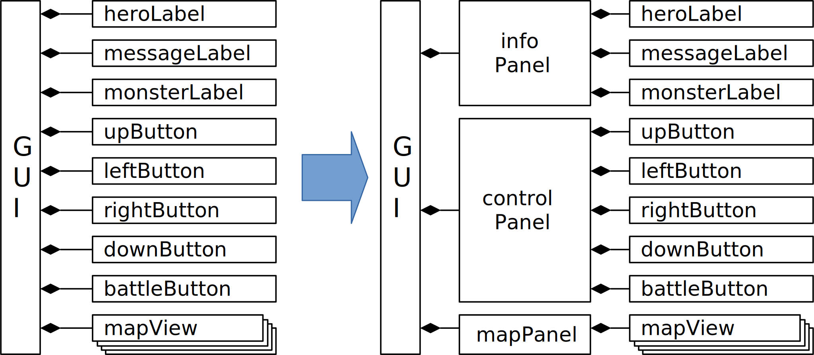
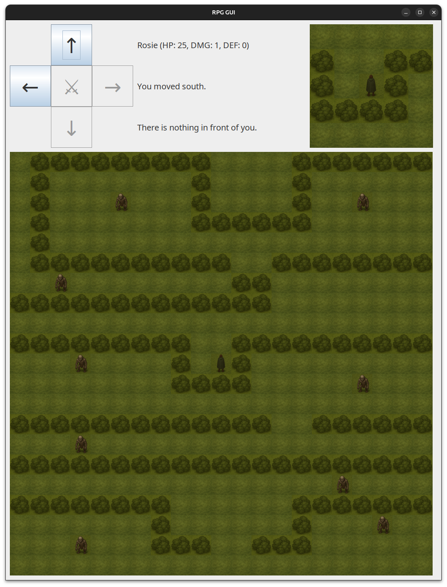
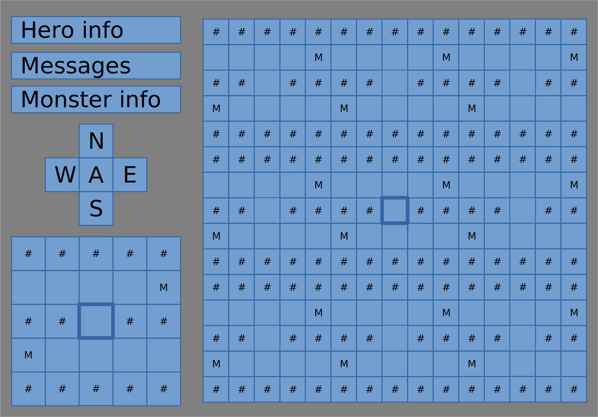
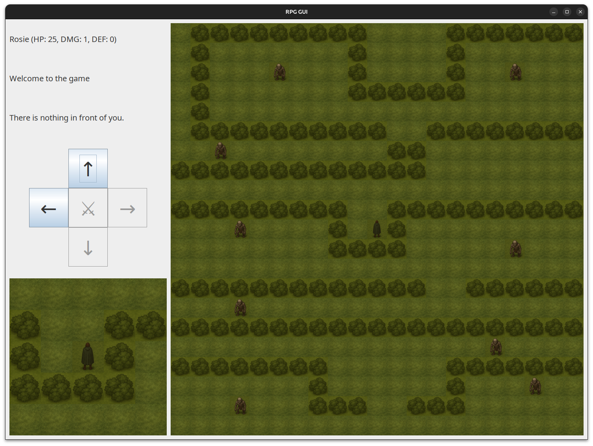
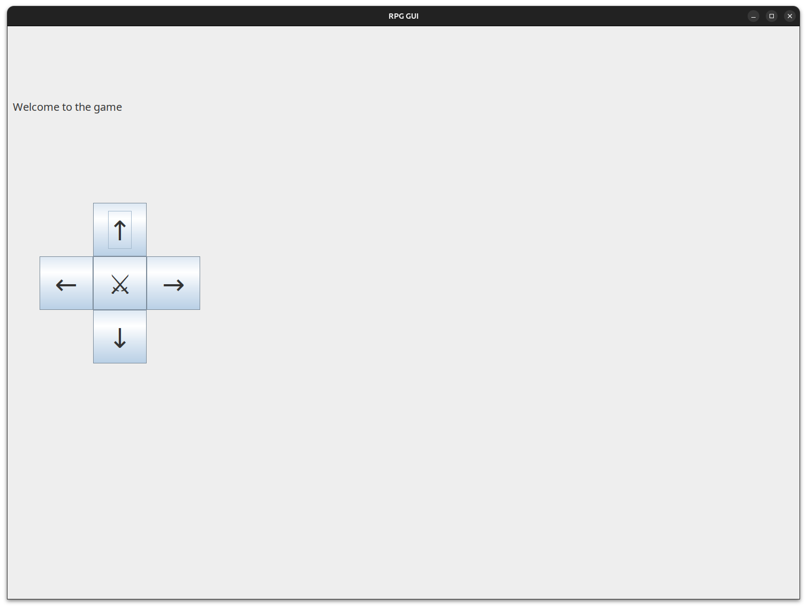
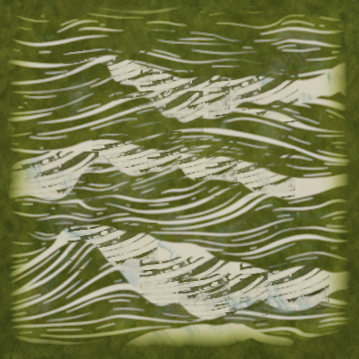
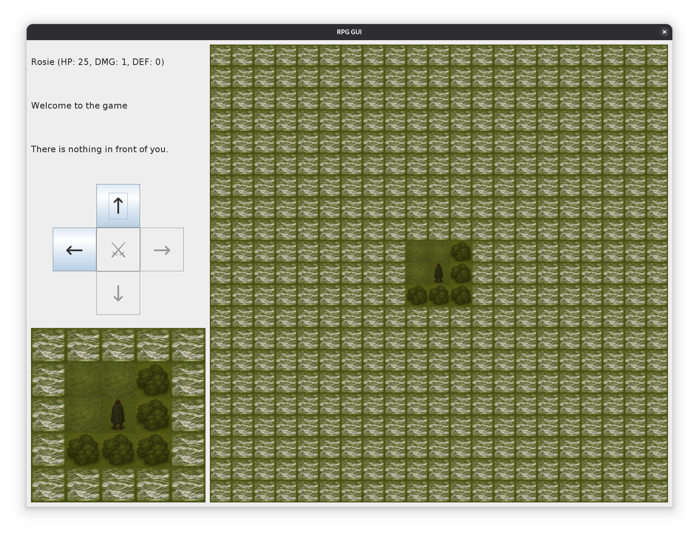
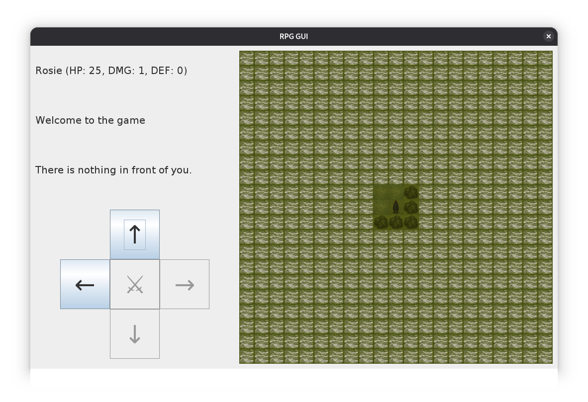
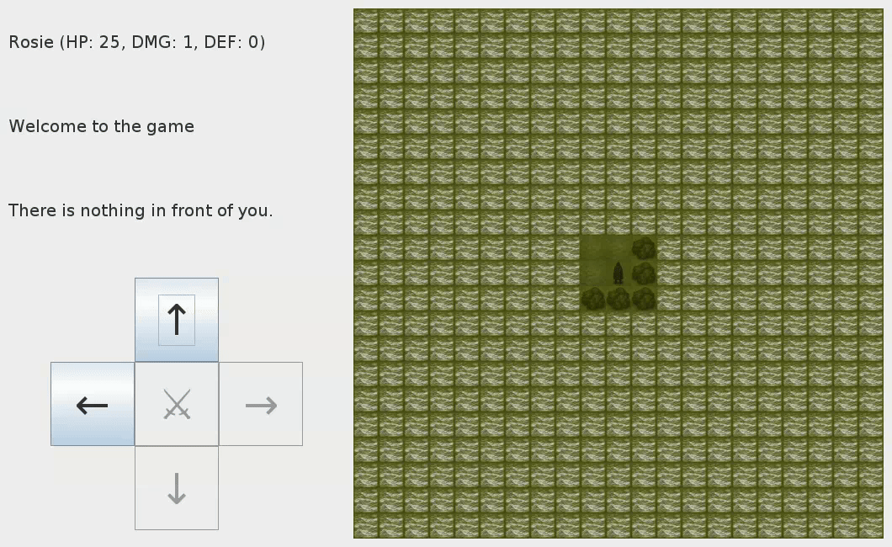

# Grafikus felület strukturálása

A grafikus felület jelenlegi változatában az `initialize_elements` és az `update` metódusok kezdenek nagyra hízni, valamint egyre átláthatatlanabbak az egyes elemeket pozicionáló `setBounds` hívásokban a beégetett konstansok. 

Logikusnak tűnne, hogy az egyes felületi elemeket csoportosítsuk, ami a kódunk szerkezetében most is látszódik, hiszen a felület 3 nagy részből áll: 
 - nyomógombos vezérlő rész
 - közvetlen környezet adatait megjelenítő szöveges rész
 - térkép

Mind a két említett metódusban a függvényhívások könnyen három blokkba szervezhetők ez alapján. 
Ezt jobban jelezhetné a kód például kommentekkel:


```java

public class GUI {
    ...
   private void initialize_elements() {
        
        // Setting default fonts and layouts

        UIManager.put("Label.font", new java.awt.Font("SansSerif", java.awt.Font.PLAIN, 20));
        UIManager.put("Button.font", new java.awt.Font("SansSerif", java.awt.Font.PLAIN, 50));

        setLayout(null);

        // Setting up textual UI hero/monster info

        heroLabel = new JLabel("");
        messageLabel =  new JLabel("Welcome to the game");
        monsterLabel = new JLabel("");

        heroLabel.setBounds(320, 20, 400, 80);
        messageLabel.setBounds(320, 120, 400, 80);
        monsterLabel.setBounds(320, 220, 400, 80);

        add(messageLabel);
        add(heroLabel);
        add(monsterLabel);

        // Setting up buttons for controlling the game

        upButton = new JButton("↑");
        downButton = new JButton("↓");
        rightButton = new JButton("→");
        leftButton = new JButton("←");
        battleButton = new JButton("⚔");
        ...
   }
   ...
}
```

Bár a kód jobban olvasható így egy szükséges módosítás esetén, még jobb volna, ha nem egy nagy objektumunk lenne, ami mindent átlát, hanem ezeket a jól elkülöníthető részeket egy kalap alatt kezelnénk, és a részleteket rábíznánk. 
Ez pedig pontosan ugyanaz a motiváció, ami ez első osztályainkhoz vezetett. 
Teljesen logikus lépés tehát, hogy külön osztályt kapjanak az egyes komponensek. 

## Saját térkép panel

Első körben a legutoljára lefejlesztett térkép nézetet szervezzük ki, több lépésben, majd ennek mintájára a másik két részt is.
Minden GUI keretrendszerben adott egyfajta container entitás, amibe csoportosítani lehet widgeteket. 
Swing esetében ez a `JPanel`, mely hasonlóan a `JFrame`-hez rendelkezik az `add` metódussal, azonban nem rendelkezik saját ablakkal, hanem köztes hierarchikus szervező rétegként szolgál a `JFrame` és az elemi widgetek között. 
Az őt tartalmazó widgetek számára úgy viselkedik, mint egy `JFrame`, viszont az őt tartalmazó `JFrame` (vagy másik `JPanel`) számára ugyanúgy kezelhető, mint a korábban megismert `JButton` vagy `JLabel` widgetek. 

A strukturális változás, amit tervezünk, így vizualizálható:



Szeretnénk tehát egy saját `MapPanel`-t, és hasonlóan ahhoz, ahogy a `GUI` származik a `JFrame`-ből, ennek a `JPanel` lesz az őse:

```java
public class MapPanel extends JPanel {
    ...
}
```

A térképhez kapcsolódó kódokat másoljuk át ennek az osztálynak a konstruktorába, valamint egy `updateView` metódusába:


```java
class MapPanel extends JPanel {
    private final int MAP_VISIBILITY = 3;
    private final int tileSize = 300 / (2*MAP_VISIBILITY+1);
    private final JLabel[][] mapView =  new JLabel[2*MAP_VISIBILITY+1][2*MAP_VISIBILITY+1];

    private ImageIcon getScaledTile(String file) {
        return new ImageIcon(new ImageIcon("tiles/" + file).getImage().getScaledInstance(tileSize, tileSize, Image.SCALE_SMOOTH));
    }
    private final ImageIcon WALL_ICON = getScaledTile("wall.png");
    private final ImageIcon FREE_ICON = getScaledTile("free.png");
    private final ImageIcon MONSTER_ICON = getScaledTile("monster.png");
    private final ImageIcon HERO_ICON = getScaledTile("hero.png");
    private final ImageIcon HERO_MONSTER_ICON = getScaledTile("heromonster.png");

    private final GameLogic model;

    public MapPanel(GameLogic model) {
        this.model = model;
        setLayout(null);
        for (int row=-MAP_VISIBILITY; row <= MAP_VISIBILITY; ++row)
            for (int col = -MAP_VISIBILITY; col <= MAP_VISIBILITY; ++col) {
                JLabel tile = new JLabel();
                tile.setBounds(150 - tileSize/2  + tileSize*col, 150 - tileSize/2 + tileSize*row, tileSize, tileSize);
                this.mapView[row + MAP_VISIBILITY][col + MAP_VISIBILITY] = tile;
                add(tile);
            }
        setPreferredSize(new Dimension(300,300));
    }

    public void updateView() {
         for (int row=-MAP_VISIBILITY; row <= MAP_VISIBILITY; ++row)
            for (int col = -MAP_VISIBILITY; col <= MAP_VISIBILITY; ++col) 
                this.mapView[row+MAP_VISIBILITY][col+MAP_VISIBILITY].setIcon(
                    this.model.isWall(row, col)
                    ? WALL_ICON 
                    : row == 0 && col == 0 && this.model.getHero().isAlive()
                        ? this.model.hasMonster(row, col) ? HERO_MONSTER_ICON : HERO_ICON
                        : this.model.hasMonster(row, col) ? MONSTER_ICON : FREE_ICON
                );
    }

}
```

A kód lényegében teljesen megegyezik azzal, ami eddig volt, csak külön osztályban. 
Pár apróságra azonban még figyelni kellett.

Egyrészt itt is ugyanúgy be kell állítanunk (illetve inkább kiiktatnunk) a layout managert egy `setLayout(null);`-lal, valamint a pozicionálások eltolódtak, mivel most már nem az ablakon, csak ezen a panelen belül kell megmondani a pozíciót. 
Ide tartozik még a panel méretének beállítása is, ami kissé eltér a `JFrame`-nél látottaktól: `setPreferredSize(new Dimension(300,300));`. 

Egy másik fontos észrevétel, hogy a `MapPanel` osztálynak ugyanúgy rendelkeznie kell egy referenciával a modellre, hiszen az alapján tudja magát frissíteni.
`update` helyett `updateView` lett a függvényünk neve. 
Ennek oka, hogy a `JPanel`-nek eleve van ilyen nevű függvénye, amit nem szeretnénk felülírni. 
Nem rontaná el a működést, ahogy eddig sem tette, de ugyanezen okból a `GUI` osztályban is megtesszük ezt az átnevezést.

A `GUI` osztályban az áthelyezett kódrészletek helyére a következők kerülnek:

```java
public class GUI extends JFrame {
    ...
    private MapPanel map;
    ...

    private void initialize_elements() {
        ...
        this.map = new MapPanel(this.model);
        this.map.setBounds(740,10,300,300);
        add(this.map);
        ...
    }

    private void updateView() {
        ...
        this.map.updateView();
        ...
    }
    ...
}
```

A teljes kód [itt](src/0400_GUI_MapPanel/), működésre teljesen megegyezik a korábbi változattal.

## `MapPanel` csinosítás

Bár valóban igaz, hogy most már elkülönítve van a `MapPanel` osztályunk, de pár dolgot érdemes volna javítani, szépíteni rajta.

> [!TIP]
> A funkcionalitás megváltoztatása nélkül milyen dolgokban fejlesztenéd a kódot?

Az első észrevétel lehetne, hogy technikailag most ez az osztály is hivogathatná a modellnek az állapotváltoztató függvényeit. 
Nem tesz ilyet, de hasonló módon, mint a `Hero` megjelenítés esetén, itt is célszerűbb a biztonságosabb utat választani, és deklarálni egy `GameStateViewer` interfészt, és azt használni a `MapPanel` esetében:

```java
public interface GameStateViewer {
    public HeroViewer getHero();
    public MonsterViewer getMonsterInFrontOfHero();    
    public boolean isGameOver();
    public boolean isWall(int relRow, int relCol);
    public boolean hasMonster(int relRow, int relCol);
}
```

Ezt implementálja a `GameLogic`, ahol az `@Override`-okat se felejtsük le az előző fejezetben foglaltak szerint.

Egy másik jó dolog volna a magic konstansok kiirtása a kódból.
Jelenleg a mezők száma és mérete az, ami ilyen, ezek vannak definiálva. 
Ezeket kaphatná paraméterként az objektum létrehozáskor, és akkor ennek megfelelően állítaná be a saját dolgait.

Ezt pár apró módosítással elérhetjük:

```java
class MapPanel extends JPanel {
    private final int visibilityRange;
    private final int size;
    private final int tileSize;
    private final JLabel[][] mapView;
    ...
    private final ImageIcon WALL_ICON, FREE_ICON, MONSTER_ICON, HERO_ICON, HERO_MONSTER_ICON; 

    private final GameStateViewer model;

    public MapPanel(GameStateViewer model, int size, int visibilityRange) {
        this.visibilityRange = visibilityRange;
        this.size = size;
        this.tileSize  = size / (2*visibilityRange+1);
        this.mapView = new JLabel[2*visibilityRange+1][2*visibilityRange+1];
        this.WALL_ICON = getScaledTile("wall.png");
        this.FREE_ICON = getScaledTile("free.png");
        this.MONSTER_ICON = getScaledTile("monster.png");
        this.HERO_ICON = getScaledTile("hero.png");
        this.HERO_MONSTER_ICON = getScaledTile("heromonster.png");
        ...
        setPreferredSize(new Dimension(size,size));
    }
}
```

A képek átméretezése, valamint a cimkemátrix inicializálása átkerült a konstruktorba, hiszen a méretek csak ekkor derülnek ki, illetve a `MAP_VISIBILITY` konstans le lett cserélve egy `visibilityRange` végleges változóra minden helyen.

A `GUI` osztályban csak az inicializálás változott meg: `this.map = new MapPanel(this.model, 300, 3);`.

A cimkék felületen történő pozícionálását illetően is egyszerűsíthetjük a dolgunkat:

```java
public class MapPanel extends JPanel {
    public MapPanel(GameStateViewer model, int size, int visibilityRange) {
        ...
        for (int row = 0; row <  2 * this.visibilityRange + 1 ; ++row)
            for (int col = 0; col < 2 * this.visibilityRange + 1; ++col) {
                JLabel tile = new JLabel();
                tile.setBounds(tileSize*col,tileSize*row, tileSize, tileSize);
                this.mapView[row][col] = tile;
                add(tile);
            }
        setPreferredSize(new Dimension(size,size));
    }
    ...
}
```

A teljes kód [itt](src/0410_GUI_MapPanel_improved/), működésre teljesen megegyezik a korábbi változattal.

## Két térkép

Jelenleg egy kb. 1000x300-as ablakunk van, és a térképes nézet csak nagyon közeli dolgokat mutat. 
Egy komolyabb labirintus bejárásánál ez már zavaró, így jó lenne egy másik térkép is, ahol sokkal messzebb ellátni, és az ablak alján van is bőven neki hely. 

Így, hogy a `MapPanel` ki lett szervezve, ennek megvalósítása csupán néhány sor módosításával megtehető:

```java
public class GUI extends JFrame {
    ...
    private MapPanel smallMap;
    private MapPanel largeMap;
    ...

    private void initialize_elements() {
        ...        
        this.smallMap = new MapPanel(this.model, 300, 2);
        this.smallMap.setBounds(740,10,300,300);
        add(this.smallMap);

        this.largeMap = new MapPanel(this.model, 1030, 10);
        this.largeMap.setBounds(10,320,1030,1030);
        this.add(largeMap);

        setSize(1060, 1360);
        ...
    }

    private void updateView() {
        ...
        this.smallMap.updateView();
        this.largeMap.updateView();
        ...
    }
}
```

Aminek az eredménye:



Ez az ablak azonban így már 1300-nál is nagyobb vertikálisan, ami sok monitoron nem férne ki. 
Célszerűbb lenne egy ilyen módon átrendezni a felületet:



Ennek megvalósítása azonban most nagyon körülményes lenne, hiszen minden gombot és cimkét a térképeken kívül egyesével kellene újrapozícionálni. 
Úgyhogy mielőtt ezt megtennénk, a `MapPanel`-hez hasonlóan kiszervezzük a másik részt saját osztályokba. 

## `InfoPanel` és `ControlPanel` megvalósítása, presenter / supervisory control

### Problémák a jelenlegi struktúrával

A `MapPanel` mintáján felbuzdulva ha belevetjük magunkat a forráskódunk refaktorálásába, és megpróbálunk kódsorok átmásolásával létrehozni egy `InfoPanel` és egy `ControlPanel` osztályt, hamar problémákba ütközünk.

Az első szembejövő kérdés, hogy hova kerüljenek a `moveButtonClicked` és az `attackButtonClicked` metódusok?
Ha a `GUI` osztályunkban maradnak, akkor a `ControlPanel` csak úgy tudja hozzárendelni a gombnyomásokhoz, ha van referenciája az ablakra.
Ez természetesen megoldható, de egy erős kötődést vezet be a `GUI` irányába, és nem szeparálja szépen el a funkciót.
Sokkal természetesebb lenne, ha ezek a metódusok a `ControlPanel` osztályban lennének. 
Ez esetben a kattintást követően a `ControlPanel` objektum direktben meghívhatja a `GameLogic` megfelelő metódusait. 
Nincs szükség a `GUI`-ra mutató referenciára, és jobban szeparált is ez a funkcionalitás. 
Viszont felmerül az a kérdés, hogy a `GUI` és a `MapPanel` honnét fogják tudni, hogy változott a játék állapota és frissíteniük kell magukat?

Lényegében két szereplő van, aki szólhat a `GUI`-nak: `ControlPanel` vagy a `GameLogic`. 
Az utóbbi szembemenne azzal, hogy a model tudjon view-ról, és ez nem szép megoldás, ezért ebbe az irányba nem is indulunk el. 

> [!NOTE]
> Az Observer pattern segítene ezt feloldani, erről majd későbbi fejezetben lesz említés.

Ha a `ControlPanel` szólna, akkor ismét szükség van egy referenciára "felfele" és itt érezzük, hogy ez az objektum két feladatot látna el: egyrészt felelne azért, hogy a felhasználótól fogadja a következő akciót és végrehajtsa azt, másrészt felelne azért, hogy a figyelje a változást, és szóljon róla a főablaknak.
Érződik, hogy ezt a két felelősséget külön volna illő választani.

A következő probléma, hogy az említett két metódus frissíti a `messageLabel`-t. 
Ez a mozgás esetében már létjogosultságát vesztette, hiszen a falak irányában már disabled-re állítódnak a gombok. 
A támadás esetében még van értelme ennek, ha kevés is. 
Elképzelhető, hogy később a mostani sima üzenet helyett megjelenhetne olyan, ahol a sebződések számszerűen adottak, ami a véletlen sebzés után lenne most igazából érdekes.

Vegyük észre, hogy akár marad a `GUI`-ban marad a `messageLabel`, akár átkerül egy `InfoPanel`-re, arra mindenképpen el kell tárolnia egy referenciát a `ControlPanel`-nek, hogy meg tudja jeleníteni az üzenetet. 
Ebből a két opcióból nyilván az utóbbi a csúnyább, oldalirányú függőségeket bevezetni komponensek között még rosszabb, mint egy gyökér/szülő objektum irányába. 

Hogy egyszerre csak egy dologgal foglalkozzunk, a `messageLabel`-t jelenlegi minimális funkciója miatt szimplán kitöröljük, és meghagyjuk saját feladatnak ennek későbbi lefejlesztését.

### Lehetséges strukturális megoldások

Az vázolt problémák egy jobban átgondolt architektúráért kiáltanak, és ha egy ilyen pici példán már előjöttek, akkor sejthető, hogy az elmúlt évtizedekben a szoftveripar tapasztalati úton már megállapodott helyes kódszervezési módoknál.
Ez így is van, egy korábbi fejezetben említettük már az MVC / MVP / MVVM mintákat, melyek azonban néhány, későbbiekben tárgyalt mintával ellentétben nem tervezési, hanem architekturális minták.
Emiatt magasabb absztrakciós szinten adottak, és nem rögzítenek pontosan objektum szintű megkötéseket, hanem azok az alkalmazási területtől (web, desktop GUI, stb.), programozási nyelvtől, keretrendszertől is jobban függhetnek. 

Ezen minták részletes tárgyalása messze túlmutat ezen a jegyzeten, bátorítjuk az érdeklődő olvasót, hogy kiegészítésként olvasson róluk fórumokon, de a fentiek alapján felkészülve arra, hogy két különböző oldalon hasonló, de részleteiben eltérő leírást olvashat MVC néven. 

Mi egy MVP-szerű megoldás irányába lépünk el, amit "supervisory control"-ként is fellelhetünk. 
Az alapelgondolás, hogy külön osztályba kiszervezzük azt a szervező feladatkört, hogy egy felhasználói interakció után hajtsuk végre a modellen a megfelelő változtatást, majd értesítsük a felületet, hogy frissítse magát.

A folyamat a következő:
1. A felhasználó kattint, ami esemény (valamelyik) view osztályban egy metódus elindulását eredményezi.
2. Ez a metódus működési logikát nem tartalmaz, legfeljebb összegyűjti a felületről a modell állapotmódosításához szükséges egyéb adatokat, majd szól a presenternek (meghívja egy dedikált metódusát).
3. A presenter meghívja a modell megfelelő függvényeit, megfelelően felparaméterezve.
4. Ugyanez a metódus szól a view-nak, hogy frissítse magát (meghívja a view `updateView` függvényét).
5. A view a modelltől lekéri a szükséges új adatokat, és frissíti a megjelenítést. 

> [!NOTE]
> Tiszta MVP esetében a view-nak nem lenne hivatkozása a modellre, hanem a presenter gyűjtené össze a szükséges adatokat, és adná tovább a view számára. 
> Ez tesztelési szempontból előnyösebb, de összetettebb presentert igényel és jól definiált adatinterfészeket. 
> Ha pedig nem a presenter szólna a view-nak, hanem a modell (például egy Observer mintát használva), akkor az már inább MVC-nek felel meg.

További fontos részlet, hogy view-ból már nekünk is kettő van, most tervezünk még kettőt csinálni, és általában ez azt jelenti, hogy több presenter is társul melléjük. 
Ebben az esetben azonban ugyanoda kerülünk, hogy ha az egyik presenter módosít valamit a modellen, a másiknak tudnia kell róla. 
Itt ismét az Observer minta kerülne elő. 
Mi azonban egy sokkal kevésbé skálázható, de a jelenlegi komplexitást könnyen kiszolgáló architektúra mellett maradunk, aminek bevett neve nincs, talán "Supervising Presenter with Composite View"-nak lehetne nevezni: egyetlen presenter lesz, ami nem gyűjti össze az adatokat a view-nak (supervising presenter), és egyetlen gyökér view-nak hívja meg az `updateView` függvényét, ami szól az általa tartalmazott gyerek view-knak (composite view). 
Ez a felállás nekünk most elég, de nehezen skálázódik, körülményesebben tesztelhető, így idővel indokolttá válna majd egy rendes MVP architektúrára váltani.

Végül, de nem utolsó sorban most egy teljesen általános `updateView()` függvényünk van, és mindig mindent frissítünk, holott ez nem feltétlenül szükséges.
Támadás esetében például a térképet csak akkor kell frissíteni, ha meghalt a szörny a hős mellett. 
Ezt a lehetőséget meghagyjuk otthoni feladatnak, továbbra is teljes frissítést hajtatunk végre függetlenül attól, milyen változás történt.

### `Presenter` Megvalósítás

Mielőtt a presenter kódját megírnánk, gondoljuk végig, hogy nézne ki a main függvényünk, ami a három részt inicializálja. 
Az első ötlet a fentiek alapján valami ilyesmi lehetne:

```java
public static void main(String[] args) throws Exception{
    GameLogic model = new GameLogic("maps/test.xml");
    Presenter presenter = new Presenter(model,view);
    GUI view = new GUI(presenter,model);
    view.run();
}
```

Az első sorral nincs semmi gond, a model létrehozható anélkül, hogy bármit tudna presenterekről, vagy view-król. 
Azonban a fent tervezett felállásban a presenternek is tudnia kell a view-ról és fordítva is. 
Belekerültünk egy tyúk-tojás szituációba, amit fel kell oldani valahogy.
Mivel oda-vissza tudniuk kell egymásról, valamelyiket előbb kell létrehozni, és az még nem tudja megkapni a konstruktorában a referenciát, és egy későbbi setterrel kell majd beállítani.
Ez azt is jelenti, hogy abban az osztályban, minden használat előtt tesztelni kell, hogy még `null`-e a referencia, mielőtt használjuk. 
Mivel az ablakunk több panelnek is tovább akarja majd adni a presentert, ezért (is) célszerűbb ezt a megoldást választani:


```java
class Main {
    public static void main(String[] args) throws Exception{
        GameLogic model = new GameLogic("maps/test.xml");
        Presenter presenter = new Presenter(model);
        GUI view = new GUI(presenter,model);
        presenter.setView(view);
        view.run();
    }
}
```

Ezek után a presenter osztály viszonylag egyszerű:

```java
public class Presenter {
    private GUI view = null;
    private final GameLogic model;

    public Presenter(GameLogic model) {
        this.model = model;
    }

    public void setView(GUI view) { this.view = view; }

    public void move(String direction) {
        this.model.moveHero(direction.substring(0,1));
        if (this.view != null) this.view.updateView();
    }

    public void battle() {
        this.model.battle();
        if (this.view != null) this.view.updateView();
    }
}
```

Az inicializálást leszámítva a két felhasználói interakciónak van 1-1 metódusa, ami - ahogy korábban terveztük - nem csinál mást, mint meghívja a megfelelő függvényét a modellnek, majd szól a view-nak hogy frissítse magát. 
Idővel ha több ilyen függvény lenne majd, akkor a guard logikát érdemes lenne nem mindenhol ismételni, így érdemes kiszervezni egy függvénybe: 

```java
public class Presenter {
    ...

    private void updateView() {
        if (this.view != null) this.view.updateView();
    }

    public void move(String direction) {
        this.model.moveHero(direction.substring(0,1));
        updateView();
    }

    public void battle() {
        this.model.battle();
        updateView();
    }
}
```

A modellben semmi változásra nincs szükség, a view-ban változik az inicializálás, kikerül a két actionlistener, helyettük a presenter metódusai hívódnak meg.
A `MapPanel` nem kapja meg a presentert, mivel jelenleg semmilyen akciót nem lehet azon inicializálni, így csak egy passzív nézetről van szó. 
A `messageLabel` egyelőre bentmaradt, de csak a játék végén kerül beállításra.
További változás, hogy mivel a módosítások a presenteren keresztül történnek, a viewnak is elég egy `GameStateViewer` a `GameLogic` helyett. 
A teljes kód [itt](src/0430_SupervisingPresenter/) elérhető, a lényegi változások:

```java
public class GUI extends JFrame {
    ...
    private final GameStateViewer model;
    private final Presenter presenter;

    public GUI(Presenter presenter, GameStateViewer model) {
        super("RPG GUI");  
        this.model = model;
        this.presenter = presenter;
        initialize_elements();  
        updateView();
    }

    private void initialize_elements() {
        ...
        upButton.addActionListener(e -> this.presenter.move("north"));
        downButton.addActionListener(e -> this.presenter.move("south"));
        rightButton.addActionListener(e -> this.presenter.move("east"));
        leftButton.addActionListener(e -> this.presenter.move("west"));
        battleButton.addActionListener(e -> this.presenter.battle());
        ...
    }
    ...
}
```
A játék ugyanúgy működik, mint korábban.

### `InfoPanel` és `ControlPanel`

Az előző alapozás után a `MapPanel`-hez hasonlóan most már könnyű kiszervezni az információs és a nyomógombos részeket. 
Ezek is `JPanel`-ek lesznek, és a `ControlPanel`-nek már meg kell kapnia presentert is. 

Kezdjük az egyszerűbbel: az `InfoPanel` így nézne ki:

```java
class InfoPanel extends JPanel {
    private final JLabel messageLabel;
    private final JLabel monsterLabel;
    private final JLabel heroLabel;

    private final GameStateViewer model;

    public InfoPanel(GameStateViewer model) {
        this.model = model;

        setLayout(null);

        this.heroLabel = new JLabel("");
        this.messageLabel =  new JLabel("Welcome to the game");
        this.monsterLabel = new JLabel("");

        this.heroLabel.setBounds(0, 0, 400, 80);
        this.messageLabel.setBounds(0, 100, 400, 80);
        this.monsterLabel.setBounds(0, 200, 400, 80);

        add(messageLabel);
        add(heroLabel);
        add(monsterLabel);
    }

    public void updateView() {
        HeroViewer hero = this.model.getHero();
        MonsterViewer monster = this.model.getMonsterInFrontOfHero();

        this.heroLabel.setText(hero.toString());
        this.monsterLabel.setText( 
            monster != null 
            ? "<html>There is a monster in front of you:<br>" + monster  + "</html>"
            : "There is nothing in front of you."
        ); 
        if (this.model.isGameOver()) this.messageLabel.setText( 
            hero.isAlive() 
            ? "Congrats, " + hero.getOfficialName() + " cleansed the world  of monsters."
            : "The hero died, the monsters reign over the world."
        );
    }
}
```

Ahogy a `MapPanel` esetében is, a releváns részek át lettek másolva.
Két lényegi változás van: egyrészt a cimkék már lehetnek `final`-ök, mert most bőven elfér a konstruktorba az inicializálás.
Másrészt a cimkék pozíciója sokkal átláthatóbb, hiszen csak a panelen belüli helyzetet kell megadni. 
Hogy a főablakon belül hol lesz ez a panel, azt majd a főablakban beállítjuk.

A `ControlPanel` hasonlóan készül el, de mivel vár felhasználói interakciót, ezért a presentert is át kell neki adni:

```java
class ControlPanel extends JPanel {
    private final JButton upButton;
    private final JButton downButton;
    private final JButton rightButton;
    private final JButton leftButton;
    private final JButton battleButton;

    private final GameStateViewer model;
    private final Presenter presenter;

    public ControlPanel(Presenter presenter, GameStateViewer model) {
        this.presenter = presenter;
        this.model = model;

        setLayout(null);

        this.upButton = new JButton("↑");
        this.downButton = new JButton("↓");
        this.rightButton = new JButton("→");
        this.leftButton = new JButton("←");
        this.battleButton = new JButton("⚔");

        this.upButton.addActionListener(e -> this.presenter.move("north"));
        this.downButton.addActionListener(e -> this.presenter.move("south"));
        this.rightButton.addActionListener(e -> this.presenter.move("east"));
        this.leftButton.addActionListener(e -> this.presenter.move("west"));
        this.battleButton.addActionListener(e -> this.presenter.battle());

        this.upButton.setBounds(100,0,100,100);
        this.downButton.setBounds(100, 200, 100, 100);
        this.leftButton.setBounds(0, 100, 100, 100);
        this.rightButton.setBounds(200, 100, 100, 100);
        this.battleButton.setBounds(100, 100, 100, 100);

        add(this.upButton);
        add(this.downButton);
        add(this.leftButton);
        add(this.rightButton);   
        add(this.battleButton);
    }

    public void updateView() {
        HeroViewer hero = this.model.getHero();
        MonsterViewer monster = this.model.getMonsterInFrontOfHero();

        this.battleButton.setEnabled(hero.isAlive() && monster != null);
        this.upButton.setEnabled(hero.isAlive() && !this.model.isWall(-1,0));
        this.downButton.setEnabled(hero.isAlive() && !this.model.isWall(1,0));
        this.leftButton.setEnabled(hero.isAlive() && !this.model.isWall(0,-1));
        this.rightButton.setEnabled(hero.isAlive() && !this.model.isWall(0,1));
    }
}
```

Ugyanúgy átmásolások, `final`-ök, és könnyebben követhető pozícionálások.

Ezek után a `GUI` osztály meglehetősen leegyszerűsödik, mindent kiemeltünk lényegében belőle, csupán annyi dolga van, hogy ezekből a panelekből egyet-egyet feltegyen magára, és frissítéskor nekik is szóljon, hogy frissüljenek:

```java
public class GUI extends JFrame {
    private InfoPanel unitInfo;
    private ControlPanel actionControl;
    private MapPanel smallMap;
    private MapPanel largeMap;

    private final GameStateViewer model;
    private final Presenter presenter;

    public GUI(Presenter presenter, GameStateViewer model) {
        super("RPG GUI");  
        this.model = model;
        this.presenter = presenter;
        initialize_elements();  
        updateView();
    }

    private void initialize_elements() {
        UIManager.put("Label.font", new java.awt.Font("SansSerif", java.awt.Font.PLAIN, 20));
        UIManager.put("Button.font", new java.awt.Font("SansSerif", java.awt.Font.PLAIN, 50));

        setLayout(null);

        this.actionControl = new ControlPanel(this.presenter, this.model);
        this.actionControl.setBounds(10,10,300,300);
        add(this.actionControl);

        this.unitInfo = new InfoPanel(this.model);
        this.unitInfo.setBounds(320, 20, 400, 300);
        add(this.unitInfo);

        
        this.smallMap = new MapPanel(this.model, 300, 2);
        this.smallMap.setBounds(740,10,300,300);
        add(this.smallMap);

        this.largeMap = new MapPanel(this.model, 1030, 10);
        this.largeMap.setBounds(10,320,1030,1030);
        this.add(largeMap);

        setSize(1060, 1360);
        setResizable(false);

        setDefaultCloseOperation(JFrame.EXIT_ON_CLOSE);
    }

    public void updateView() {
        this.unitInfo.updateView();
        this.actionControl.updateView();
        this.smallMap.updateView();
        this.largeMap.updateView();
    }    

    public void run() {
        setVisible(true);
    }
}
```

Lényegében kiüresedett ez az osztály, az egyetlen felelőssége az maradt, hogy felépítse panelekből a felületet, azokat egymáshoz képest elhelyezze, és továbbítsa a frissítés kérést a presentertől. 

Jelen állapotban az egyes panelek mozgatása már könnyen megvalósítható: 

```java
    private void initialize_elements() {
        ...
        this.actionControl = new ControlPanel(this.presenter, this.model);
        this.actionControl.setBounds(60,330,300,300);
        add(this.actionControl);

        this.unitInfo = new InfoPanel(this.model);
        this.unitInfo.setBounds(10, 10, 400, 300);
        add(this.unitInfo);

        
        this.smallMap = new MapPanel(this.model, 400, 2);
        this.smallMap.setBounds(10,660,400,400);
        add(this.smallMap);

        this.largeMap = new MapPanel(this.model, 1050, 10);
        this.largeMap.setBounds(420,10,1050,1050);
        this.add(largeMap);

        setSize(1480, 1070);
        setResizable(false);
        ...
    }
```

Mely a korábban tervezett layoutot eredményezi: 



A végleges kód [itt](src/0440_3Panels/) elérhető.

### Direkt frissítési logika

A mostani `GUI` osztály egyik felelőssége, hogy továbbadja a frissítési kérést. 
Ha új elemek jelennek meg, akkor nem szabad elfelejteni, hogy az `updateView`-ban is fel kell őket venni, és meg kell hívni az ő `updateView` függvényüket is. 
Ha pedig később egy ilyen panelt további panelekre szedünk szét, ott is figyelni kell erre a logikára. 
Jó lenne, ha ezt valahogy automatizálnánk, nem a `GUI`-nak kellene szólnia a panelekhez, hanem a presenter tudna az összesről és mindegyiknek szólna.

Presenter oldalon ennek a megvalósítása nem nehéz, egy view helyett egy listát tartunk számon, és mindegyikre meghívjuk az `updateView` függvényt. 
Azonban ehhez kell egy olyan interfész, ami ezt megköveteli, legyen ez `View` egyelőre, és ezt implementálja a `GUI` valamint a 3 panelünk: 

``` java
public interface View {
    public void updateView();
}

public class GUI extends JFrame implements View { ... }
class ControlPanel extends JPanel implements View { ... }
class InfoPanel extends JPanel implements View { ... }
class MapPanel extends JPanel implements View { ... }
```

Majd a presenterben `setView` helyett `registerView`-val lehetővé tesszük a view regisztrálását és az `updateView`-ban mindegyikre meghívjuk a frissítést:

```java
public class Presenter {
    private final ArrayList<View> views = new ArrayList<View>();    
    ...

    public void registerView(View view) { this.views.add(view); }

    private void updateView() {
        for (View view : views) { view.updateView(); }
    }
    ...
}
```

Ezek után már csak a regisztrálást kell megejteni. 
Ezt megteheti `GUI` létrehozáskor:

```java
public class GUI extends JFrame implements View {
    ...
    public GUI(Presenter presenter, GameStateViewer model) {
        super("RPG GUI");  
        this.model = model;
        this.presenter = presenter;
        this.presenter.registerView(this);
        initialize_elements();  
        updateView();
    }

    private void initialize_elements() {
        ...

        this.actionControl = new ControlPanel(this.presenter, this.model);
        this.presenter.registerView(this.actionControl);
        ...

        this.unitInfo = new InfoPanel(this.model);
        this.presenter.registerView(this.unitInfo);
        ...

        
        this.smallMap = new MapPanel(this.model, 400, 2);
        this.presenter.registerView(this.smallMap);
        ...

        this.largeMap = new MapPanel(this.model, 1050, 10);
        this.presenter.registerView(this.largeMap);
        ...
    }

    @Override
    public void updateView() { }  
    ...
}
```
Valamint a `Main` is leegyszerűsödik, kikerül a `setView` hívás belőle.
Ha futtatjuk a kódot így, az elején furcsa eredményt látunk:



A hiba ott leledzik, hogy eddig a `GUI` konstruktorának a végén meg lett hívva az `updateView`, ami a panelek azonos nevű függvényén keresztül beállította a lényeg infóit, illetve a térkép képeit.
Ez most lemaradt, ezért minden panel konstruktorának a végére tegyük is oda, és akkor már helyesen működik a program.
A kód ezen állapota [itt](src/0450_Observer/) elérhető.

### Direkt frissítés automatizálása

A mostani megoldásunk során is külön regisztrálni kell a paneleket a presenternél, de legalább ez már ugyanott van, mint a létrehozásuk, így kisebb eséllyel felejti le a fejlesztő. 
De nyilvánvalóan kedvezőbb lenne, ha ez létrehozáskor automatikusan megtörténne. 
A regisztrálás meghívását átmozgathatjuk a panelek konstruktorába, de ekkor meg kell az `InfoPanel`-nek és a `MapPanel`-nek is kapnia a presentert, nem csak a modellt. 
Bár a felelősség így már jobb helyen van, továbbra sem automatikus a regisztrálás, ezt minden panel esetében kézzel kell megtenni. 

Ekkor juthat eszünkbe, hogy mindegyik ilyen view a `View` interfészt implementálja, az egy közös pont, jó volna oda kivinni ezt a logikát. 
Interfész azonban nem tartalmazhat működést, így a `View`-nak interfészből osztállyá kell változnia. 
Ekkor viszont abba a problémába ütközünk, hogy ellentétben Pythonnal, C++-szal, stb. Javaban nem megengedett a többszörös öröklődés, a paneljeink pedig már öröklődnek a `JPanel`-ből, a `GUI` pedig a `JFrame`-ből.

Egy megoldási lehetőség volna, hogy a paneljeink nem öröklődnek a `JPanel`-ből, hanem tartalmazzák azt (öröklődés helyett kompozíció), és így "felszabadulnak".
Ebben az esetben nem magát a `MapPanel`-t tudjuk majd rátenni egy felületi elemre, hanem valahogy le kell tőle kérdezni a belső paneljét. 
Bár ennek a megoldásnak is megvannak az előnyei, most nem ebbe az irányba indulunk el.

Vegyük észre, hogy a `GUI`-t leszámítva mindenki a `JPanel`-ből öröklődik, és a `GUI::updateView` teljesen kiürült. 
Ha megfogadnánk, hogy semmilyen elemet nem teszünk direktben a `GUI`-ra, akkor teljesen homogén lenne a `View` interfészt implementáló osztályok ősosztálya, valamint ki is kerülhetne minden frissítési logika a `GUI`-ból. 
Könnyen látható, hogy ez nem egy túl nagy vállalás, hiszen ha mégis szeretnénk valamit teljes ablak szinten, akkor a mostani panelek és a főablak közé könnyen beilleszthető lesz majd egy `MainPanel`.
Nem is baj továbbá, hogy a főablakunk megjelenítő szerepe megszűnik, és csak a megjelenítéseket összefogó szerepe marad.

De miért előnyös, hogy minden `View`-t implementáló osztály a `JPanel`-ből származik? Azért,mert így köztes ősként ősosztályként megjelenhet a `View`, immár a regisztrációs működéssel.
Ahelyett, hogy `MapPanel` a `JPanel`-t bővítené ki, a `View` fog öröklődni a `JPanel`-ből, és abból a mi három panelünk. 
Itt a `View`-ban azonban még nem akarjuk implementálni az `updateView` függvényt, ezért úgynevezett absztrakt osztály lesz csak.


Ekkor viszont a presenterbe is bekerülne az a függés, hogy csak `JPanel`-ből származó nézeteket lehet regisztrálni. 
Ez a későbbiekben még jelenthet gondot, ha szöveges naplózást, vagy például valamilyen hálózati kommunikációt is szeretnénk bekötni.
Erre felkészülve még egy szintet beilleszünk, a `View` megmarad interfésznek, azonban ezt fogja implementálni egy `ViewPanel` absztrakt osztályt, ami a `JPanel`-ből származik.

Kódszinten a `View` tehát nem változik, elkészül egy ilyen osztály az automatikus regisztrációval:

```java
public abstract class ViewPanel extends JPanel implements View {
    protected final Presenter presenter;

    public ViewPanel(Presenter presenter) {
        this.presenter = presenter;
        presenter.registerView(this);
    }
}
```

De ha már a presenter elmentését ebbe az ősbe tettük, akkor a modellel is megtehetjük ugyanezt:

```java
public abstract class ViewPanel extends JPanel implements View {
    protected final Presenter presenter;
    protected final GameStateViewer model;

    public ViewPanel(Presenter presenter, GameStateViewer model) {
        this.presenter = presenter;
        presenter.registerView(this);
        this.model = model;
    }
}
```


A `GUI` osztály tényleg a szervezésre redukálódik, és ha a későbbiekben nem tervezünk további paneleket hozzáadni, csak inicializáláskor, akkor nem is szükséges elmenteni a modelt, presentert. 
Ekkor pedig a konstruktor kellően kicsi lesz, hogy az elemek inicializálását visszamozgathassuk ide, és akkor a panelek is `final`-ök lehetnek újra:

```java

public class GUI extends JFrame {
    private final InfoPanel unitInfo;
    private final ControlPanel actionControl;
    private final MapPanel smallMap;
    private final MapPanel largeMap;

    public GUI(Presenter presenter, GameStateViewer model) {
        super("RPG GUI");  
        UIManager.put("Label.font", new java.awt.Font("SansSerif", java.awt.Font.PLAIN, 20));
        UIManager.put("Button.font", new java.awt.Font("SansSerif", java.awt.Font.PLAIN, 50));

        setLayout(null);

        this.actionControl = new ControlPanel(presenter, model);
        this.actionControl.setBounds(60,330,300,300);
        add(this.actionControl);

        this.unitInfo = new InfoPanel(presenter, model);
        this.unitInfo.setBounds(10, 10, 400, 300);
        add(this.unitInfo);

        
        this.smallMap = new MapPanel(presenter, model, 400, 2);
        this.smallMap.setBounds(10,660,400,400);
        add(this.smallMap);

        this.largeMap = new MapPanel(presenter, model, 1050, 10);
        this.largeMap.setBounds(420,10,1050,1050);
        this.add(largeMap);

        setSize(1480, 1070);
        setResizable(false);

        setDefaultCloseOperation(JFrame.EXIT_ON_CLOSE);
    }  

    public void run() {
        setVisible(true);
    }
}
```

Sikerült ismét átlátható méretűre hozni ezt az osztályt is.
A panelek pedig az új absztrakt osztályt egészítik ki, kikerült a presenter, model elmentése, helyette az ősosztály (`ViewPanel`) konstruktora hívódik meg. 
Ha ezt lefelejtenénk, akkor fordítási hibát kapunk, így nem fordulhat elő olyan működő program, ahol nem frissülő panelt helyeztünk a felületünkre.

```java

class ControlPanel extends ViewPanel {
    ...

    public ControlPanel(Presenter presenter, GameStateViewer model) {
        super(presenter,model);
        ...
    }
    ...
}

class InfoPanel extends ViewPanel{
    ...
    public InfoPanel(Presenter presenter, GameStateViewer model) {
        super(presenter, model);
        ...
    }
    ...
}

class MapPanel extends ViewPanel{
    ...
    public MapPanel(Presenter presenter, GameStateViewer model, int size, int visibilityRange) {
        super(presenter, model);
        ...
    }
    ...
}
```
Az utóbbi két alfejezetben valójában az Observer mintát valósítottuk meg a nézetek és a presenter között.
Erről a mintáról a későbbiekben lesz még szó részletesen.
A végleges kód [itt](src/0460_Observer2/) 

## Záró gondolatok a GUI strukturáláshoz

Ha élhetünk azzal a feltételezéssel, hogy csak egy presenter van, akkor alkalmazható volna a Singleton minta, és akkor a referenciát sem volna szükségszerű eltárolni a paneleknél. 
Lehetne továbbá a presenternek egy `getGameStateView` függvénye, hogy a modellt se kelljen, vagy implementálhatná maga a presenter ezeket a metódusokat, hogy a view és a model közötti link szükségtelenné váljon.
Ahogy korábban tárgyaltuk, nagyobb, dinamikusan változó felületek esetében leve több presenter a jellemző, és nem a view-k iratkoznak fel a presenterre, hanem a presenterek a modellre inkább. 
Ezért ilyen változtatásokat nem ejtünk most meg, de önálló gyakorlásnak megfelelőek.

Egy másik fontos észrevétel, hogy pazarló a mostani kódunk olyan értelemben, hogy soha nem regisztrálunk ki egy nézetet. 
Nem igazán támogatja a jelenlegi felállás azt, hogy paneleket felveszünk, leteszünk, stb. 
Ha monjduk a felhasználó becsukja a minitérképet, akkor az továbbra is a memóriában marad, mert a `presenter.views` listában ott van rá a referencia, és emiatt frissítődik is mindig a háttérben, csak nem látjuk.


# Csomagokba szervezesés

Elérkeztünk ahhoz a szinthez, hogy ha kilistázzuk az `.class` fájljainkat, bizony szépen megnövekedett a számuk:
```
 ControlPanel.class          HeroViewer.class      Presenter.class
'GameLogic$Position.class'   InfoPanel.class       TUI.class
 GameLogic.class             Main.class            Unit.class
 GameStateViewer.class       MapPanel.class        UnitViewer.class
 GUI.class                   Monster.class         View.class
 Hero.class                  MonsterViewer.class   ViewPanel.class
```

Kezd kényelmetlen lenni, hogy ezek mind egy könyvtárban vannak, és nem csak a fájlok rendezése miatt, hanem logikailag is értelmes volna valahogy a jobban összetartozó osztályokat valahogy csoportosítani. 

## `package`-ek

A korábbiak alapján viszonylag egyértelmű, hogy van két nagy csoport: modell és view osztályok, valamint ezek mellett van még a presenter és a `Main`. 
Java esetében a csoportosítás eszközei a csomagok, melyek szabályszerint a könyvtárszerkezetet is 1-1 követik. 
Az előzőek után adja magát egy egyszerűbb hierarchikus szerkezet, amiben van egy `rpg` gyökér csomag, és ennek három alcsomagja:

```
rpg
├── model
├── view
└── presenter
```

A `Main` maradhat szimplán az `rpg` csomagban, és a legtöbb osztályról/interfészről egyértelmű, hogy hova kerül.
A `GameLogic`, `Unit`, stb. egyértelműen az `rpg.model`-ben lesznek, ahogy a `GUI` és `TUI` is a `rpg.view`-ban, valamint a `Presenter` az `rpg.presenter`-ben.

Bár a név kissé megtévesztő lehet, de a `*Viewer` interfészek helye szintén az `rpg.model`, hiszen nem megjelenítési logikát tartalmaznak, csupán csak olvasó interfészek az `rpg.model`-ben található további osztályokhoz. 

Végül, de nem utolsó sorban, a `View` szintén nem az `rpg.view`-ba, hanem az `rpg.presenter`-be kerül, hiszen ez valójában egy feliratkozó interfész a `Presenter`-hez.

Érezzük, hogy a korábbi névválasztásaink nem mindig öregedtek jól, a `View` helyett is valószínűleg kifejezőbb volna egy  `PresenterObserver`, de most - hogy egyszerre csak egy dolgot csináljunk - még nem nevezünk át semmit.

Ezek alapján a könyvtárszerkezet így fog kinézni:

```
├── model/
│   ├── GameLogic.java
│   ├── GameStateViewer.java
│   ├── Hero.java
│   ├── HeroViewer.java
│   ├── Monster.java
│   ├── MonsterViewer.java
│   ├── Unit.java
│   └── UnitViewer.java
├── view/
│   ├── GUI.java
│   ├── TUI.java
│   └── ViewPanel.java
├── presenter/
│   ├── View.java
│   └── Presenter.java
└── Main.java
```

Ezt az egészet még illik beletenni egy `src` könyvtárba, a térképeket és mezőképeket pedig mellette egy `resources` könyvtárba:

```
src/
└── rpg/
    ├── model/
    ├── view/
    └── presenter/
resources/
├── maps/
└── tiles/
```

Ezek után van még teendő: 
 - Minden Java fájl elején fel kell tüntetni a csomagot, pl: `package rpg.model`
 - A másik csomagokban lévő osztályok/interfészek használatához `import`-ok szükségesek, pl.: `import rpg.presenter.Presenter;`
 - A `Main`-ben és az `MapPanel`-ben az elérési utak elejére oda kell kerülnie a `resources/`-nek.

Fordításhoz ilyenkor már érdemes elgondolkodni valamilyen build framework használatán. 
A jegyzet írásakor a leglogikusabb választás a [Maven](https://maven.apache.org/) és a [Gradle](https://gradle.org/). 
A mi programunk szerencsére még annyira egyszerű, hogy az ezekkel járó plusz betanulást el tudjuk kerülni, hiszen majdnem egy sorban továbbra is megoldható a fordítás / futtatás. 
Ennek módja platformonként eltérő lehet, itt most `bash` esetére adjuk meg a parancsokat: 

```bash
javac src/rpg/**/*.java src/rpg/Main.java
```

Ebben az esetben a class fájlok továbbra is a java fájlok mellett lesznek. 
Most viszont már szebb volna az `src` mellé egy `build` könyvtárat is létrehozni, ahol elválasztódnak a forrásoktól.
A fordítás ezek után:

```bash
javac -d build/ src/rpg/**/*.java src/rpg/Main.java
```

Futtatás pedig egyszerűen:
```bash
java -cp build rpg.Main
```

Azonban ha csak a fenti lépéseket végeztük el, már fordítás során hibába ütközünk. 
Több osztálynál metódusnál elfelejtettük kitenni a `public` kulcsszót, és emiatt az alapértelmezett package-private láthatósági szintre kerültek, ami azt jelenti, hogy az azonos csomagban lévő osztályok látják, mások nem. 
Ez eddig nem tűnt fel, mert minden az alapértelmezett package-ben volt, most azonban már nem. 
Egyelőre írjuk be a `public`-ot mindenhova, hogy lefordulhasson a kód, hamarosan átgondoljuk jobban az ehhez a láthatósági szinthez tartozó lehetőségeket.

Ha mindent láthatóvá tettünk, amit kellett, akkor a program ugyanúgy működik, mint eddig, a kód ezen változata [itt](src/0465_Packages/) érhető el.

## package private láthatósági szint

Bár eddig erről a jogosultsági szintről bővebben nem beszéltünk, minden osztály, metódus ezzel rendelkezett, amihez nem tettük ki expliciten a `public`/`protected`/`private` kulcsszavak valamelyikét. 
Ilyenek voltak a legelső osztályaink, metódusaink, vagy az imént fordítási hibát okozók.
De továbbra is maradt még bőven ilyen a kódunkban: a `GUI.java`-ban a `GUI` melletti összes panel osztályunk ilyen. 
Ha megpróbálnánk betenni eléjük a `public` kulcsszót, hibát is kapnánk, mivel nem csak a csomagok elnevezése és a könyvtárszerkezet, hanem a publikus osztályok/interfészek és fájlnevek között is 1-1 kapcsolat van Java-ban. 
Ha egy külső (másik csomagban lévő) osztály importálja a `foo.bar.Something`-ot, akkor azt az `foo/bar/Something.java`-ban fogja keresni, máshol nem. 
Ezért nem lehet a `MapPanel` osztály publikus a `GUI.java`-ban.

Bár ezeket a paneleket nem szeretnénk publikussá tenni, maradhatnak a jelenlegi package private szinten, érdemes az eddigi lustaságunkat korrigálni, és mindegyik panelt a saját fájljában elhelyezni. 
Könnyebben átláthatóak lesznek ezek a fájlok, és most már az sem gond, hogy nagyon megnőne az egy könyvtárban lévő fájlok száma, hiszen a csomagok miatt szétszórtuk őket.
Az osztályok külön fájlokba történő szétszedésének megvan az az előnye is, hogy az fájl elején levő importok lerövidülhetnek, vagy specifikusabbak lehetnek. 

Jelenleg tehát így néz ki az `rpg/gui` könyvtár:

```
rpg/view/
├── ControlPanel.java
├── GUI.java
├── InfoPanel.java
├── MapPanel.java
├── TUI.java
└── ViewPanel.java
```
A `TUI` kissé kilóg a listából, illetve biztosan nem fogja használni a paneleket, így lehetne tovább cizellálni a dolgot egy `rpg.view.gui` és egy `rpg.view.tui` csomagokkal, de egyelőre ettől eltekintünk.

> [!TIP]
> Jelen formájában a szöveges UI nagyon elavulttá vált a GUI mellett, de a térképes megjelenítés a GUI miatt bevezetett metódusokkal szövegesen is megoldható. 
> A fenti architektúra begyakorlására kiváló lehetőség a TUI MVP architektúrára történő átszerkesztése. Melyet követően várhatóan felvetődik majd a kérdés, hogy a `GameStateViewer` jó helyen van-e az `rpg.model` csomagban.

Ezek után lényegében érdemes végigmenni az összes, eddig `public` osztályon, interfészen és metóduson, hogy valóban szükséges-e, hogy publikus maradjon, vagy elég / jobb, ha csak a csomagon belül látható.

> [!TIP]
> Továbbolvasás előtt érdemes egyedül végiggondolni ezt, kiszedni a feleslegesnek gondolt `public`-okat, és folyamatosan ellenőrizni, hogy a kód lefordul-e.

A teljesség igénye nélkül egy lista, hogy mik kerültek át package public láthatósági szint alá, teljes jelenlegi kód [itt](/src/0470_Package_public/):
 - Az összes panel package private, a konstruktoraik is, de az `updateView` marad public.
 - `GUI`-ban marad minden `public`.
 - `rpg.presenter`-ben minden változatlan, de a `View`-t nevezzük át `PresenterObserver`-re, hogy jobban tükrözze a név a funkcióját.
 - `rpg.model`-ben a `GameStateViewer` és a `GameLogic` nem változik.
 - A `*Viewer`-ek maradnak publikusak a metódusokkal együtt, és ezek implementációi is. 
 - A `Unit`, `Monster`, `Hero` osztályokban ami nem `public` vagy `protected`, `private` az mind lehete package private, maguk az osztályok és konstruktoraik is.

Itt egy érdekes észrevétel, hogy több osztálynál maga az osztály package private, tehat kintről nem látható, de egy örökölt metódusa publikus. 
Ez elsőre furcsának tűnhet, de teljesen rendjén van, mert aki a publikus metódusát használja az objektumnak, az nem csak egy publikus interfészt lát, azon keresztül kommunikál az objektummal. 
De ő maga nem tudna ilyet létrehozni. 

## Felesleges viewerek

Az előző fejezetben egy hosszadalmas gondolkodás eredményeként hoztuk létre a `HeroViwer` interfészt, hogy a felület elemei véletlenül se tudják mutálni a `Hero` objektumot.
 Ez továbbra is egy jó megoldás, és nagyfokú kontrolt ad afelett, hogy pontosan mit teszünk láthatóvá, mit nem. 
 A csomagokba szervezéssel azonban adottá vált egy másik lehetőség is, amihez kellően egyszerű még a kódunk, most most demonstrációs céllal ki is használjuk. 

Az eredeti probléma az volt, hogy szerettük volna, hogy az egységeket mutáló támadó, gyógyító metódusokat csak a modellhez tartozó osztályok tudják meghívni, a felületet fejlesztő programozó véletlenül se csinálhasson ilyet. 
Erre most adja magát a megoldás, hogy az ilyen, állapotot módosító metódusokat package private láthatósági szintre állítsuk. 
Ekkor az `rpg.model`-ben lévők elérik, de a `GUI`-ban / `Presenterben` véletlenül sem lehet őket meghívni, az már fordítási hibát eredményez.

Tehát megszüntethetjüka `*Viwer` interfészeinket, és szimplán ami eddig miattuk `public` volt, az az is marad, ami package private, az pedig továbbra is rejtve van külső szemek elől.
Maguk az osztályok publikussá válnak, de a konstruktoraik nem.
A paneleken pedig ismént `Monster` és `Hero` referenciákat lehet használni.

A változások elvégzése után a [kód](src/0480_No_viewers/) ugyanúgy működik, ha például a presenterben megpróbálnánk a támadás előtt mindig felgyógyítani a hőst:

```java
public class Presenter {
    ...
    public void battle() {
        this.model.getHero().healToFull();
        this.model.battle();
        updateView();
    }
}
```
Akkor az alábbi hibaüzenetet kapjuk:

```
src/rpg/presenter/Presenter.java:26: error: healToFull() is not public in Hero; cannot be accessed from outside package
        this.model.getHero().healToFull();
                            ^
1 error
```

# Enough of `this`

Apró módosítás, de eddig attríbútumoknál mindig kitettük a `this.`-ot, hogy hangsúlyozzuk, belső adattagról van szó. 
Azonban talán most már elég gyakorlatot szeretztünk, hogy erre az emlékeztetőre nincs szükség, és ahol nem szükséges (pl. konstruktorok), ott elhagyjuk. 
(Nem szándékosan eddig is sikerült már párszor.)

Ezután az apró módosítás utáni, könnyebben olvasható változata a kódnak [itt](src/0481_No_this/) található.


# Fog of war

Azt, hogy mennyit látunk a térképből, jelenleg a `MapPanel` konstruktorában határozzuk meg. 
Gyakori játéklogika, hogy a hősnek van egy távolsága, ameddig ellát, amögött nem látja, mi történik. 
Ezt a logikát implementáljuk most, ami azonban a megjelenítést is érinti majd, hiszem most már olyat is meg kell jeleníteni, hogy valamit nem látunk, amire ezt a mezőképet használjuk majd:


Logikának a következőt alkalmazzuk:
 - mezőtávolság alatt a sor- és oszlopkülönbségek négyzetét értjük
 - erre a hős limitje kezdetben 2
 - minden szintlépéskor 3-mal szorzódik.


## Játéklogika módosítása

Ezt a logikát a `Hero` osztályban az eddigiek alapján gyorsan és könnyen implementálhatjuk:

```java
public class Hero extends Unit {
    private int vision = 2;
    ...

    private void levelUp() {
        ...
        vision *= 3;
    }

    int getVisionRangeSq(){ return vision; }    

}
```

Annak a logikáját, hogy lát-e egy mezőt, a `GameLogic` osztályba tesszük, hiszen a későbbiekben előfordulhat összetettebb logika, hogy fal mögé nem látunk be, stb. 
A gettert egyelőre package private-nak meghagyjuk, ha netán később szükség lenne rá mondjuk view oldalon, akkor majd publikussá tesszük.

A `GameLogic` osztályban az `isWall` és a `hasMonster` működését át kell gondolni. 
A játéklogika része most már, hogy amennyiben a hős látótávolságán kívüli mezőt kérdezünk le, akkor ne tudjunk válaszolni erre a kérdésre.
Ezt többféleképpen megoldhatnánk, például:
 - nem látható pozícióknál mindjkét függvény `false`-ot ad vissza, és van egy harmadik `isVisible` függvény.
 - nem látható pozícióknál mindkét függvény kivételt dob.
 - egy új függvényt csinálunk, ami a tile-oknak megfelelő enumot ad vissza.

Mindhárom út járható a maga előnyével és hátrányával. 
Azonban már eddig is lekezeltük azt az esetet, amikor pályán kívüli mezőt kértek le tőlünk, ami egy hasonló logika, így konzisztensen ugyanúgy kezeljük a ködöt is le, azaz az első megoldást választjuk, annyi módosítással, hogy a pályán kívüli mezők mindig ködösek lesznek.
Mivel a függvények neve nem fejezi ki ezeket a háttérlogikákat, ezért docstringben mindenképp fontos ezen speciális esetek megemlítése. 
Annak azonban általában nagyobb esélye van, hogy a függvény módosításával a dokumentációs sztring nem változik, és ha se a függvénynév, se ez nem ír le egy esetet, az kellemetlen következményekkel járhat. 
Úgyhogy most inkább újragondoljuk a függvényneveinket, még akkor is, ha ez view oldali refaktorálást is igényelni fog. 
A jelenlegi `isWall` valójában egy `isWallOrOutside`, most pedig a fenti logika kapcsán egy `isWallOrOutsideIfVisible` lenne a helyes név.
Viszont ha a kinti területeket ködnek akarjuk értelmezni, akkor a logikát is jobban tükröző `canSeeWall` és `canSeeMonster` függvények lesznek helytállók, kiegészítve egy `canSee`-vel. 

A módosítások `rpg.model`-ben:

```java
public interface GameStateViewer {
    ...
    public boolean canSeeWall(int relRow, int relCol);
    public boolean canSeeMonster(int relRow, int relCol);
    public boolean canSee(int relRow, int relCol);
}

public class GameLogic implements GameStateViewer{
    
    private record Position(int row, int col){
        int distanceSq(Position other) {
            return (row-other.row)*(row-other.row)+(col-other.col)*(col-other.col);
        }
    } 

    ...

    private boolean isValidPosition(Position pos) {
        return pos.row >= 0 && pos.row < accessible.length
            && pos.col >= 0 && pos.col < accessible[0].length;
    }

    private boolean isInVisibilityRange(Position pos) {
        return hero.getVisionRangeSq() >= heroPosition.distanceSq(pos);
    }
    
    private boolean canSee(Position pos) { 
        return isValidPosition(pos) && isInVisibilityRange(pos); 
    }

    private Position getAbsolutePosition(int relRow, int relCol) {
        return new Position(heroPosition.row + relRow, heroPosition.col + relCol);
    } 

    @Override
    public boolean canSeeWall(int relRow, int relCol) {
        Position pos = getAbsolutePosition(relRow, relCol);
        return canSee(pos) && !accessible[pos.row][pos.col];
    }

    @Override
    public boolean canSeeMonster(int relRow, int relCol) {
        Position pos = getAbsolutePosition(relRow, relCol);
        return canSee(pos) && monsters.containsKey(pos);
    }

    @Override
    public boolean canSee(int relRow, int relCol) {
        return canSee(getAbsolutePosition(relRow, relCol));        
    }    
}
```

## Felület igazítása

Ezek után természetesen a `MapPanel` és a `ControlPanel` is módosul. 
Előbbiben a az `isWall` cserélődik csak `canSeeWall`-ra. 
Emiatt technikailag ha nem látna a hős 1 távolságra, és ott lenne egy fal, akkor a gomb továbbra is enabled lenne. 
Ez egyrészt nem okoz problémát, mert a modell csak ignorálja a lépést, másrészt a szomszédos mezőket alapból láthja a hős.
A `MapPanel` már kicsit több változtatást igényel:

```java
package rpg.view;

import rpg.model.GameStateViewer;
import rpg.presenter.Presenter;

import java.awt.Dimension;
import java.awt.Image;
import javax.swing.*;

class MapPanel extends ViewPanel{
    ...
    private final ImageIcon ..., FOG_ICON; 
    ...

    MapPanel(Presenter presenter, GameStateViewer model, int size, int visibilityRange) {
        ...
        FOG_ICON = getScaledTile("fog.png");
        ...
    }

    @Override
    public void updateView() {
         for (int row=-visibilityRange; row <= visibilityRange; ++row)
            for (int col = -visibilityRange; col <= visibilityRange; ++col) 
                mapView[row+visibilityRange][col+visibilityRange].setIcon(
                    !model.canSee(row,col)
                    ? FOG_ICON
                    : model.canSeeWall(row, col)
                        ? WALL_ICON 
                        : row == 0 && col == 0 && model.getHero().isAlive()
                            ? model.canSeeMonster(row, col) ? HERO_MONSTER_ICON : HERO_ICON
                            : model.canSeeMonster(row, col) ? MONSTER_ICON : FREE_ICON
                );
    }
}
```

Ezek után a játék indításakor ezt látjuk:



Két térkép helyett lehet jobb ötlet volna csak egyet használni, ami azonban méreteződne annak megfelelően, mennyit látunk a pályából.
A méretezést a következő alfejezetben megtesszük, a kis térkép levételéhez csak a `GUI` konstruktorát kell módosítani a `smallMap`-es részek törlésével, és a nagy térkép, valamint az ablak átméretezésével. 
Mivel a `smallMap` saját magát regisztrálta be a presenternél, ezért erre most nincs gondunk, hogy onnét kiszedjük.

```java
public class GUI extends JFrame {
    ...
    private final MapPanel map;

    public GUI(Presenter presenter, GameStateViewer model) {
        ...

        map = new MapPanel(presenter, model, 630, 10);
        map.setBounds(420,10,630,630);
        add(map);

        addNotify();
        Insets insets = getInsets();
        setSize(1060 + insets.left + insets.right, 650 + insets.top + insets.bottom);
        ...

        setDefaultCloseOperation(JFrame.EXIT_ON_CLOSE);
    } 
    ...
}
```

Mely után ilyen lesz induláskor az ablak:



A láthatósági távolság növekedése pedig ezen a videón látható, hogy működik:



A kód ezen állapota [itt](src/0490_Fog_of_war/) érhető el.

## Dynamic map

Az ötlet az, hogy a térkép mérete automatikusan növekedjen annak megfelelően, hogy éppen mennyit lát a hős. 
Amikor updateli magát, megnézi, hogy növekedett-e a hős látótávolsága, és ha igen, ennek megfelelően újra létrehozza a mezőket.
Ehhez nem árt egy olyan segédfüggvény, mely megmondja, hogy egy irányban max hány mezőig lát el a hős. 
Jelen esetben mi az 

```java

class GameStateViwer {
    ...
    public int getMaxSightRange();
}

class GameLogic {
    ...
    @Override
    public int getMaxSightRange() {
        return (int) Math.sqrt(hero.getVisionRangeSq());
    }
}
```

A `MapPanel`-ben is viszonylag kevés módosításra van szükség, a konstruktor nagy része átkerül egy privát `resize(range)` metódusba, `tileSize` helyett a teljes méretet jegyezzük meg, illetve átadunk egy maximális rávolságot, aminél nagyobb ne legyen a mutatott távolság:

```java

class MapPanel extends ViewPanel{
    ...
    private final int size;
    private final int maxRange;
    ...

    private void resize(int range) {
        if (range <= visibilityRange) return;
        if (range > maxRange) range = maxRange;

        visibilityRange = range;
        tileSize  = size / (2*visibilityRange+1);
        mapView = new JLabel[2*visibilityRange+1][2*visibilityRange+1];

        WALL_ICON = getScaledTile("wall.png");
        FREE_ICON = getScaledTile("free.png");
        MONSTER_ICON = getScaledTile("monster.png");
        HERO_ICON = getScaledTile("hero.png");
        HERO_MONSTER_ICON = getScaledTile("heromonster.png");
        FOG_ICON = getScaledTile("fog.png");
        
        removeAll();

        for (int row = 0; row <  2 * visibilityRange + 1 ; ++row)
            for (int col = 0; col < 2 * visibilityRange + 1; ++col) {
                JLabel tile = new JLabel();
                tile.setBounds(tileSize*col,tileSize*row, tileSize, tileSize);
                mapView[row][col] = tile;
                add(tile);
            }
    }

    MapPanel(Presenter presenter, GameStateViewer model, int size, int maxRange) {
        super(presenter, model);
        this.maxRange = maxRange;
        this.size = size;
        this.visibilityRange = 0;

        setLayout(null);
        setPreferredSize(new Dimension(size,size));

        updateView();
    }

    @Override
    public void updateView() {
        if ( visibilityRange < maxRange && model.getMaxSightRange() + 1 > visibilityRange) resize(model.getMaxSightRange()+1);

        ...
    }
}
```

A kód úgy lett megírva, hogy amíg nem érjük el a `maxRange`-et, addig a szélén mindig egy mezőnyi köd legyen.
Ezek után így néz ki az előző játékmenet:


A kód ezen állapota [itt](src/0495_Dynamic_map/) érhető el.

# Záró gondolatok

Bár sok funkció, amiről a legelső fejezetben ötleteltünk, nem került megvalósításra még, sikerült egy olyan alapot letenni, ami sok további fejlesztésnek jó alapot ad. 
Innentől az olvasóra bízzuk a további bővítést, eddigi design döntések felülbírálását, stb. 
A hátralevő fejezetek további tervezési segítséget adnak ahhoz, hogy megfelelő irányba alakuljon a szoftver architektúrája. 
Erősen javasoljuk, hogy minden új megtanult módszernél az olvasó először vizsgálja felül a jelenlegi kódbázist, lehetne-e valahol alkalmazni az ott tanultakat, majd ezt követően valamely ötlettel bővítse ki a kódot, ahol az új tudást alkalmazni és begyakorolni tudja.

Hogy egy kicsit izgalmasabb legyen a játék záró változata, két feladatot felvetünk itt, amiknek egy implementálása [itt](src/0500_Shrine_Monster_Movement/) megtalálható:
 - Ha már tud a hősünk gyógyulni, legyen olyan szentély a térképen, amit ha meglátogat a hős, akkor teljesen felgyógyul.
 - Amikor egy bármilyen akciót a hős végrehajt, a szörnyek közül néhány véletlenszerűen mozogjon 1 mezőt véletlen irányba.

Mintajáték, ahol Rosie győzedelmeskedik:


