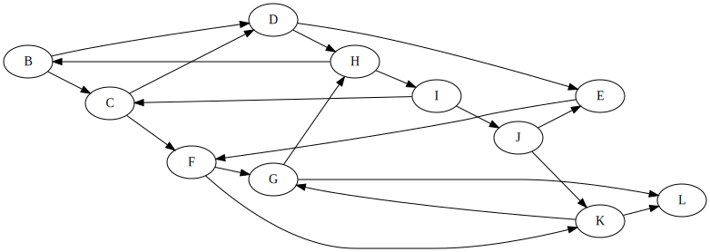

# Levelező PótZH1 
2025.05.24. $JEGY = \left\lceil \frac{ReLU(PONT-31)}{8}\right\rceil +1$

# Igaz-Hamis állítások - 8p
Adottak az alábbi állítások. Döntse el, hogy igazak-e vagy hamisak.
 - A Kruskal algoritmus csak páros gráfokhoz adja meg a minimális feszítőfát.
 - A Counting sort helyben rendez.
 - Láncolt listában minimum keresése $O(n)$ időben végezhető.
 - Dijkstra algoritmusa működik negatív élt tartalmazó gráfokon, ha körmentesek.
 - Min-kupacban minimum keresése $O(\log(n))$ időben végezhető.
 - Adjacencia mátrixban egy csúcs szomszédainak kilistázása $O(n)$ időben végezhető.
 - A bináris keresőfa magassága legrosszabb esetben $O(n)$.
 - Dinamikus tömbben adott indexű elem keresése $O(1)$ időben végezhető.

# Rendezések - 8p
Nevezzen meg két olyan algoritmust, mely legrosszabb esetben $O(n \log{n})$ időben rendez.

Nevezzen meg három másik rendező algoritmust, mely stabil.

Összehasonlításon alapuló rendezések gyorsaságának mi az elméleti minimuma és miért?

# Aszimptotikus jelölések - 6p
Adottak az alábbi függvények, illetve függvényhalmazok. Jelölje, ahol a tartalmazás fennáll. 
| |  $o(n^5)$ | $O(n^4)$| $\Theta(n^3)$| $\omega(n^3)$| $\Omega(n^1)$ |
| --- | --- | --- | --- | --- | --- |
| $n^2$ |
| $n^3$ |
| $n^2 + 123n$ |
| $n^2 \log n$ |
| $\log(n^2)$ |
| $n + \log(n)$ | 

# Partícionálás - 3p
A tanult algoritmussal partícionálja az alábbi tömböt. `[23, 11, 24, 51, 35,2, 16, 34]`

# Bináris keresőfa - 9p
Készítsen egy bináris keresőfát a következő számok sorrendben történő beillesztésével: 25, 13, 17, 12, 24, 36, 48. 
Rajzolja fel a fa ezen állapotát, majd mindegyik alábbi lépés után is, azokat sorrendben végrehajtva:
 - 12 törlése
 - 18 beszúrása
 - 17 törlése
 - 25 törlése

A végleges fában adja meg a csúcsok postorder bejárásának sorrendjét.

# Kupac - 7p
Készítsen max-kupacot az alábbi tömbből a tanult eljárással:
```
[23, 11, 51, 35, 19, 2, 16, 35]
```
Rajzolja fel a kupac ezen állapotát, majd kétszer törölje ki a legnagyobb elemet a kupacból, és rajzolja fel a törlések utáni állapotokat.


# Láncolt lista - 5p
Adott az alábbi egyszerű láncolt lista elem:
```c
typedef struct LLnode {
    int data;
    struct LLnode *next;
} LLNode;
```
Készítsen függvényt az alábbi szignatúrával, mely egy (új) láncolt listában visszaadja a megadott értéknél nagyobb elemeket.
```c
LLNode* filter_greater(LLNode *head, int lower_limit);


```

# Mélységi bejárás - 6p
Az `B` csúcsból indulva végezze el a mélységi bejárást az alábbi gráfban, és adja meg az egyes csúcsok érkezési és távozási idejét. A gyerekek bejárásának sorrendje ábécé szerint történik. 



# Minimális feszítőfa - 6p

Adja meg a minimális feszítőfát az alábbi gráfban Kruskal algoritmusával. 


# Legrövidebb utak - 5p

Az előző feladat gráfján adja meg a legrövidebb utat `B`-ből `I`-be Dijkstra algoritmusával.