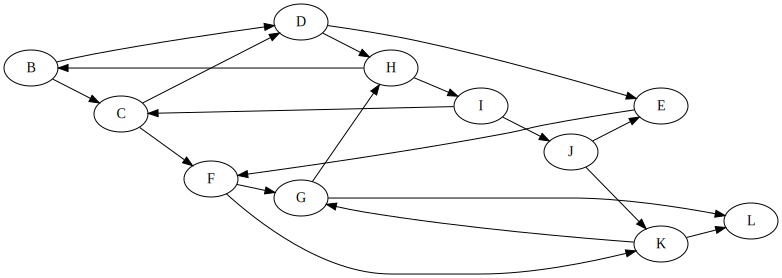
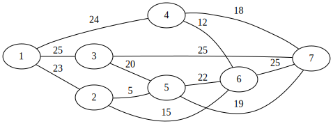

# Levelező ZH - A csoport
2025.05.09.


$JEGY = \left\lceil \frac{ReLU(PONT-31)}{8}\right\rceil +1$

# Igaz-Hamis állítások - 8p
Adottak az alábbi állítások. Döntse el, hogy igazak-e vagy hamisak.
 - A bináris keresőfa magassága legjobb esetben $O(\sqrt{n})$.
 - Láncolt listában adott indexű elem keresése átlagosan $O(n)$ időben végezhető.
 - A Prím algoritmus futása során a beválasztott élek menetközben nem mindig alkotnak összefüggő gráfot.
 - Bináris keresőfában minimum keresése $O(\log(n))$ időben végezhető.
 - Adjacencia mátrix memóriaigénye $O(n)$, ahol $n$ a csúcsszám.
 - A Ford-Fulkerson módszer csak körmentes gráfokra működik.
 - Dijkstra algoritmusa működik kört tartalmazó gráfokon, de csak ha páros a gráf.
 - A Merge sort helyben rendez.

# Rendezések - 8p

Adjon meg két rendező algoritmust, aminek a legjobb és legrosszabb futási ideje nem ugyanaz, valamint írja meg, melyik milyen esetben fordul elő.

Összefésülő rendezésnél hányszor hívódik meg az összefésülő szubrutin? (rövid indoklás)

A Radix / Számjegyes rendezés számára a felhasznált rendező algoritmus mely tulajdonsága fontos? Nevezzen meg 3 olyan rendező algoritmust, mely rendelkezik ezzel a tulajdonsággal.

# Aszimptotikus jelölések - 5p
Adottak az alábbi függvények, illetve függvényhalmazok. Kösse össze azokat, ahol a tartalmazás fennáll. 
| Függvények | <span style="display:inline-block; width:100px; visibility:hidden;"></span>| Függvényhalmazok |
|------------|---|------------------|
| $n^8$ || $o(n\log(n))$ |
| $n^3$ || $O(n^2)$ |
| $n^3 + 123n$ || $\Theta(n^3)$ |
| $n^2 \log n$ || $\omega(n^4)$ |
| $\log(n^2)$ || $\Omega(\sqrt{n})$ |
| $n + \log(n^{42})$ || 

# Bináris keresőfa - 8p
Készítsen egy bináris keresőfát a következő számok sorrendben történő beillesztésével: 33, 15, 23, 7, 12. 
Rajzolja fel a fa ezen állapotát, majd mindegyik alábbi lépés után is, azokat sorrendben végrehajtva:
 - 15 törlése
 - 18 beszúrása
 - 7 törlése

A végleges fában adja meg a csúcsok postorder bejárásának sorrendjét.

# Kupac - 5p
Készítsen min-kupacot az alábbi tömbből a tanult eljárással:
```
[23, 11, 24, 2, 16, 35, 1]
```
Rajzolja fel a kupac ezen állapotát, majd törölje ki a legkisebb elemet a kupacból, és rajzolja fel az ezutáni állapotot.

Ebben a végső kupacban, mint fában adja meg az elemek inorder bejárását.

# Partícionálás - 3p
A tanult algoritmussal partícionálja az alábbi tömböt. (A pivot az utolsó elem.)
```
[23, 11, 24, 51, 35, 19, 2, 16]
```

# Láncolt lista - 6p
Adott az alábbi (két irányba) láncolt lista elem:
```c
typedef struct LLnode {
    int data;
    struct LLnode *next;
    struct LLnode *prev
} LLNode;
```
A láncolt listánk egy körkörösen, két irányba láncolt fejes lista, azaz a `head` pointer egy dummy csúcsra mutat, ahol a `data` értéke `NULL`. Készítsen függvényt az alábbi szignatúrával, mely a Stalin sort algoritmust valósítja meg, azaz kitörli a nem növekvő sorrendben lévő számokat.
```c
void stalin_sort(LLNode *head);
```
Példa:
```
head -> DUMMY <-> 1 <-> 8 <-> 3 <-> 14 <-> 5 <-> DUMMY
stalin_sort(head);
head -> DUMMY <-> 1 <-> 8 <-> 14 <-> DUMMY
```

# Mélységi bejárás - 6p
A `H` csúcsból indulva végezze el a mélységi bejárást az alábbi gráfban, és adja meg az egyes csúcsok érkezési és távozási idejét. A gyerekek bejárásának sorrendje ábécé szerint történik. 



# Minimális feszítőfa - 6p

Adja meg a minimális feszítőfát az alábbi gráfban Kruskal algoritmusával. 




# Legrövidebb utak - 8p

Az előző feladat gráfjában adja meg a legrövidebb utakat, illetve azok hosszát minden csúcsba az `5`-ös csúcsból Dijkstra algoritmusával. 


