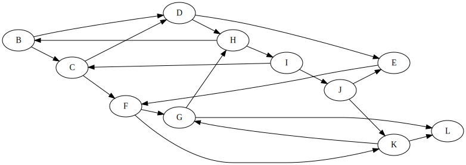
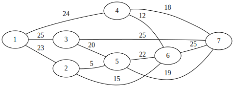

# Levelező ZH - A csoport
2025.06.19.


$JEGY = \left\lceil \frac{ReLU(PONT-31)}{8}\right\rceil +1$

# Igaz-Hamis állítások - 8p
Adottak az alábbi állítások. Döntse el, hogy igazak-e vagy hamisak.
 - A bináris keresőfa magassága legrosszabb esetben $O(\sqrt{n})$.
 - (Rendezetlen) láncolt listában legkisebb elem keresése $O(n)$ időben végezhető.
 - A Kruskal algoritmus futása során a beválasztott élek menetközben nem mindig alkotnak összefüggő gráfot.
 - Min-kupacban minimum keresése $O(\log(\log(n)))$ időben végezhető.
 - Adjacencia mátrix memóriaigénye $O(n+m)$, ahol $n$ a csúcsszám, $m$ az élszám.
 - A Ford-Fulkerson módszer csak irányított gráfokra működik.
 - Bellman-Ford algoritmusa nem működik kört tartalmazó gráfokon.
 - A kupacrendezes helyben rendez.

# Rendezések - 8p

Adjon meg két rendező algoritmust, aminek a legjobb és legrosszabb futási ideje ugyanaz.

Legjobb és legrosszabb esetben hányszor hívódik meg gyorsrendezésnél a partícionáló eljárás? 

Miért?

Mikor NEM érdemes / lehet használni a számláló / counting sortot?

Miért?

# Aszimptotikus jelölések - 5p
Adottak az alábbi függvények, illetve függvényhalmazok. Jelölje, ahol a tartalmazás fennáll. 
|  | $o(2^n)$ | $O(n^2)$ | $\Theta(n\log(n))$ | $\Omega(n^3)$ | $\omega(\log(n))$ | 
| --- | --- | --- | --- | --- | --- |
| $n + n^2$ | 
| $n + \log(n^2)$ | 
| $n + 2^n$ | 
| $n + 2n$ | 
| $n ^ {n + 2}$ | 

# Bináris keresőfa - 8p
Készítsen egy bináris keresőfát a következő számok sorrendben történő beillesztésével: 1,5,21,2,8,3,13
Rajzolja fel a fa ezen állapotát, majd mindegyik alábbi lépés után is, azokat sorrendben végrehajtva:
 - 5 törlése
 - 8 törlése
 - 11 beszúrása

A végleges fában adja meg a csúcsok preorder bejárásának sorrendjét.

# Kupac - 6p
Készítsen max-kupacot az alábbi tömbből a tanult eljárással:
```
[1,5,21,2,8,3,13]
```
Rajzolja fel a kupac ezen állapotát, majd törölje ki a legnagyobb elemet a kupacból, és rajzolja fel az ezutáni állapotot. Ezt ismételje meg még egyszer.

Ebben a végső kupacban, mint fában adja meg az elemek inorder bejárását.

# Partícionálás - 3p
A tanult algoritmussal partícionálja az alábbi tömböt. (A pivot az utolsó elem.)
```
[23, 11, 24, 51, 35, 19, 2, 16]
```

# Láncolt lista - 4p
Adott az alábbi láncolt lista elem, amit egy körkörös fejes listában használunk, azaz a `head` pointer egy dummy csúcsra mutat, ahol a `data` értéke `NULL`.
```c
typedef struct LLnode {
    int data;
    struct LLnode *next;
} LLNode;
```
Készítsen függvényt az alábbi szignatúrával, mely leellenőrzi, hogy növekvő sorrendben vannak-e a számok. A függvény akkor is `true`-val térjen vissza, ha üres a lista.
```c
bool isIncreasing(LLNode *head);
```

# Mélységi bejárás - 6p
A `C` csúcsból indulva végezze el a mélységi bejárást az alábbi gráfban, és adja meg az egyes csúcsok érkezési és távozási idejét. A gyerekek bejárásának sorrendje ábécé szerint történik. 



# Minimális feszítőfa - 6p

Adja meg a minimális feszítőfát az alábbi gráfban Prim algoritmusával a `4`-es csúcsból indulva.




# Legnagyobb folyam - 9p

Az előző feladat gráfjában adja meg a legnagyobb folyamot `1`-ből `6`-ba a Ford-Fulkerson módszerrel.
