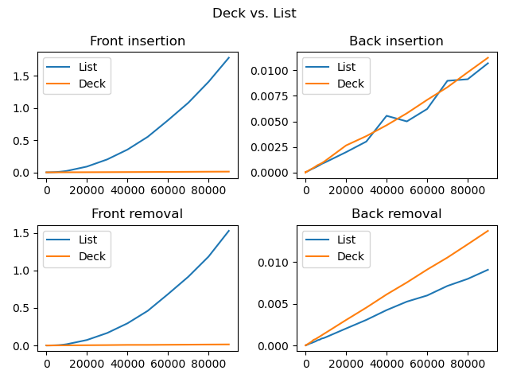

# Comparison of efficiency of front/back insertions/removals for Dequeue and List

## Goal
Measuring and comparing the performance of `list` and `deque` for a large number of insertions and removals on both ends.

## Approach
For insertion tests, an empty container is created, then, the time is measured to individually add a large number of elements. 
For removal tests, the containers are initialized with a large number of zeros and items are removed one by one.

```python

def push_test(container, count:int, back = True):
    push = container.push_back if back else container.push_front
    for i in range(count): 
        push(i)

def pop_test(container, count:int, back = True):
    pop = container.pop_back if back else container.pop_front
    for _ in range(count):
        pop()

```

## Implementations

The implementations rely on the `list` and `deque` containers with the methods listed below for front/back insertions/removals:

|           | `list`            |                 | `deque`             |                 |
| --------- | ----------------- | --------------- | ------------------- | --------------- |
|           | front             | back            | front               | back            |
| insertion | `.insert(0,item)` | `.append(item)` | `.appendleft(item)` | `.append(item)` |
| removal   | `.pop(0)`         | `.pop()`        | `.popleft()`        | `.pop()`        |

For full implementation details, refer to [proper_list_vs_deck.py](proper_list_vs_deck.py)

## Test cases

A total of 45 test cases were run with sizes of 1,2,...,9,10,20,...90,100,...,9000. 
Each case was measured with [timeit](https://docs.python.org/3/library/timeit.html#timeit.Timer.timeit)

## Results

The raw results can be found in [this](notdone.csv) file. 
The following graph depicts the general trends:



## Conclusions

Several conclusions can be made:
 - For `list`, both the insertion and removal test on the front shows quadratic nature. This is to be expected as each operation has an **O(n)** complexity, and **O(n)** operations were carried out in a test.
 - The same operations for `deque` seem to be constant, but the raw data shows that they have in fact a linear nature, as expected with **O(1)** complexity operations.
 - For back operations both containers behaved similarly, in a linear fachion (**O(n)** operations with **O(1)** complexity)
 - In case of back insertion, several "spikes" can be observed for `list`, which probably happens when the size of the testcase exceeds the reserved size of the container, and a reallocation was necessary.
 - For back removals, both containers have a linear profile, but `deque` is slowe by a factor of ?% in average. This is due to the fact, that `list.pop()` only need to reduce a size counter, while `deque.pop` has to set a few pointers. 
