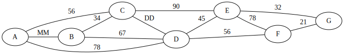

# Adatstruktúrák és algoritmusok ZH2
2024.12.03.

<hr />

## Név: 

## Neptun: 

## Születésnap (MM/DD) : 

<hr />

## I/H kérdések - 4p
 - A hash függvények értrelmezési tartománya és értékkészlete tipikusan hasonló méretű.
 - Szélességi bejáráshoz FIFO adatszerkezetet érdemes használni.
 - A Prím és a Kruskal algoritmus esetében is  először a teljes élhalmazt rendezni kell növekvő sorrendbe.
 - Egy egyszerű implementáció esetében a Dijkstra algoritmus O(|V|^2) időben megadja egy csúcsból a gráf összes többi csúcsába a legrövidebb út hosszát. 

## Szélességi bejárás implicit gráfon - 5p

Adott néhány dobozunk, egyszerűség kedvéért csak 2 dimenziósak. Kedves ismerősünknek ezekbe szeretnénk Matrjoska baba jelleggel becsomagolni egy darab Haribo gumimacit úgy, hogy minél több dobozt kelljen kibontania. Hogy minél jobban meglepődjön, a legkülső doboznak a rendelkezésre álló legnagyobb területű dobozt válasszuk. Mivel azt sem szeretnénk, hogy nagyon lötyögjenek a dobozok, egy doboz sem lehet legalább háromszor akkora, mint a közvetlen benne levő doboz. 

Szélességi bejárással keress egy olyan megoldást, amiben legalább 4 doboz kerül egymásba. A keresés gyökere legyen a fentebb leírrtaknak megfelelően egymagában a legnagyobb doboz. A gyerekek mindig a meglévőkbe tegyenek bele újabb dobozt. A "legbaloldalibb" gyerek esetében legyen a legnagyobb (területű) új doboz használva, majd csökkenő sorrendben a többi, és a legvégén, "jobb oldalt" a legkisebb.

A dobozok méretei: `3~2 3~5 4~4 6~6 7~4 8~7 9~5 10~10`

Elegendő az első 10 lépést végrehajtani.

## Legrövidebb út -- 6p
Keresd meg a legr0videbb utat `A`-ból `G`-be a Dijkstra algoritmussal. `MM/DD` a születésnapod.



## Feszítőfa -- 4p 
Adj meg egy minimális súlyú feszítőfát a fenti gráfra Prim algoritmussal annyiadik csúcsból indulva, ahányadik sorban ülsz. (A-1, B-2, stb.)


<br />


## Hibás? bejárás -- 4p
A fenti dobozos problémára egy rekurzív megoldás az alábbi. Vannak-e benne hibák? Ha igen, hol, miért? A potenciális javítás után mi az első 3 sor, amit kiír a program?

```python
def max_box(start_box:tuple[int,int], other_boxes : list[tuple[int,int]]) -> int:
    max_depth = 0
    next_box = None
    for box in other_boxes:
        if start_box[0] > box[0] and start_box[1] > box[1] and start_box[0]*startbox[1] < 3 * box[0]*box[1]:
            max = max_box(box, other_boxes)
            if max > max_depth: 
                max_depth = max
                next_box = box
    print(next_box, max_depth)
    return max

max_box((10,10), [(3,2), (3,5), (4,4), (6,6), (7,4), (8,7), (9,5)])
```


