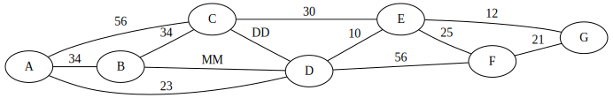

# Adatstruktúrák és algoritmusok PótZH2
2024.12.16.

<hr />

## Név: 

## Neptun: 

## Születésnap (MM/DD) : 

<hr />

## I/H kérdések - 4p
 - A hash függvények minden bemenethez különböző értékeket rendelnek hozzá.
 - Mélységi bejáráshoz LIFO adatszerkezetet érdemes használni.
 - A Dijkstra algoritmus nem működik kört tartalmazó gráfokon.
 - A Prim algoritmus minden lépése vagy eggyel növeli egy rész fa méretét, vagy kettő ilyen diszjunkt fát köt össze. 

## Mélységi bejárás implicit gráfon - 5p

Adott néhány 3 dimenziós dobozunk. Kedves ismerősünknek ezekbe szeretnénk Matrjoska baba jelleggel becsomagolni egy darab Haribo gumimacit úgy, hogy minél több dobozt kelljen kibontania. Hogy minél jobban meglepődjön, a legkülső doboznak a rendelkezésre álló legnagyobb területű dobozt válasszuk. Mivel azt sem szeretnénk, hogy nagyon lötyögjenek a dobozok, egy doboz sem lehet legalább négyszer akkora, mint a közvetlen benne levő doboz. 

Mélységi bejárással keress egy olyan megoldást, amiben legalább 5 doboz kerül egymásba. A keresés gyökere legyen a fentebb leírrtaknak megfelelően egymagában a legnagyobb doboz. A gyerekek mindig a meglévőkbe tegyenek bele újabb dobozt. A "legbaloldalibb" gyerek esetében legyen a legnagyobb (területű) új doboz használva, majd csökkenő sorrendben a többi, és a legvégén, "jobb oldalt" a legkisebb.

A dobozok méretei: `2~3~6, 2~4~5, 3~3~3, 3~4~8, 3~7~7, 5~8~9, 6~7~9, 7~7~7, 7~8~9, 8~9~10`

Elegendő az első 10 lépést végrehajtani.

## Legrövidebb út -- 6p
Keresd meg a legr0videbb utat `A`-ból `G`-be a Dijkstra algoritmussal. `MM/DD` a születésnapod.



## Feszítőfa -- 4p 
Adj meg egy minimális súlyú feszítőfát a fenti gráfra Kruskal algoritmussal.


<br />
<br />
<br />


## Hibás? bejárás -- 4p
A fenti dobozos problémára egy szélességi bejárársos megoldás az alábbi. Vannak-e benne hibák? Ha igen, hol, miért? A potenciális javítás után mi az első 3 sor, amit kiír a program?

```python
def find_packing(start_box:tuple[int,int,int], other_boxes : list[tuple[int,int,int]], depth:int) -> list[tuple[int,int,int]]:
    open_cases = {[start_box]}
    while len(open_cases) != 0:
        print(open_cases)
        boxes = open_cases.pop()
        if len(boxes) = depth: return boxes
        for box in other_boxes:
            if boxes[-1] < box: 
                boxes.append(box)
                open_cases.put(boxes)        
    raise ValueError(f"No solution with depth {depth} can be found")

max_box((10,8,9), [ (2,3,6), (2,4,5), (3,3,3), (3,4,8), (3,7,7), (5,8,9), (6,7,9), (7,7,7), (7,8,9)])
```


