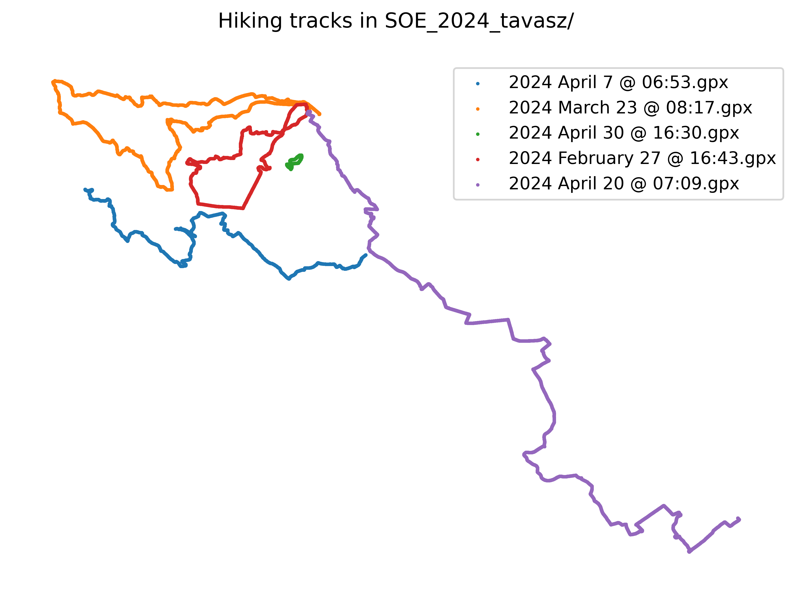

# Programozás 1 - ZH 2 
2024.05.20

## Alap koncepció

A feladat egy olyan parancssori alkalmazás készítése, mely a félév túráinak trackjeiből képes diagram kimutatásokat készíteni. A `.gpx` kiterjesztésű fájlokra példa a [SOE_2024_tavasz](SOE_2024_tavasz) könyvtárban található.
Kétféle diagram típust szeretnénk készíteni:
 - Egy adott túrára a pulzust és a magasságot ábrázoló diagramot
 - Az összes, könyvtárban található túrára az útvonalak egymásra vetítését 

### Minta a készítendő diagramokra

A diagramok készítése során a "csicsázás" nem fontos, a lényeg, hogy látszódjanak a megfelelő adatok. Az overlay digramnál a rögzített gps koordináták x/y plotolása elég.




### Működés

Az elkészült program parancssori applikációként működjön, első argumentumként várjon egy parancsot, majd a parancshoz szükséges opcionális paramétereket:

```bash
./main.py COMMAND [optional arguments]
```

Egy túrához a pulzus- és magasságdiagramot a következő módon tudjuk generálni:

```bash
ProgZH2$ ./main.py analyze -f SOE_2024_tavasz/2024\ April\ 20\ @\ 07:09.gpx -o diagram.png
```

Ha `-o`-val nem adjuk meg a kimeneti fájlt, akkor a `gpx` fájllal megegyező nevű és `png` kiterjesztésű fájlba készüljön a diagram. 
Ha az `analyze` parancs esetében ha nincs `-f` / `--file` kapcsoló megadva, akkor a programnak hibaüzenetet kell kiírnia.

Hasonló módon, az összes túra útvonalát egyetlen diagramon megjelenítő parancs:

```bash
ProgZH2$ ./main.py overlay -p SOE_2024_tavasz -o SOE_2024_tavasz.png
```

Ha a `-o` kapcsoló nincs megadva, akkor a `overlay.png` nevű fájlba kerüljön a diagram ugyanabban a könyvtárban. Ha a `-p` / `--path` kapcsoló nincs megadva, akkor a programnak hibaüzenetet kell kiírnia.

## GPX fájlok felépítése

A [GPX](https://docs.fileformat.com/gis/gpx/) egy XML alapú fájlformátum, melyben trackek pontjai vannak eltárolva. A kiadott fájlokban másodpercenként adott 1-1 pont, melyet egy ilyen részlet ír le:
```xml
      <trkpt lat="47.6332789845764636993408203125" lon="16.60075460560619831085205078125">
        <ele>201.1999969482421875</ele>
        <time>2024-04-07T04:54:24.000Z</time>
        <extensions>
          <ns3:TrackPointExtension>
            <ns3:atemp>15.0</ns3:atemp>
            <ns3:hr>57</ns3:hr>
            <ns3:cad>49</ns3:cad>
          </ns3:TrackPointExtension>
        </extensions>
      </trkpt>
```

Az egy túráról készülő digrammokhoz értelemszerűen ezekre a sorokra lesz szükség ebből:

```xml
        <ele>201.1999969482421875</ele>
            <ns3:hr>57</ns3:hr>
```

Az útvonalak egymásra vetítéséhez pedig erre:
```xml
      <trkpt lat="47.6332789845764636993408203125" lon="16.60075460560619831085205078125">
```

## Kötelezően megvalósítandó függvények

A feladat megvalósítása akkor elfogadható, ha a fent leírtaknak megfelelően működik, és a következő, XML parzolást segítő függvényeket az [xml.py](xml.py) modulban implementálja, az azokra írt tesztek hibamentesen lefutnak. A megvalósítás során elegendő egyszerű beépített string műveleteket használni, és csak a leírt eseteket kezelni.

### `fetch_value`

```python
def fetch_value(line:str, tag:str) -> str:
    pass
```

mely egy egyetlen XML sort tartalmazó stringből kinyeri a megadott tag tartalmát, például:

```python
>>> fetch_value('<ele>201.1999969482421875</ele>', 'ele')
'201.1999969482421875'
>>> fetch_value('<ns3:hr>57</ns3:hr>', 'ns3:hr')
'57'
>>> fetch_value('trallalallala <b>sallalallalala</b> tumturumm' , 'b')
'sallalallalala'
```
A függvény feltételezheti, hogy a sorban az említett tag pontosan egyszer szerepel, és a tartalma egyszerű szöveg (nincsenek további tag-ek benne), valamint a tagnek nincsenek argumentumai, és felesleges whitespace-ek sincsenek a nyitó / záró tagen belül. 

### `fetch_arg_values`

```python
def fetch_arg_values(opentag:str) -> dict[str,str]:
    pass
```

mely egyetlen nyitó XML tag-ből kinyeri az argumentumokat és azok értékeit egy `dict`-be, például:

```python
>>> fetch_arg_values('<trkpt lat="47.6332789845764636993408203125" lon="16.60075460560619831085205078125">')
{'lat': '47.6332789845764636993408203125', 'lon': '16.60075460560619831085205078125'}
>>> fetch_arg_values('<a href="https://www.google.com" target="_blank">')
{'href': 'https://www.google.com', 'target': '_blank'}
```

A függvény feltételezheti, hogy a sorban (whitespace-eket leszámítva) csak ez a nyitótag található.

## Egyéb szempontok

 - Az összes minta fájlra működnie kell hiba nélkül a programnak.
 - Ha a megadott fájl vagy könyvtár nem létezik, akkor a program ezt jelezze hibaüzenettel, és szabályosan álljon le.
 - Más hibákra, pl. hibás gpx tartalom (hiányzó tag-ek, stb.) nem kell felkészíteni a programot.
