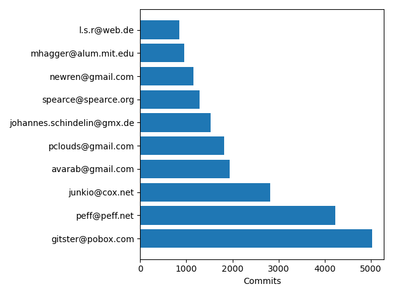
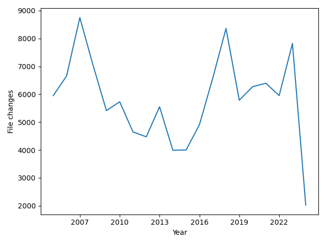

# Programozás 1 - PótZH 2
2024.05.23

## Áttekintés

A feladat két parancssori alkalmazás készítése, melyek `git`tel verziókövetett projektekkel kapcsolatban adnak információkat. Az első script feladata egy `git log` kimenet `json` formátumra alakítása, a másodiké pedig ezen fájl alapján két diagram készítése. 

Az alapértelmezett `git log` kimenetre erősen hasonlító szerkezetű szöveges fájlok a bemenetek, melyekre mintaként három, a félévben sokat használt szoftver GitHubon megtalálható repository-ja ad példát:
- [examples/git.log](examples/git.log)
- [examples/vscode.log](examples/vscode.log)
- [examples/cpython.log](examples/cpython.log)

Mindegyik fájl a `git --no-pager log --pretty=format:"commit %H%nAuthor: %an <%ae>%nDate:   %aI" --shortstat --diff-filter=ACDMR` paranccsal készült, és bennük 1-1 üres sorral elválasztva, minden commitról 4 információs sor található:

```log
commit 1da177e4c3f41524e886b7f1b8a0c1fc7321cac2
Author: Linus Torvalds <torvalds@ppc970.osdl.org>
Date:   2005-04-16T15:20:36-07:00
 17291 files changed, 6718755 insertions(+)
```

A [log_parser.py](log_parser.py) feladata egy ilyen fájl `json` formátumra alakítása ilyen formában:

```json
[
 ...,
 {
  "author": "Linus Torvalds",
  "email": "torvalds@ppc970.osdl.org",
  "date": "2005-04-16T15:20:36-07:00",
  "changes": 17291
 },
 ...
]
```

Az [examples/](examples/) könyvtárban megtalálható a fent említett három példára az elkészített `json` fájl.

A [stats.py](stats.py) feladata két diagram készítése a fenti `json` fájl alapján:
- commitok száma alapján a top 10 közreműködőről egy sávdiagram
- az egyes években történt fájlmódosítások számáról egy vonaldiagram

Az [examples/](examples/) könyvtárban megtalálhatóak a fenti három példára az elkészített diagramok, a `git`-re például így néznek ki:





## Specifikáció / követelmények

### [log_parser.py](log_parser.py)

A program kötelező parancssori argumentumként várja a `.log` kiterjesztésű fájl nevét, melyből ugyanabba a könyvtárba, ugyanazzal a névvel, `.json` kiterjesztéssel készíti el a kimenetet. Az `-a`/`--author`, `-e`/`--email`, `-d`/`--date`, `-c`/`--changes` kapcsolókkal lehet kiválasztani, hogy melyik mezők kerüljenek bele a kimenetbe. Ha egyik kapcsoló sem kerül megadásra, akkor az összes mező belekerül.

A `git`-hez néhány példa kimenet megtekinthető a [examples/](examples/) könyvtárban:
- `./log_parser.py examples/git.log` -> [examples/git.json](examples/git.json)
- `./log_parser.py examples/git.log --author`  -> [examples/git_a.json](examples/git_a.json)
- `./log_parser.py -a -e examples/git.log`  -> [examples/git_ae.json](examples/git_ae.json)
- `./log_parser.py -ecd examples/git.log`  -> [examples/git_ecd.json](examples/git_ecd.json)

Nem létező fájl esetén a program adjon értelmes üzenetet, az feltételezhető, hogy a fájlok szerkezetében nincs hiba.

[log_parser.py](log_parser.py)-ban megadott tesztek hiba nélkül fussanak le.

### [stats.py](stats.py)

A program kötelező parancssori argumentumként várja a `.json` kiterjesztésű fájl nevét, melyből ugyanabba a könyvtárba, a név után a `_top10_contributors.png`-t és `_annual_file_changes.png`-t ragasztva készítse el a két fenti diagrammot.

Példa: `./stats.py examples/git.json` -> [examples/git.json_top10_contributors.png](examples/git.json_top10_contributors.png), [examples/git.json_annual_file_changes.png](examples/git.json_annual_file_changes.png)

- Feltételezhető, hogy a megadott fájl létezik, valid `json` és a fenti formátumú.
- Feltételezhető, hogy volt legalább 10 contributor.
- **Nem** feltételezhető, hogy a diagramokhoz szükséges adatok szerepelnek a fájlban. Például ha nincsenek e-mail címek, akkor a top 10 diagram nem készül el, helyette hibaüzenetet ad a program. Hasonlóképp, ha a dátumok vagy fájlmódosítások számai hiányoznak, a második diagram helyett hibaüzenet kerül kiírásra. Viszont amelyik diagram elkészíthető, az készüljön is el.
- A diagramok esetében a cicomázás nem kötelező, de az adatoknak stimmelnie kell.

## Checklist
- [ ] A unit tesztek helyesen lefutnak a `log_parser.py`-ban.
- [ ] A `log_parser.py` szól, ha nem adunk meg fájlnevet.
- [ ] A `log_parser.py` szól, ha nem létezik a fájl.
- [ ] A `log_parser.py` helyes fájlnévvel hozza létre a `.json` fájlt.
- [ ] A `log_parser.py` a kapcsolóknak megfelelő adatokat teszi csak a `.json` fájlba.
- [ ] Ha nincs kapcsoló, akkor az összes adat belekerül.
- [ ] A `stats.py` legenerálja a top 10 diagrammot a megfelelő fájlnévvel, ha adottak a megfelelő adatok.
- [ ] A `stats.py` legenerálja az éves fájlmódosítás diagrammot a megfelelő fájlnévvel, ha adottak a megfelelő adatok.
- [ ] A `stats.py` figyelmeztető üzenetet ad (elcrashelés helyett), ha valamelyik diagrammhoz nincs megfelelő adat.
