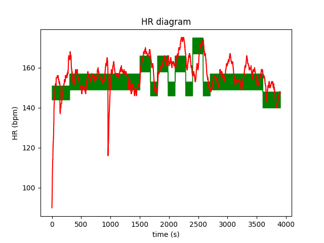

# Programozás alapjai 2. - Próba ZH
2021.03.19

## 0. Bevezető

Manapság a legtöbb edző nem tempó, hanem pulzus alapján ír elő edzéseket. 
Ez azt jelenti, hogy az előírt edzés egyes szakaszaiban egy pulzustartomány (pl.: 155-165) van előírva, és a sportolónak úgy kell igazítania a tempóját, hogy megpróbáljon ezen a tartományon belül maradni. 
Egy edzés több ilyen szakaszból áll, az én drága edzőm ezzel kedveskedett nekem pl tegnapra:

- 5 perc bemelegites: 144-151
- 20 perc kényelmes futás: 149-157
- 3 perc lendületes futás: 158-166
- 2 oerc pihenő: 146-153
- 3 perc lendületes futás: 158-166
- 2 oerc pihenő: 146-153
- 3 perc lendületes futás: 158-166
- 2 oerc pihenő: 146-153
- 3 perc intenzív futás: 167-175
- 2 oerc pihenő: 146-153
- 15 perc kényelmes futás: 149-157
- 5 perc levezető: 140-148

A feladat egy olyan program elkészítése lesz, amiben ilyen edzéseket rakhatunk össze, illetve vizualizálhatjuk, elemezhetjük azt, hogy a delikvens mennyire tartotta be a dolgokat.

 # 1. Alap osztály: lépés

Készüljön egy `TrainingStep` osztály, mely egy edzésszakasz adatait tárolja el. 
Lehessen 4 paraméterrel inicializálni, amik a leírás, a hossz (másodpercben), valamint az előírt puluszóna alsó és felső határa.

```python
step = TrainingStep("Warm up",300,144,151)
```

Az inicializáló függvény dobjon kivételt, ha:
 - a megadott időtartam negatív
 - a pulzuszóna alja magasabb, mint a teteje
 - a pulzuszóna alja lejjebb van, mint 40
 - a pulzuszóna teteje feljebb van, mint 210


 # 2. Összetett osztály: edzésterv

Készüljün egy `Training` osztály, mely egy egész edzést modellez. Az inicializálás paraméter nélkül történik.

Legyen az osztálynak egy `add_step` függvénye, melynek egy ugyanúgy 4 argumentumot kell megadni, mint a fenti inicializálónak. 
Ha rossz adatokat adunk meg, ne dobjon kivételt, hanem írjon ki egy hibaúzenetet, és szimplán ne adja hozzá az edzéshez a lépést.

Legyen egy `repeat` metódusa az osztálynak, mely 2 paramétert vár: az első, hogy a legutóbbi hány lépést tegye be az edzés végére újra, a második, hogy hányszor. 
Legyen tesztelve, hogy értelmes adatokat kapunk-e, és ha nem, akkor írjon ki egy hibaüzenetet, és ne adjon hozzá semmit az edzéshez.
Rosszak az argumentumok, ha:
 - a lépések száma nem pozitív vagy több, mint az eddigi lépések száma
 - az ismétlés száma nem pozitív

A fenti edzéstervet például összeállíthatjuk így:

```python
thursday = Training()

thursday.add_step("Warm up", 300, 144, 151)
thursday.add_step("Wrong timing", -45, 120, 120) #  not added
thursday.add_step("Comfortable run", 1200, 149, 157)
thursday.add_step("Energetic run", 180, 158, 166)
thursday.add_step("Recovery", 120, 156, 153)
thursday.repeat(2, 2) # repeat the last 2 steps 2 times 
thursday.add_step("Intensive run", 180, 167, 175)
thursday.add_step("Recovery", 120, 156, 153)
thursday.add_step("Comfortable run", 900, 149, 157)
thursday.add_step("Cool down", 300, 140, 148)
```

Legyen egy egyszerű `print` metódus az osztálynak, ami valahogy kiírja az edzéstervet.
Például így: 

```python
>>> thursday.print()
             Warm up ( 300 s): 144-151 bpm
     Comfortable run (1200 s): 149-157 bpm
       Energetic run ( 180 s): 158-166 bpm
            Recovery ( 120 s): 146-153 bpm
       Energetic run ( 180 s): 158-166 bpm
            Recovery ( 120 s): 146-153 bpm
       Energetic run ( 180 s): 158-166 bpm
            Recovery ( 120 s): 146-153 bpm
       Intensive run ( 180 s): 167-175 bpm
            Recovery ( 120 s): 146-153 bpm
     Comfortable run ( 900 s): 149-157 bpm
           Cool down ( 300 s): 140-148 bpm

```


Legyen az osztálynak egy `total_time` függvénye, mely másodpercben visszaadja, hogy mennyi ideig tart a teljes edzés.

```python
>>> thursday.total_time()
3900
```

Legyen egy olyan metódus, `get_zone`, mely adott másodperchez visszaadja, hogy akkor milyen intervallumot kellene tartani egy tuple formájában.
Ha rossz argumentumot adunk meg, adjon vissza egy `None`-t.
A másodpercek 0-tól indexelődnek.

```python
>>> thursday.get_zone(0)
(144, 151)
>>> thursday.get_zone(1234)
(149, 157)
>>> thursday.get_zone(12345)
None
```

Legyen az osztálynak egy `examine` függvénye, mely egy  argumentumot vár, ami megadja egy fájlnak a nevét, amiben az edzésen mért pulzusadatok találhatók. 
Minden sor egy másodpercnek az adata. 
Példa fájl a [`run_hr.txt`](run_hr.txt)-ben található.
Nem garantált, hogy pontosan annyi adat van a fájlban, mint amilyen hosszú az edzés, de feltételezhető, hogy legalább annyi.
Ha a fájl nem létezik, akkor írjon ki hibaüzenetet, és térjen vissza `None`-nal.

A függvény két dolgot csinál:
 - visszaadja, hogy az edzést hány százalékban tartottuk be (egészre kerekítve)
 - ugyanazzal a névvel, de `png` kiterjesztéssel csinál egy diagrammot, amin látszódik idő függvényében a zóna alja, teteje, valamint a tényleges pulzus. Egy példa a [`run_hr.png`](run_hr.png)-ben látható:



Nem számít, mennyire "szép" a diagram, csak legyenek valahogy rajta az adatok.
A példában látható kitöltéshez az `axes.fill_between(x,bottom_y,tol_y, color="green")` függvény használható. 
 

# Példa kimenet

A [`main.py`](main.py)-ban található kódra ez a várt kimenet:

```
Could not add step, invalid data provided.

The training:
             Warm up ( 300 s): 144-151 bpm
     Comfortable run (1200 s): 149-157 bpm
       Energetic run ( 180 s): 158-166 bpm
            Recovery ( 120 s): 146-153 bpm
       Energetic run ( 180 s): 158-166 bpm
            Recovery ( 120 s): 146-153 bpm
       Energetic run ( 180 s): 158-166 bpm
            Recovery ( 120 s): 146-153 bpm
       Intensive run ( 180 s): 167-175 bpm
            Recovery ( 120 s): 146-153 bpm
     Comfortable run ( 900 s): 149-157 bpm
           Cool down ( 300 s): 140-148 bpm

Total time: 3900 s

HR zones:
 - At 0 s : (144, 151)
 - At 1234 s : (149, 157)
 - At 12345 s : None

Examine none-existent run.txt
Wrong filename.

Examine run_hr.txt
49% of the time the HR zones were met.
```
