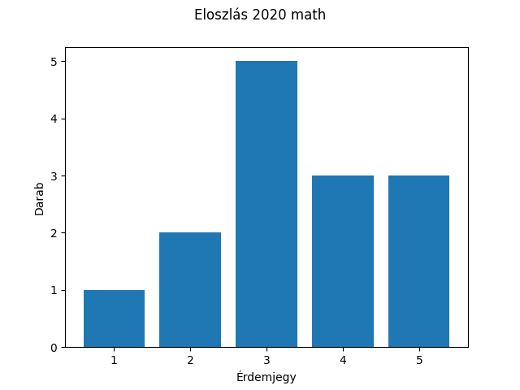
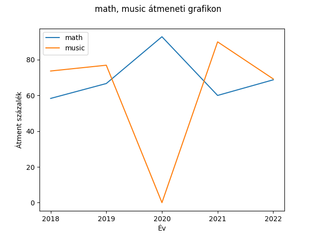

# ZH1

Adott egy olyan mappastruktúra ahol évekre bontva megtalálhatóak az adott évben tanított tárgyak külön file-okra bontva. (pl: 2020/[matek, angol, biologia, rajz, testneveles], 2021/[matek, angol, foldrajz, nemet, irodalom]). Az egyes fileok json formátumban a diákok adott tárgyra kapott év végi jegyét tartalmazzák.

## 1. feladat

Valósítsa meg a `def result_plot(subject: str, year: int)` függvény-t, ami egy olyan statisztikát készít, ami a megadott tárgy adott éves jegyeinek eloszlását tartalmazza. Majd az elkészített statisztikát elmenti egy `<subject>_<year>_results.png` file-ba. Amennyiben vagy az év nem létezik, vagy a tárgy nincs az adott évben a program hibára futhat, ezt kezelje le python hibakezelés használatával. A grafikon jelenítse meg címként, hogy milyen adatokat tartalmaz, illetve címkézze fel a tengelyeket is ahol értelmes.

```python
result_plot('math', 2020)
```



## 2. feladat

Valósítsa meg a `def result_plot_over_years(subjects: list)` függvényt. A függvény az paraméterül megkapott tantárgyakról statisztikát készít méghozzá oly módon, hogy évekre bontva megadja, hogy a diákok hány százaléka ment át az adott tárgyból és ezt plotolja. Amennyiben több tárgy is megadásra kerül, akkor ezek mindegyikét egy ábrán jeleníti meg. Ha az adott évben a tárgy nem indult, akkor 0%-os átmenettel számoljon. A grafikont pedig a `<subject1_subject2_...>_results.png` file-ba menti ki. A grafikon jelenítse meg címként, hogy milyen adatokat tartalmaz, illetve címkézze fel a tengelyeket is ahol értelmes.

```python
result_plot_over_years(['math', 'music'])
```



## 3. feladat

Az elkészítet metódusokat csomagolja be egy `Grade_Statistics` osztályba. Az osztálynak ezek belső metódusai legyenek. Az osztály konstruktorként megkapja a mappát, ahol az adatok találhatóak.

```python
stats = Grade_Statistics('./results')
stats.result_plot('math', 2020)
stats.result_plot_over_years(['math', 'music'])
```
