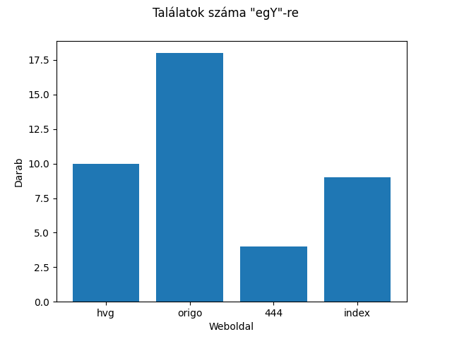
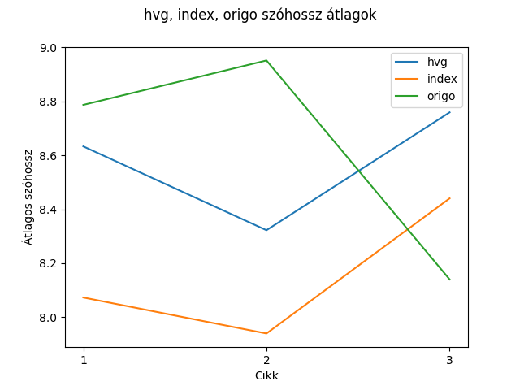

# ZH1 - PÓT

Adott egy olyan mappastruktúra ahol weboldalakra bontva megtalálhatóak az weboldalak pár cikke file-okra bontva. (pl: hvg/[idojaras_jegdara_vihar, reszeg_autosok_rendorseg, wizz_air_keses]). A cikk-ek `.txt` formátumban vannak eltárolva.

## 1. feladat

Valósítsa meg a `search(term: str)` függvény-t, ami egy olyan statisztikát készít, ami megadja, hogy a keresett szó melyik oldalon hány alkalommal fordul elő. Majd az elkészített statisztikát elmenti egy `<term>_results.png` file-ba. A grafikon jelenítse meg címként, hogy mire kerestünk, illetve címkézze fel a tengelyeket is ahol értelmes. Csak a tényleges egyezést kell figyelembe vennie. Nem kell olyan szavakat feldolgozni amik valamilyen írásjelet tartalmaznak, de a kis- és nagybetűk nem számítanak pl: `egy, Egy, eGy` mind jól kell, hogy működjön.

```python
search('egY')
```



## 2. feladat

Valósítsa meg a `def website_average_word_statistics(sites: list, min_length: int = 5)` függvényt. A függvény a paraméterül megkapott weboldalakról statisztikát készít méghozzá oly módon, hogy cikkekre bontva megadja, hogy mennyi az átlagos szóhossz az adott cikkben és ezt plotolja, oly módon, hogy közben figyelembe veszi a `min_length` értékét is és csak akkor dolgoz fel egy szót, hogyha a hossza legalább ennyi. A cikkek sorrendje a honlapon belül lényegtelen. Amennyiben több oldal is megadásra kerül, akkor ezek mindegyikét egy ábrán jeleníti meg. A grafikont a `<site1_site2_...>_results.png` file-ba menti ki. A grafikon jelenítse meg címként, hogy milyen adatokat tartalmaz, illetve címkézze fel a tengelyeket is ahol értelmes.

```python
website_average_word_statistics(['hvg', 'index', 'origo'])
```



## 3. feladat

Az elkészítet metódusokat csomagolja be egy `ArticleSearch` osztályba. Az osztálynak ezek belső metódusai legyenek. Az osztály konstruktorként megkapja a mappát, ahol az adatok találhatóak.

```python
search = ArticleSearch('articles')
search.search('egY')
search.website_average_word_statistics(['hvg', 'index', 'origo'], 4)
```
